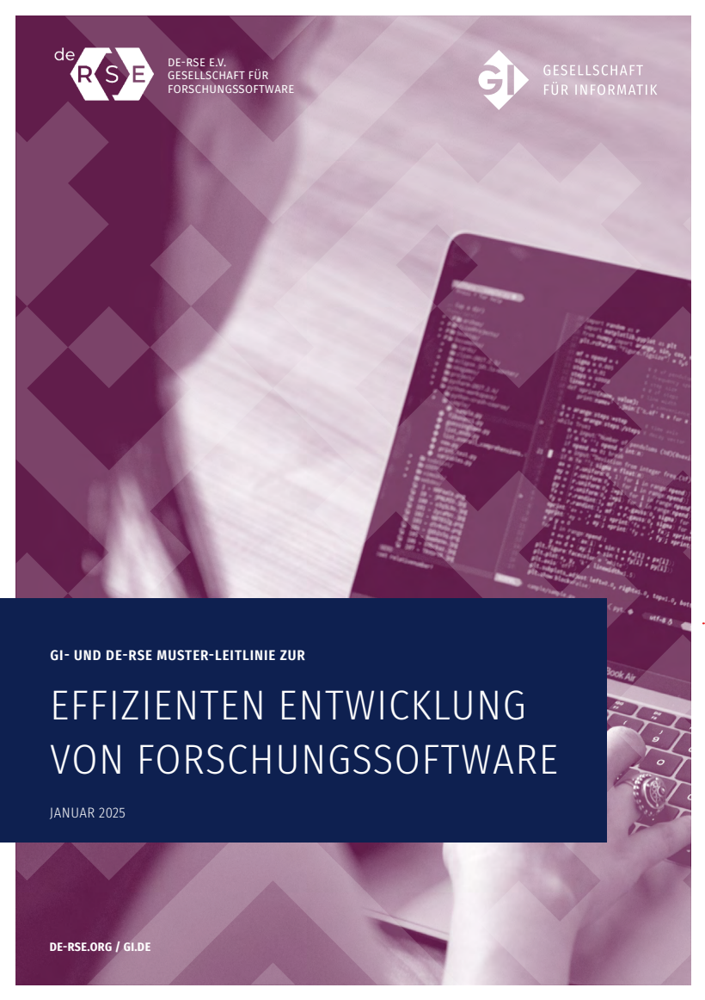
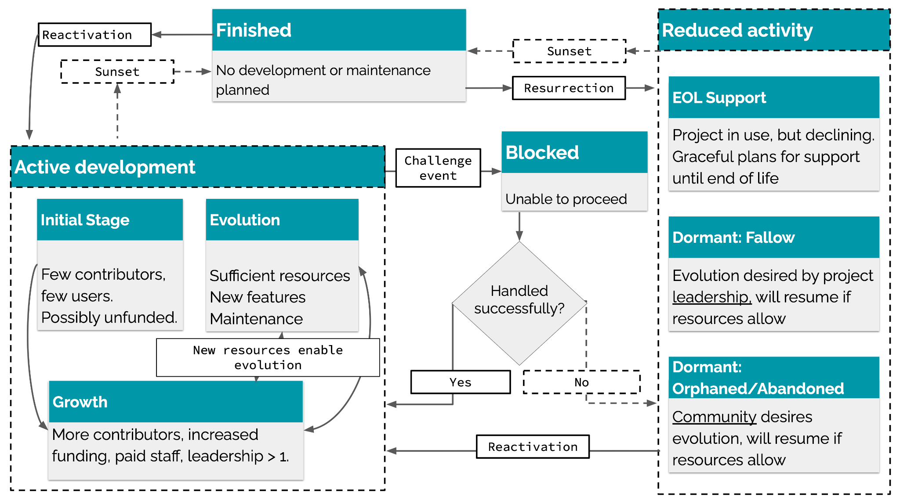
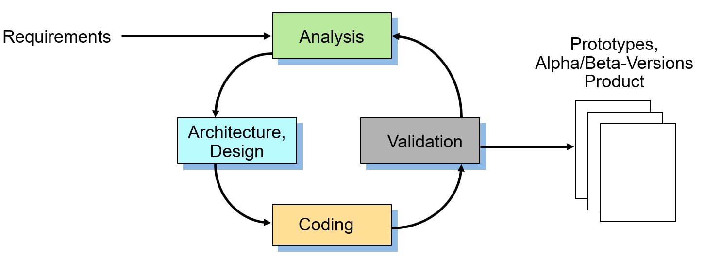

# GI and DE-RSE Template Guideline for the Efficient Development of Research Software
**Derived from German Version V1.0**

*The official reference to the german version:*

[CEF+25] A. Czerniak, A. Ehrenhofer, B. Fritzsch, M. Funk, F. Goth, R. Härhnle, C. Haupt, M. Konersmann, J. Linxweiler, F. Lörffler, A. Lürpges, S. Nielebock, B. Rumpe, I. Schieferdecker, T. Schlauch, R. Speck, A. Struck, J. P. Thiele, M. Tichy, I. Ulusoy:
GI- und DE-RSE Muster-Leitlinie zur effizienten Entwicklung von Forschungssoftware.
Gesellschaft für Informatik, Technischer Bericht, GI Leitlinien, DOI 10.18420/2025-gi_de-rse, Gesellschaft für Informatik e.V., Jan. 2025.

## Table of Contents

[Preamble: Purpose of this Template Guideline](#preamble-purpose-of-this-template-guideline)

[Use of the Template Guideline and License](#use-of-the-template-guideline-and-license)

[Contributors and Thanks for Your Cooperation](#contributors-and-thanks-for-your-cooperation)

[Main Sources Used](#main-sources-used)

[1 Executive Summary (for Decision-Makers)](#1-executive-summary-for-decision-makers)

&ensp;[1.1 Reading Notes](#11-reading-notes)

[2 Introduction](#2-introduction)

&ensp;[2.1 Characteristics of Software, Especially Research Software](#21-characteristics-of-software-especially-research-software)

&ensp;[2.2 Characteristics of Research Software Engineering](#22-characteristics-of-research-software-engineering)

&ensp;[2.3 Tasks of the Guideline](#23-tasks-of-the-guideline)

&ensp;[2.4 Delimitation, Non-Objectives of the Guideline](#24-delimitation-non-objectives-of-the-guideline)

&ensp;[2.5 Coordinated Framework Guidelines for Safeguarding, Good Research Practice, Code of Conduct Requirements](#25-coordinated-framework-guidelines-for-safeguarding-good-research-practice-code-of-conduct-requirements)

&ensp;[2.6 Conclusion](#26-conclusion)

[3 Technical Guidelines for Software Development](#3-technical-guidelines-for-software-development)

&ensp;[3.1 Introduction](#31-introduction)

&ensp;&ensp;[3.1.1 Research Software: Demonstrator, Product, Infrastructure](#311-research-software-demonstrator-product-infrastructure)

&ensp;[3.2 Categorization of Research Software](#32-categorization-of-research-software)

&ensp;&ensp;[3.2.1 Kind of Software or Software Component (Dimension Kind)](#321-kind-of-software-or-software-component-dimension-kind)

&ensp;&ensp;[3.2.2 Degree of Utilization of the Software or Software Component](#322-degree-of-utilization-of-the-software-or-software-component-dimension-use)

&ensp;&ensp;[3.2.3 Classification in the Technology Readiness Levels (TRL) according to the EU](#323-classification-in-the-technology-readiness-levels-trl-according-to-the-eu)

&ensp;&ensp;[3.2.4 Application Classes](#324-application-classes)

&ensp;&ensp;[3.2.5 Status of the Software](#325-status-of-the-software)

&ensp;&ensp;[3.2.6 Other factors](#326-other-factors)

&ensp;[3.3 Minimal Requirements for Core Competencies, Development Processes and Project Planning in Software Development	30](#33-minimal-requirements-for-core-competencies-development-processes-and-project-planning-in-software-development)

&ensp;&ensp;[3.3.1 Minimum Requirements for the Technology Readiness Level based on the Degree of Utilization (Use) and the Kind of Software (Kind)](#331-minimum-requirements-for-the-technology-readiness-level-based-on-the-degree-of-utilization-use-and-the-kind-of-software-kind)

&ensp;&ensp;[3.3.2 Minimum Requirements for Rields of Action and Necessary Core Competencies in Software Development based on the Technology Readiness Level](#332-minimum-requirements-for-rields-of-action-and-necessary-core-competencies-in-software-development-based-on-the-technology-readiness-level)

&ensp;[3.4 Methodological Principles of Software Development](#34-methodological-principles-of-software-development)

&ensp;&ensp;[3.4.1 Software Engineering Processes](#341-software-engineering-processes)

&ensp;&ensp;[3.4.2 Quality Management (Testing, Validation, etc.)](#342-quality-management-testing-validation-etc)

&ensp;&ensp;[3.4.3 Understanding Requirements](#343-understanding-requirements)

&ensp;&ensp;[3.4.4 Software Architecture](#344-software-architecture)

&ensp;&ensp;[3.4.5 Software Modeling](#345-software-modeling)

&ensp;&ensp;[3.4.6 Versioning](#346-versioning)

&ensp;&ensp;[3.4.7 Test Concept and Automation](#347-test-concept-and-automation)

&ensp;&ensp;[3.4.8 Management of Software-related Data and Data Basis](#348-management-of-software-related-data-and-data-basis)

&ensp;&ensp;[3.4.9 Best Practices, Design Patterns, Issue Tracking, Coding Guidelines](#349-best-practices-design-patterns-issue-tracking-coding-guidelines)

&ensp;[3.5 Technical Basics](#35-technical-basics)

&ensp;&ensp;[3.5.1 Git Version Control System](#351-git-version-control-system)

&ensp;&ensp;[3.5.2 Continuous Integration/Continuous Delivery](#352-continuous-integrationcontinuous-delivery)

&ensp;&ensp;[3.5.3 Test Frameworks](#353-test-frameworks)

&ensp;&ensp;[3.5.4 Dissemination](#354-dissemination)

&ensp;&ensp;[3.5.5 Software Discovery](#355-software-discovery)

[4 Granting and Use of Licenses (Legal Protection)](#4-granting-and-use-of-licenses-legal-protection)

&ensp;[4.1. Scientific Exploitation and License Selection \-- General](#41-scientific-exploitation-and-license-selection-general)

&ensp;[4.2 Notes on Economic Utilization](#42-notes-on-economic-utilization)

&ensp;[4.3 License Types](#43-license-types)

&ensp;&ensp;[4.3.1 Open Source Licenses](#431-open-source-licenses)

&ensp;&ensp;[4.3.2 Permissive Open Source Licenses](#432-permissive-open-source-licenses)

&ensp;&ensp;[4.3.3  Copyleft Open Source Licenses (Best Practice Examples)](#433-copyleft-open-source-licenses-best-practice-examples)

&ensp;&ensp;[4.3.4 Proprietary Licenses](#434-proprietary-licenses)

&ensp;[4.4 Consulting Services and Procedure for Selection](#44-consulting-services-and-procedure-for-selection)

&ensp;[4.5. Use of Third-Party Software](#45-use-of-third-party-software)

&ensp;&ensp;[4.5.1 Rights and Obligations through Licenses](#451-rights-and-obligations-through-licenses)

&ensp;&ensp;[4.5.2 Compatibility of Licenses](#452-compatibility-of-licenses)

[5\. Support Services by the \[\[University | Research institution\]\]	54](#5-support-services-by-the-university-research-institution)

&ensp;[5.1 Personnel Support for the Creation and Expansion of Research Software](#51-personnel-support-for-the-creation-and-expansion-of-research-software)

&ensp;[5.2 Support Services for the Long-term Maintenance of Software](#52-support-services-for-the-long-term-maintenance-of-software)

&ensp;[5.3 Support Services in Continuing Education](#53-support-services-in-continuing-education)

&ensp;[5.4 Appreciation of the Research Software Engineers](#54-appreciation-of-the-research-software-engineers)

&ensp;[5.5 Support Services for Licenses](#55-support-services-for-licenses)

&ensp;[5.6 Support Services through Technical Services](#56-support-services-through-technical-services)

&ensp;[5.7 Financing of Support Services for the Development and Maintenance of Software](#57-financing-of-support-services-for-the-development-and-maintenance-of-software)

&ensp;&ensp;[5.7.1 Transfer to RSE Center Costs ("University Software")](#571-transfer-to-rse-center-costs-university-software)

&ensp;&ensp;[5.7.2 Acquisition at the Expense of the Research Unit ("Institute Software")](#572-acquisition-at-the-expense-of-the-research-unit-institute-software)

&ensp;&ensp;[5.7.3 Design of the Support](#573-design-of-the-support)

&ensp;[5.8 Other Support Services](#58-other-support-services)

[References](#references)

[Appendix A: Categorization Options](#appendix-a-categorization-options)

[Appendix B: Checklist for the Transfer of Software](#appendix-b-checklist-for-the-transfer-of-software)

[Appendix C: Principles and Contributors](#appendix-c-principles-and-contributors)

## Preamble: Purpose of this Template Guideline

This template guideline provides a framework for the development, management, and transfer of software at a university or research institution. It is also suitable for cross-institutional collaborative research projects, especially when the project participants at the various universities and research institutions use compatible versions.

The focus of the template guideline is on creating a policy framework specific to research software development without going deeply into the subject-specific requirements of individual research areas. It is fully compatible with the DFG guidelines \[DFG22\] and offers options for further specification, in particular the DFG guidelines on the use of research software \[DFG24\]. It therefore usually makes sense to elaborate on these aspects in more detail in specific guidelines tailored to the institution's or subject domain's requirements, e.g., with respect to stricter requirements for medical devices. Other topics, including interdisciplinary topics less related to software technology, are not the focus here and should therefore be considered in addition, especially depending on the needs of the respective institution.

**Research software engineering** (RSE) is primarily the application of software engineering (SE) practices for research software, i.e., software created for and primarily used in scientific research projects. \[Wik24b\]

RSE is not simply a subset of classical software engineering, but as an interface discipline includes elements of computer science (especially programming and software engineering), the various disciplines, and open science. \[Lam24\]

Consequently, in Germany, the term "research software engineers" is emerging as an independent professional profile \[GAB+24\], which is a mixture of the actual research domain (STEM, geology, robotics, medical technology, sociology, etc.) and software engineering methods. RSE is not identical, but related to High-Performance Computing (HPC), Computational Science and Engineering (CSE), Artificial Intelligence, or Data Science, because it has both independent goals and methods for achieving them.

Due to the increased relevance and complexity of research software across a large number of research projects, as well as the reliability and longevity often required, it has become apparent that the efficient and high-quality creation of research software also requires a set of **organizational, methodological, and legal measures**.

The following document is a proposal for the development of individual guidelines within universities, and research institutions. On the one hand, this attempts to provide concrete assistance for defining one's own guidelines and, on the other hand, to give the different cultures in individual subjects and research institutions freedom for further specification through explicit variability. Nevertheless, this document is relatively detailed and extensive for guidelines, because there is much to clarify and understand in the field of RSE, and there are numerous alternatives that can be selected. The actual "selected" guideline is therefore significantly more succinct.

This template guideline should therefore be used to create an independent document and, ideally, be adopted as a guideline by the respective university or research institution. It focuses exclusively on software development and neglects the research part in "RSE", which may have its own guidelines, but which cannot be part of this document due to the high degree of individuality.

This results in consequences for both the management of organizational support and for the people working operationally in software development. These guidelines were created on the based on the knowledge distilled to date (as of 2024\) about the development of software in general (software engineering) and research software in particular (research software engineering). It is planned to further develop these guidelines on a regular basis and to incorporate new findings.

This multi-variant template guideline for the development of research software was created by the working group of the same name of the joint RSE specialist group of the German Informatics Society (GI) and the Society for Research Software e.V. (de-RSE e.V.).

The template guideline of the de-RSE and the GI is explicitly supported by the expert committee Medical Informatics of the GMDS \- German Association for Medical Informatics, Biometry, and Epidemiology and the working group Medical Software and Medical Device Law (MSM) of the TMF \- Technology and Methods Platform for Networked Medical Research.

### Use of the Template Guideline and License

The persons who have contributed to this document are listed under contributors. As far as legally possible, the persons who have associated this guideline with CC0 1.0 DEED waive all rights of use and exploitation of this guideline. The license can be found at [https://creativecommons.org/publicdomain/zero/1.0/](https://creativecommons.org/publicdomain/zero/1.0/).

Although there is no citation obligation, the authors would appreciate guidelines based on this sample document to be marked with the following note: "Created on the basis of \[GI25\], the guidelines of the GI specialist group RSE and de-RSE, version 1.0".

All formulations can therefore be freely adopted. Gaps in the formulations are marked with \[\[...\]\]. If there are alternatives to choose from, these are marked with \[\[Text 1 | Text 2\]\], for example in \[\[university | research institution\]\]. Complete, alternative passages are marked as

\[\[Variant A1\]\]
	Text passage 1
\[\[Variant A2\]\]
	Text passage 2
\[\[End of Variant A\]\]

Optional texts are marked in the same way:

\[\[Option B\]\]
	Optional text
\[\[Enf of Option B\]\]

In addition, \[\[stage directions\]\] are interspersed in the text where appropriate:

\[\[Note for guideline authors/university management: The entire preamble (i.e., this Section 0\) is not part of the actual guideline and should therefore be deleted\]\]

A guideline on research software development should include the following sections, supplemented, where necessary, with additional sections that integrate related topics. For this reason, this guideline is organized using the same structure. The purpose and content of each section are

1. The Executive Summary is primarily for decision-makers and management personnel.
2. The introduction describes software characteristics, RSE, and outlines the tasks and areas of application of the guideline.
3. Methodological and technical principles for research software development describe the definition of various classifications (e.g., TRL, application classes), the minimum methodological and organizational standards and measures required for each, and the implementation of software dissemination.
4. Legal issues deal with the use and definition of licenses, and their consequences.
5. Organizational support services by the \[\[university | research institution\]\] include methodological support by experts, personnel support by developers, and technical support by services, as well as further training measures for relevant RSE knowledge. The focus is both on empowering researchers with the aim of supporting them in the development and maintenance of the software as an infrastructure.
6. Appendix

In addition, there can of course be several subject-specific additions. If these concern the entire research unit, it is appropriate to include or refer to them within these guidelines. References to subject-specific guidelines on reliability (safety), cybersecurity, etc., may be relevant. If there are multiple subject-specific supplements (e.g., references to procedures, standards, etc.), it is recommended to document them in separate supplementary guidelines.

### Contributors and Thanks for Your Cooperation

See Appendix C, which may form part of a final guideline.

The authors would appreciate feedback on which university or research institution is using the text in which form, what experiences have been made, and what could be improved.

### Main Sources Used

In particular, the following documents have been incorporated into the preparation of this template guideline:

* Dealing with research software in the DFG's funding activities. \[DFG24\]
* Guidelines for the development and distribution of software at Forschungszentrum Jülich. \[BOSS22\]
* Template Guideline for Sustainable Research Software at the Helmholtz Centers. \[BBB19\]
* Research Software Engineering \- Create and maintain research software efficiently. \[GLHR24\]
* DLR Software Engineering Guidelines (1.0.0) \[SMH18,SMH18b\]
* Use of open source software at DLR. 2022 \[DLR22\].
* Research Software Alliance (ReSA). Web Collection of Guidelines. \[RESA24\]

\[\[Note for guideline authors/university management: End of the preamble: this section can be deleted, as the preamble is not part of the actual guideline. For this reason, relevant parts of the preamble are repeated in the actual introduction below.\]\]

## **1. Executive Summary (for Decision-Makers)**

\[\[Note for guideline authors/university management: The executive summary is intended to provide a brief summary of the content and, above all, to give decision-makers an overview. However, the document is rich in variants, which may require adaptation of the summary.\]\]

→→ Parts that are particularly relevant for managers and decision-makers (e.g., heads of institutes or departments) are marked in green in the document. ←←

Software is both a central component, a tool, and an important result of modern academic research. Although it should be long-lasting and comprehensible in its use, it is often highly complex due to its continuous expansion and further development. This is one of the reasons why the DFG published the recommendations on the use of research software \[DFG24\] in October 2024, for which these guidelines are to be understood as a fully compatible organizational and technical specification.

**Research software** includes all forms of descriptions, documentation, executable models, configuration files, embedded data/records, scripts and executable programs that are developed and used in the context of research or for research purposes. \[GKL+21\]

**Research software engineering** (RSE) is the use of software engineering (SE) practices for research software, i.e., software created for and primarily used in scientific research projects. \[Wik24b\]

RSE is not simply a subset of classical software engineering, but as an interface discipline includes elements of computer science (especially programming and software engineering), the various disciplines, and open science. \[Lam24\]

RSE therefore addresses the organizational, technical, and methodological embedding of efficient, and high-quality software development within the research process. This means that all relevant development activities are set up in such a way that the quality of the result and the efficiency of the development (i.e., working time per output) are adequately addressed, taking into account the scientific and technical objectives and the relevant guidelines and standards.

This includes the professional qualification of developers to manage project planning, technical requirements, technical and IT/mathematical correctness, architecture, design, modeling, construction, programming, quality assurance, documentation, optimization, evolution, maintenance, versioning, management of variants, and subsequent use in an economically and ecologically efficient manner, and thus contribute to sustainable research software. Activities such as

* Project management;
* Architecture and design, i.e., the structuring of functionality into modular, reusable units that can be developed in parallel, as well as the appropriate integration of already developed (possibly external) software components;
* Gathering and defining the functional and technical requirements of all stakeholders (decision-makers, funding bodies, users, and developers) for the software;
* Selection of terms of use and licenses and ensuring the compatibility of licenses for own and possibly external software components; and
* Quality assurance, i.e., verification and validation (e.g., correctness, usability, maintainability) of the software and thus of the scientific findings.

RSE has an **independent professional profile** and its own specialist community with established exchange formats, such as conferences and workshops.

This guideline of the \[\[university | research institution\]\] defines a practical and reliable framework for employees to operate within when developing software. It contributes to the efficient development and management of high-quality research software, thereby enabling scientific impact. The guideline underlines the appreciation of high-quality software in a digitally transformative science and supports the professionalization of software development in the research context. It promotes the long-term usability of research software, its publication and reusability and thus good scientific practice through the verifiability and reproducibility of research results.

The guideline contains **general guidelines** as well as **concrete organizational measures** for the development, further development, and maintenance of the software, the legal **protection of licensing** for the transfer of the software as research results to the public or the specialist community and support services of the \[\[university infrastructure | research institution\]\]. If necessary, additional subject-specific guidelines and technical standards must be observed, which play a special role in the case of critical software, e.g., in medical technology.

\[\[Note for guideline authors/university management: Source: Section 3 (kept more general here because there are many alternatives)\]\]

**Section 3:** The guidelines contain a **categorization of software** according to degree of use, type of software (demonstrator, product, infrastructure), and technology readiness level (TRL according to EU classification), as these also determine the necessary development activities. It makes sense to define the objectives of research software and the long-term strategy at an early stage in order to select different development methods on this basis and ensure that the developers have the relevant skills. The guidelines define **minimum requirements for skills, development processes, and project planning** in software development and thus also specify the qualification profile of those involved and the availability of technical services, such as version control or error management systems. It makes sense to differentiate between the skills of several project participants.

The guidelines thus contain an initial guide for managers(\!) and developers to classify their software and derive what basic knowledge, and skills must be available for development and which techniques/tools should be used.

\[\[Note for guideline authors/university management: Source: Section 4 (Licenses)\]\]

**Section 4:** In order to support the efficient development of research software with high-quality standards, the \[\[university | research institution\]\] designs the regulatory framework and provides \[\[consulting, support, and training services\]\].

For the selection of licenses under which own research software can be made available, the most important ones are presented, which should cover the majority of cases that arise and are considered usable by the \[\[university | research institution\]\]. These include more permissive and copyleft open source licenses.

\[\[Note for guideline authors/university management: Source: Section 5 on support Services\]\]

\[\[Note for guideline authors: According to informal statements (as of May 2024), an "RSE Center" is a construct also suggested by the DFG, which adequately addresses the relevance of the topic of RSE and should be eligible for funding in combination with research proposals. For details, see Section 5\.\]\] \[\[Variant Center\]\]

**Section 5:** Because many scientists who develop research software identify themselves as researchers in their specialist domain, software development is an additional qualification feature that varies from person to person. Therefore, the provision and use of methodological support services, as well as tools and technical services of the \[\[university | research institution\]\], are essential to achieve the set goals of software development. The DFG handout \[DFG24\] explicitly points this out and also clarifies eligibility for funding.

The \[\[university | research institution\]\] therefore offers continuously improved and expanded services to support research software development. These include

* Design, development, enhancement, and maintenance of research software by professional research software engineers in collaboration with researchers, i.e., the co-developers and users of research software (within the scope of personnel availability);
* Technical upgrading of existing research software through improvement measures (architecture, security, safety, user experience, etc.);
* Organizational, technical, and methodological advice for software development from a pool of experts;
* Further training for people and teams involved in research software;
* Advice on handling licenses (see Section 4);
* Provision, operation, and maintenance of technical resources;
* Publication of software; and
* Other aspects, such as cybersecurity, ethics, and data protection issues.

The \[\[university | research institution\]\] has set up \[\[the RSE Center | decentralized RSE units | RSE contact\]\] for this purpose, which supports researchers from all disciplines in the above-mentioned areas by providing advice and development services and can provide funding for research proposals. The \[\[List:Library, Computing Center, Legal Department, Center for Doctoral Studies, Research Data Management Center, and other research-related services\]\] will be involved in the implementation of the guideline. RSE experts in the field of software development can be funded (a) by taking over the costs of the RSE Center ("university software") or (b) by taking over the costs of the research unit ("institute software") and is dependent on availability. Details are regulated by an award procedure.

\[\[Variant Center (see Section 5)\]\]

The RSE Center coordinates the training and further education of research software engineers as well as active assistance in the conception, development, further development, and administration of research software, the establishment of new tools, and all development-related activities. In particular, the RSE Center offers specialist support for decentralized research units that cannot afford or do not wish to have their own RSE position. The experts at the RSE Center can be booked for individual periods of time and work collaboratively with members of the research unit to develop sustainable research software in a purposeful manner.

\[\[End of Variant Center\]\]

Important technical services for collaborative development, documentation, project management, ticket management, data management, communication, etc., are provided by the \[\[university | research institution\]\] via its IT services.

### **1.1 Reading Notes**

This guideline is aimed at

1. all developers of research software,
2. their managers or decision-makers of the \[\[university | research institution\]\] who are directly or indirectly involved in the development, management, and dissemination of software at the research institution, and
3. the management of the \[\[university | research institution\]\].

The Executive Summary is intended particularly for managers and decision-makers, providing an overview of the relevant topics and insights into which skills and competencies should be available or trained within the respective research projects.

Developers receive an overview of relevant applicable topics of software development, tools provided, and methodological and training support offers, as well as help with specific questions.

## **2. Introduction**

Software has become a central component of research and is often essential for the feasibility of research projects. High data volumes and simulations, enabled by increasingly powerful hardware, place demands on software developed specifically for research purposes, which in turn enables excellent research. Such research software \[GKL+21\] includes all forms of source code, descriptions, documentation, executable models, configuration files, embedded data/records, scripts, and executable programs generated from them, which are developed in the context of research or for research purposes \[BHK22\].  This is one of the reasons why the DFG published the Guidelines for the Handling of Research Software \[DFG24\] in October 2024, for which these guidelines are to be understood as a fully compatible organizational and technical specification.

Research software engineering (RSE) addresses, among other things, the embedding of measures relating to research software in research work. The *embedding* includes organizational, legal, and, in particular, technical and methodological elements. The *measures* relate to high-quality, efficient software development and the qualification of researchers in the field. The aim is to manage research software development activities in an economically efficient manner, and to create and use them sustainably. This includes requirements engineering, architecture, design, modeling, construction, programming, documentation, quality assurance, evolution, maintenance, versioning, variant management and preparation for subsequent use.

In order to define a practical and reliable framework for researchers in the context of developing software, this guideline is available for the \[\[university | research institution\]\], which supports the efficient development and management of software with high-quality standards and thus strengthens research.

This guideline is aimed at

1. all developers of research software, and
2. their managers who are directly or indirectly involved in the development, management, and distribution of software at the \[\[university | research institution\]\].

The guideline also serves as a basis for

3. the administration, which defines a legal framework at the \[\[university | research institution\]\]  for the transfer and licensing of research software as a complete or partially independently developed software package, and thus enables unbureaucratic cooperative research projects or research transfer involving the transfer or sharing of software,
4. research-related service facilities that create a support framework for consulting, further training, and, where appropriate, contribution to the long-term development of reusable research software, and
5. the management of the \[\[university | research institution\]\] as an organizational framework for the financial and organizational support of the development, maintenance, and servicing of research software.

This guideline aims to establish a reliable and sustainable approach to self-developed/adapted research software, to improve software quality and maintain it in the long-term, and thus enable more efficient research with higher impact. This, in turn, increases the appreciation of high-quality software and the visibility and acceptance of research software-based academic achievements. The guideline therefore supports professionalization in the field of software development and promotes good scientific practice in terms of the verifiability and reproducibility of research results in connection with research software.

This guideline contains concrete organizational measures for the development, evolution, and maintenance of the research software, as well as the legal safeguarding of licensing for the transfer of the software to the public or the specialist community.

### **2.1 Characteristics of Software, Especially Research Software**

**Software** generally includes all forms of source code, descriptions, documentation, executable models, configuration files, embedded/linked data/records, scripts, and executable programs generated from them, as well as the tests and test descriptions for their quality assurance.

**Research software** must therefore be understood to include all forms of descriptions, documentation, executable models, configuration files, embedded/linked data/records, scripts, and executable programs that are developed and used in the context of research or for research purposes. \[GKL+21\]

Software is traditionally divided into three main areas: system software, application software, and development tools. Application software includes, for example, office products such as word processing and spreadsheets. Technical software and system software include operating systems, database and communication software and development tools such as version control systems or libraries for visualization, data transfer or data storage available through other types of software. They do not fall under the category of research software, but can still be an essential part of a scientist's toolbox.

The development of research software (hereinafter: software) is usually part of a creative process and, in this sense, generates executable knowledge. This is another reason why software development is generally an intellectual and copyright-protected achievement and, in the context of research, an independent product of scientific work.

Software is also an integral part of modern publications. Therefore, an agile, adaptable procedure for publishing and collaborating on the development and further development of software, in the form of suitable licenses and cooperation agreements, is essential.

Research software can be subject to a long, evolutionary development process. In addition to adding new functions or other forms of executable knowledge, the execution efficiency is optimized, the area of use is generalized, or the bugs that are always present in software are fixed. Evolutionary and high-quality further development is time-consuming and requires different methodological approaches than those used in the initial creation.

The scientists involved in the development of research software (research software engineers) must be acknowledged in the results of the scientific work. In accordance with the standards of good scientific practice (cf. Guideline 14 \[DFG22\]), joint authorship is required for publications of findings that are essentially based on the research software (see Section 5.4).

## 2.2 Characteristics of Research Software Engineering**

Most scientists who develop software are not trained software developers, but excellent researchers in their discipline. When it comes to software engineering, they are often guided by their immediate work environment and their colleagues' experiences, without necessarily being aware of the consulting services, tools, best practices, and experiences of the \[\[university | research institution\]\], if they exist.

In order to support these scientists in their independence and ability to act, RSE offers a bundle of measures that address the problems of software development in general, but also under academic conditions. It should be noted that subject-specific and scientific guidelines are left out here, as the present guidelines focus exclusively on the software development part:

* Which quality attributes are relevant for a specific research software?
* How can it be ensured that the software works properly and correctly?
* How is the regulatory compliance of the software or the software development process ensured?
* How can the software be developed efficiently (working time)?
* How can efficient software be developed (compute)?
* How can software be further developed and kept usable in the long-term?
* How can deadlines and budget restrictions be adhered to?
* How can software be generalized to reach more users?

RSE addresses the organizational, technical, and methodological embedding of efficient and high-quality software development, including all relevant software engineering development activities. This also includes the qualification of developers to manage requirements, architecture, design, modeling, construction/programming, quality assurance, documentation, evolution, maintenance/support, versions, variants, and reuse in an economically efficient manner and thus to create and maintain research software sustainably.

RSE addresses several special features in the development of research software: It is typically highly specialized and requires appropriate scientific expertise in both development and application. Because knowledge advances and research questions and experimental conditions can change significantly, research software is also change-intensive. Because the community of users and developers grows over time and has to organize itself worldwide, the approach, technical and organizational framework conditions change, and the multitude of different, sometimes conflicting, and often not precisely formulable requirements increase.

This results in specific challenges for software development. The procedure for requirements elicitation in RSE must be organized differently because it is inextricably linked to the research process. This has a significant impact on the applicable methods, for example, agile development, the often necessary refactoring of the architecture, or quality assurance through automated testing. Research-specific quality criteria include transparency and reproducibility of the calculated results and the reusability of the software itself, and therefore robustness, configurability, and variability, as well as the software's ability to evolve.

### **2.3 Tasks of the Guideline**

This guideline provides a framework for the development, management and dissemination of software at the \[\[university | research institution\]\]. It is also suitable for cross-site collaborative research projects if the project participants use compatible versions of the guideline. This guideline

* sets out basic requirements for the development, management, and distribution of software (Section 3),
* defines the valuable and necessary basic knowledge of scientists to efficiently develop research software of the required quality (Section 3),
* describes practical and organizational processes (Section 3),
* provides a decision-making basis for the selection of suitable licenses (Section 4),
* defines how the \[\[university | research institution\]\] supports researchers in the development of research software (Section 5\) and
* specifies the guidelines for handling research software in DFG funding activities \[DFG24\].

This guideline deals with essential parts of the software lifecycle, from software development and its sub-activities, such as design, quality assurance, acceptance, documentation, to archiving, transferring, and maintaining of the software.

The guideline is intended to support high standards in software development, software quality, and management, while also helping make efficient use of the limited resources of the stakeholders involved. This professionalization will achieve greater sustainability, improve the subsequent use of investments, and promote good scientific practice in terms of the verifiability and reproducibility of research results.

This guideline is aimed at all stakeholders in software development, specifically developers and managers who are directly or indirectly involved in the reuse, development, management, and dissemination of software at the \[\[university | research institution\]\]. The guideline aims to establish a reliable and sustainable approach to research software, improve software quality, increase development efficiency, and raise the appreciation of high-quality software.

In the spirit of open science, access to and reuse of software are the basis for the traceability, verifiability, and reproducibility of scientific results. The FAIR principles (Findable, Accessible, Interoperable, Reusable) \[FAIR20\], which apply to research data, must be applied to research software \[BHK+22\] as well. Here, the further development, error correction, security updates, and versioning of the actual software, together with the software components used, such as the operating system, the firmware, and, if applicable, the hardware, must also be taken into account. For this reason, the \[\[university | research institution\]\] encourages researchers to make software openly accessible in accordance with the FAIR principles for research software, for example, as "open source" with extensive access and (subsequent) usage rights, taking into account the further development, error correction, security updates, and versioning of the software.

### **2.4 Delimitation, Non-Objectives of the Guideline**

It should be noted that the guideline does not address the specific legal and sub-legal regulations for software in the scientific domain. Instead, the subject-specific further directives and technical standards that play a special role in critical software, such as in medical technology, must be respected.

The guideline does not address the business conditions for the purchase of software or the costs of running software on rented or purchased hardware. Total cost of ownership considerations on this topic can be found in relevant specialist literature, for example, on "make or buy" processes or the "not invented here syndrome" of software development.

\[\[Option: Differentiation from AI. \-- Dynamic field currently allows hardly any durablestatements\]\]

The topic of AI, in particular the use of LLMs, is currently the subject of intense debate. Depending on the perspective, LLM-based AI can simply be seen as another tool that supports software development in order to translate requirements into models and models into code more quickly and efficiently, to create test cases, identify quality issues, generate explanations and documentation, etc. The use of LLMs is subject to the same rules as any other tool, i.e., licensing, exploitation rules, plagiarism avoidance, etc. Detailed guidance on this will be refined as the use of LLMs is consolidated and as better clarification emerges on how to deal with them. The \[\[university | research institution\]\] also offers advice and support in this regard (Section 5). Irrespective of this, AI components, such as neural networks or explanation-generating LLMs, can be integrated into software products. The respective subject matter experts can help here, as the same rules apply to the integration of AI into software products as for all other software components in terms of quality, correctness, traceability, etc.

\[\[End of Option\]\]

### **2.5 Coordinated Framework Guidelines for Safeguarding, Good Research Practice, Code of Conduct Requirements**

Both internal framework conditions and other recommendations were taken into account in developing this guideline. Many of these sources are in German, because the original GI/de-RSE guidelines \[GI25\] are German.

\[\[Variants: add additional ones if necessary\]\]

* der “GI- und de-RSE-Vorschlag für Leitlinien zur effizienten Entwicklung von qualitativ hochwertiger und langlebiger Forschungssoftware an Universitäten, Hochschulen und Forschungseinrichtungen” \[GI24\]
* Handreichung zum Umgang mit Forschungssoftware der Schwerpunktinitiative Digitale Information der Allianz der deutschen Wissenschaftsorganisationen \[KF18\]

* die DFG-Leitlinien zur Sicherung guter wissenschaftlicher Praxis \[DFG22\]

* die Handreichung: “Umgang mit Forschungssoftware im Förderhandeln der DFG \[DFG24\]
* \[\[Option: the rules for safeguarding good scientific practice, \[in-house?\] \]\]
* \[\[Option: the internal specifications of the "publication guideline", \[in-house?\] \]\]
* \[\[Option: the "Research Data Guideline", \[in-house?\] \]\]
* die „Checkliste zur Unterstützung der Helmholtz-Zentren bei der Implementierung von Richtlinien für nachhaltige Forschungssoftware“ des Arbeitskreises Open Science der Helmholtz Gemeinschaft \[MPB+21\].

\[\[End of Variants\]\]

### **2.6 Conclusion**

The implementation of this software guideline by the \[\[university | research institution\]\] enables employees to develop and share software with high-quality standards in a practical and reliable framework.

The classification according to several categories, such as application classes and technology readiness levels (TRLs), the identification of quality standards and correspondingly recommended measures, the consideration of possible transfer paths or license types and the associated legal aspects, ensures the necessary range of professionalization in the \[\[university | research institution\]\].

\[\[Option: Commitments that a modern research institution should make\]\]

This is supplemented by decision-making support and advisory services for organizational and, in particular, methodological development support provided by the \[\[university | research institution\]\].

Internal training courses on software development methodologies and best practices are continuously being expanded and updated in line with the state of the art in order to enable young scientists to achieve high standards in software development and documentation.

Complex software engineering issues are supported by technical experts in the form of coaching and on-the-job training. A corresponding expert group has been set up for this purpose at the \[\[university | research institution\]\]. These specialized RSE roles are recognized in DFG funding schemes.

\[\[End of Option\]\]

The impact generated by this guideline creates sustainability and good scientific practice in the development and dissemination of software and thus adds value in society, industry, science, and politics.

## **3. Technical Guidelines for Software Development**

The technical part of the guidelines is intended for **managers and decision-makers** (e.g., heads of institutes or departments) as well as **developers** in order to develop software efficiently and sustainably.

→→ Parts that are particularly relevant for **managers and decision-makers** (e.g., heads of institutes or departments) are highlighted. ←←

The guidelines contain a guide for managers(\!) and developers to categorize their software and derive what basic knowledge and skills must be available for development and which techniques/tools should be used.

### **3.1 Introduction**

Various well-developed process models, methods, practices, and tools exist for software development, both across all topics and for individual activities, in order to support these activities, from the collection of requirements to the decommissioning of a software system. The IEEE Computer Society's "Guide to the Software Engineering Body of Knowledge" \[BF14\] provides a comprehensive (and therefore not directly recommended) overview of these software engineering activities. Software engineering can be learned well through appropriate lectures or standard books. Practical experience is very relevant. Good reading resources for developers with some experience and an interest in in-depth study include Sommerville ("Software Engineering", English and German) \[Som18\] or Lichter/Ludewig ("Software Engineering: Grundlagen, Menschen, Prozesse, Techniken") \[LL23\], as well as a detailed reference work by Balzert/Ebert ("Lehrbuch der Softwaretechnik") \[Bal25\]. Numerous topic-specific books are also helpful.

→→ For decision-makers ←←

Based on the particular challenges for research software, it is necessary to define the goals of research software and the long-term strategy at an early stage in order to select different methods for creation and management on this basis and to ensure relevant developer core competencies. An important aspect here is to accept and jointly anticipate the potentially different goals of all stakeholders (including developers, decision-makers, funding bodies, and research units). Examples include short-term success with scientific publications versus long-lasting, sustainably available infrastructure (in the sense of research software) for further research activities; these are partly contradictory and can be addressed primarily through the application of techniques in the software engineering portfolio.

* Step 1: Define the objectives of the software/project together. The forms of classification and categorization of the software defined in the following sections serve this purpose.

\[\[Note: some of the four steps are to be deleted if the corresponding section has been deleted; for example, the selection of the application class is no longer necessary if dimension and target TRL have been selected.\]\]

→→ For decision-makers ←←

There are three further steps that should be carried out by the decision-makers in order to clarify the boundary conditions for the development results as well as the procedure. The steps are explained in the following sections:

* Step 2: Classify the software: what kind of software is it (dimension Kind) and which degree of utilization should the software have after/at the end(\!) of the project? The existing and available software must also be taken into account, and suitable software components must continue to be used efficiently or developed further (see Section 3.2.2).
* Step 3: Define the target TRL or adopt the specifications from the funding body and define the specific criteria for robustness, scaling, connection to neighboring systems, flexible expandability, security, etc. (see Section 3.2.3).
* Step 4: Identify the desired application class (see Section 3.2.4).

#### **3.1.1 Research Software: Demonstrator, Product, Infrastructure**

In the medium term, software that is created in research projects and is to be reused for subsequent research takes on the role of infrastructure for research. Not all software becomes infrastructure, but may only have a limited scope. It is therefore important to consider the readiness level (TRL, see below) of the software at an early stage. In addition to defining a software development process, a software management plan (SMP) can help to define structures and goals so that the development of long-lasting and reusable software is supported.

The quality and reproducibility of the research results generated with long-lasting software depend just as much on the software used and its quality as on any follow-up work based on it. This type of software is therefore an expensive research infrastructure that needs to be maintained in the long term and must be systematically, rigorously, and professionally developed, continuously maintained, and operated (or even discontinued). Software is always used in a technical context: e.g., it is developed for an operating system and possibly a specific hardware architecture. Ideally, it uses existing program libraries and frameworks. The technical context is constantly being developed independently of the research project and will no longer be available in the configuration used at some point. This makes it necessary to actively maintain research software if research results are to be kept reproducible. If the software cannot be maintained, neither the reproducibility of the research results nor their long-term continued use can be guaranteed.

Planning and maintaining research software as an infrastructure increases the effectiveness and efficiency of research. Recurring technical tasks can be developed more quickly. In addition to saving development costs, the learning effort required by researchers to operate and develop research software can also be reduced if recurring or similar tasks are not always implemented from scratch and inconsistently. Continuous quality assurance measures for the research software strengthen the internal validity of the research process.

### **3.2 Categorization of Research Software**

Research software takes many forms and can be assigned to different categories depending on its area of application and purpose. This categorization is of crucial importance as it helps to determine the requirements for the software and thus provides a basis for selecting suitable software engineering methods. We recommend categorizing along the following dimensions:

\[\[Remove unused parts (see variants 1-4 below):

* The kind of research software (Kind),
* the degree of utilization (Use),
* the readiness level (Technology Readiness Level according to EU classification (TRL)), and
* the application class (ApC).

\]\]

\[\[Variant 1: The use of categorization is optional; however, later definitions are based on it\]\]
Funding bodies, such as the DFG in \[DFG24\], recommend an explicit classification of the software type/category and the resulting procedure for the development process and maintenance of the software when submitting a proposal.

#### **3.2.1 Kind of Software or Software Component (Dimension Kind)**

A dimension variant is defined by the type of software, or the closely related purpose of the software. A detailed categorization can be found in \[HDB+24\], therefore only a very rough distinction is given here, which is not always clear-cut:

| | |
| :---- | :---- |
| (Kind:MSD) | Modeling, simulation, and data analytics software that models systems or processes, performs simulations, or complex data analyses. |
| (Kind:PoC) | Proof-of-concept software that is used as a prototype for a system or process that is being invented or developed. |
| (Kind:Ctrl) | Control software that is embedded in machines, sensors, or similar devices and takes over their control and regulation in order to carry out experiments and collect data. |
| (Kind:Tool) | Software tools, libraries, and frameworks that are used for the development and operation of software. |
| (Kind:User) | User apps to allow interaction with human test subjects and users. |

Complex software may contain components of several types. The type of software has an influence on aspects such as criticality (see Appendix A), security and privacy, usability and accessibility, or the required readiness level (TRL).

\[\[End of Variant 1\]\]

\[\[Variant 2: The use of software types is optional; however, later definitions are based on it; it requires/supplements variant 1\]\]

#### **3.2.2 Degree of Utilization of the Software or Software Component  (Dimension Use)**

| | |
| :---- | :---- |
| (Use:TI) | Technical infrastructure that is largely mature software serving as basic research infrastructure, e.g., for data, configuration and change management, modeling tools, general tools, or provided libraries. |
| (Use:FI) | Specialist infrastructure, largely mature software, that provides specialized functionality and can be reused for various purposes. It can be used by external users independently of the developers. |
| (Use:Growing) | Software intended for external users; however, it currently has only a limited user base beyond the original clients/core developers. Independent use by external users is only possible to a limited extent. |
| (Use:Ind) | Individual software that is used by a limited group of researchers. |
| (Use:Dem) | Demonstration software that presents functions and/or concepts or simulation approaches/mathematical models in first running software without already being applied in production environments. |

(Use:Ind) may have the potential to become infrastructure via the intermediate step (Use:Growing), but is currently only in locally limited use and still allows direct interaction with users, pointing out deficits in use, training them, and responding to further requirements. The phase (Use:Growing) requires explicit dissemination, community building, and user training, and can typically succeed only if robustness in use, adaptability, and expandability of the software by external developers, along with a few other quality attributes, are addressed. However, this must be planned at an early stage, as it is also difficult to achieve subsequent quality improvements in the software. For the (Use:TI) or (Use:FI) phase at the latest, organizational measures are also necessary to adequately define responsibilities and, if necessary, to make the software available as a service or tool. This is an organizational as well as a financing issue, which is discussed under support services in Section 5\.

(Use:Dem) software is built from the beginning to fulfill its demonstration purpose quickly and is typically disposed of afterwards. It is in the nature of (Use:Dem) not to have a sensible internal architecture and therefore not the ability to evolve.

→→ For decision-makers ←←
If applicable, for components to be clarified individually: Which category should the software be assigned to at the end of the currently planned development phase?

Step 2: Classify the software: what is the intended kind (dimension Kind) and the degree of utilization (dimension Use) of the software after/at the end(\!) of the project? The existing and available software must also be taken into account and suitable software components must continue to be used efficiently or developed further.

\[\[End of Variant 2\]\]

\[\[Variant 3: The use of TRLs is optional; however, later definitions are based on them\]\]

#### **3.2.3 Classification in the Technology Readiness Levels (TRL) according to the EU**

The **Technology Readiness Level (TRL**, \[DIN20\]) is a type of measurement system used by funding bodies such as the EU to assess the current or envisaged state of development of technologies. The TRLs are also applied to software, and specifically to research software. See, for example, the classification by NASA's Earth Science Technology Office (ESTO) \[NAS20\]. Specifically, it indicates on a scale of 1 to 9 how usable research software is based on defined criteria.

In the case of TRLs, the classification is typically made on the basis of the current or planned form of application of the research software, e.g., it is already in practical use, and does not directly represent a seal of quality for the software itself. The research software usually has to go through all stages of development up to the required TRL. Agile development methods, however, ensure high TRLs at an early stage and then gradually expand the software.

The assignment of software to TRLs must be checked individually for each piece of research software, and deviations from the assignment to TRLs can be made in justified exceptional cases. In the event of significant changes to the software, the TRL must be redetermined, as it can both increase and decrease.

The TRL table for research software:

| Table of technology readiness levels (TRLs) for research software |
| :---- |
| **TRL 7-9: Delivery & Use** |
| 9: Stable product under continuous quality control in general use |
| 8: Stable version available; software robust and quality-assured |
| 7: Beta version for external users successfully in continuous productive use  |
| **TRL 4-6: Development & Hardening** |
| 6: Beta version tested by selected end users under controlled conditions |
| 5: Alpha version tested and validated outside the development team in an external research lab  |
| 4: Alpha version successfully used internally by development team  |
| **TRL 1-3: Exploration and Prototyping** |
| 3: First prototype (proof of concept)       			 |
| 2: Technology (software stack) and key requirements clarified  |
| 1: First ideas developed  |

→→ For decision-makers ←←
Questions to be clarified individually for components, if applicable:

* Which category should the software be assigned to after the currently planned development phase? What is the target TRL?
* If software development has already started: What category (i.e., actual TRL) does the software currently have? (Consequence: What needs to be done to achieve the target TRL based on the actual TRL).

TRL-1 to TRL-3 of the research software means that it has reached the status of an experimental prototype that proves the basic ideas of the research software work in principle. However, this only has limited functionality and does not have the robustness required for general, reliable use in a research context (Use:Dem). In most cases, interfaces and the processing of results are missing. At least TRL-5 to TRL-6 are required to use the research software to achieve reproducible, correct research results in a lab (i.e., (Use:Ind)), whereby the "relevant, controlled research lab" is typically the commissioning research team from the own \[\[university | research institution\]\], and thus developers and users have communicative channels or are even the same people. Research software (Use:Ti) and (Use:FI) that is to be used in the long term must achieve a TRL-7 to TRL-9, whereby "several research labs" includes in particular external labs that have no advisory support for the use of software. At TRL-9, external labs use the software independently as a trustworthy tool.

A target TRL clarifies the necessary consequences for the development process and the activities and tools to be used, as higher TRLs require different methods for development, testing, and validation concepts, as well as software architectures to ensure quality and usability. It is important that both must be built into the software at an early stage, and are difficult or impossible to adapt retrospectively.

A software management plan helps to design these objectives at an early stage and then implement them in a structured manner. Trustworthy research results require secure, applicable, robust and correct software. Externally reusable software should have reached TRL-8, initial research results in your own lab can be reliably published from TRL-4. Subject-specific TRL definitions can deviate massively from this in individual cases (see example of medical technology).

Please note:

* The TRL depends on two criteria: (a) the development status and robustness of the software, and (b) the externally validated proof that the software is successfully in use.
* In TRL 1-3, the definition of the software is closely linked to the actual research process. In contrast, from TRL 4 onwards, the focus shifts more to software development itself and its practical application in the research process.

Step 3: Define the target TRL or adopt the specifications from the funding body and define the specific criteria for robustness, scalability, connectivity to neighboring systems, adaptability, security, etc.

\[\[End of Variant 3\]\]

\[\[Variant 4: Optional: Application classes fit, e.g., to large research institutions; they are a strong simplification, e.g., in comparison to the TRLs of the funding bodies, recommendation: if applicable, do not include both\]\]

\[\[Note on Variant 4: In discussions during the preparation of this guideline, it was noted that these application classes are primarily usable in large research institutions with the capacity to develop everything in-house. They are less suitable for universities that work more with external partners, because on the one hand they aggregate several dimensions, but are incomplete in this aggregation, especially for distributed development and distributed responsibility, which can lead to an unfortunate overall picture.\]\]

#### **3.2.4 Application Classes**

Based on \[SMH18,SMH18b\], a scale of four application classes can be defined, which represent a rough, linearized classification of several metrics for software, current and planned use, and the developer base, and may not be suitable for critical software categories.  The explanations in this section are largely taken from \[SMH18,SMH18b\].

The application classes (ApC) help define appropriate measures for software quality. They enable designing activities and tool deployments in line with requirements, identifying the necessary development skills for developers, and structuring communication among those involved regarding requirements, boundary conditions, and quality. The application classes are each assigned recommendations, some of which build on each other, while others must also replace each other to ensure appropriate development efficiency and quality of results. They address investment protection, risk reduction, knowledge retention, and the long-term preservation and usability of the resulting software.

This is followed by a subdivision into four application classes (0-3), in which the degree of quality and the necessary measures typically increase. The "focus" aspect is decisive for the classification; the scope and measures may change only partially in line with it.

**Definition Application classes**

*Application Class ApC0:*

* Focus: Personal use and no distribution of the software planned, isolated solutions for narrowly defined research content
* Scope of the software: Low
* Measures: Self-determined with consideration of good scientific practice
* Example: Scripts for organizing your own data

*Application Class ApC1:*

* Focus: Researchers not involved in the development should be able to use the software within a defined research framework
* Scope of the software: Few functionalities or a small range of functions to be provided or further developed by the research institution
* Measures: Aim of comprehensibility, traceability and reproducibility, i.e., among other things, that requirements and problems are set
* Example: Data analysis scripts for publications; software from theses or projects that are not planned for long-term use

*Application Class ApC2:*

* Focus: Longer-term further development and maintainability, usability for new scenarios, and a more extensive user group
* Scope of the software: A Larger scope of the software to be provided and further developed by the \[\[university | research institution\]\] in the longer term
* Measures: Constraints, requirements, and quality standards must be defined in an appropriate software architecture
* Example: Frameworks that are relevant for several research groups

*Application Class ApC3:*

* Focus: Research software that is relevant or critical for the institution, typically a high risk for the institution if the software malfunctions, and an extensive group of users who may be critically affected if the software is deficient
* Scope of the software: Large scope with product character
* Measures: Risk minimization, error reduction for the operation of the software, and a high degree of traceability of functionality
* Example: Critical software for aeronautical missions

This classification maps several criteria to four classes and leaves room for concrete allocation within each class. For example, a compact script (actually ApC0) for aeronautical missions is then classified according to ApC3 criteria. Another influencing factor is the distribution of the developer base, from within the institute to an internationally distributed one. A distinction must also be made between the current and planned target application class.

Application classes provide a simple approach to categorizing research software to derive requirements for the development process. When assessing the class, they primarily use inherent characteristics and external requirements, e.g., criticality, potential users, or planned service life. This means that the criteria for assessing the application classes and the TRLs defined in \[DIN20\] are not congruent. For example, any software from ApC0 to ApC3 can achieve a TRL-9, but can also remain at TRL-3.

→→ For decision-makers  ←←

The definition of the desired application class is a projection into the future and therefore depends on the planning of the decision-makers.

Step 4: Identify the desired application class.

\[\[End of Variant 4\]\]

\[\[Variant 5\]\]

#### **3.2.5 Status of the Software**

The following figure shows various states that a software or its development project can adopt, see \[YCF+24\]:

This approach can also contribute to the definition of development activities and methods.
\[\[End of Variant 5\]\]

#### **3.2.6 Other factors**

Additional factors also influence the development process:

* Community Scope: Nature and size of the user base: from small research teams to global, diverse communities.
* Developer scope: The number, backgrounds, and organizational affiliation of the developers involved: individual doctoral students, an institute, or a globally distributed open source community. It is particularly important here whether the project structure is hierarchical or federative, and thus whether there are uncertainties regarding the personnel structure.
* Criticality: Addresses the effects of problems with the software, i.e., risks such as the misestimation of development complexity on costs, up to and including the shutdown of an institute's operations, damage to property, and personal injury, or the destruction of an experiment (see Appendix A).
* Complexity and future viability of the software stack to be used, and the available hardware variants.

\[\[Variant 6: Optionally, all basic categorization variables not used above can be listed here as influencing factors\]\]

* \[\[not variant 1, then:\]\] Type of software
* \[\[not variant 2, then:\]\] Degree of utilization of the software: How many internal and, above all, external users does the software have and therefore need to be taken into account in the project?
* \[\[not variant 3, then:\]\] Technology Readiness Levels (TRL) according to the EU
* \[\[not variant 4, then:\]\] Application classes according to DLR report
* \[\[not variant 5, then:\]\] (Target) status of the software

\[\[End of variant 6\]\]

→→ For decision-makers ←←

The categorization of research software enables a better assessment of which software engineering tools are needed. It is important to note that the perspective of the person categorizing influences the categorization, because the definition of the target categories is a projection into the future and thus depends on the planning of the decision-makers.

### **3.3 Minimal Requirements for Core Competencies, Development Processes and Project Planning in Software Development**

The classifications mentioned above and in Appendix A, the planned future use, and the stakeholders involved (users, developers, and funding bodies) form the basis for the selection of the necessary software engineering practices to be applied. These address organizational, methodological, and technical measures to implement, further develop, and deploy the software. Such measures, therefore, offer **investment protection** and serve to **minimize risks** and preserve and pass on knowledge. In addition, specifications and acceptance criteria are derived for the creation of research software by external parties (e.g., software development companies) as well as specifications and evaluation criteria for student work. The practices introduced here are an elaboration of the guiding principles for the development of research software defined in \[DFG24\].

Due to the many influencing factors, the selection of measures should be carried out or at least suggested by experienced research software engineers. Software engineering practice shows that agile methods, for example, are very efficient, but only work with a minimum level of experience on the part of those involved. There are also dependencies between the measures that build on each other or are mutually exclusive.

The distribution of roles in team-based projects allows for varying levels of expertise among participants. "Scientists who code", i.e., scientists whose primary focus is on gaining scientific knowledge (publication) in their own domain, may be able to get by with formulating basic algorithms if they are supported by one or more experienced research software engineers. Nevertheless, at least knowledge of the existence and purpose of software engineering methods, such as refactoring, is also helpful for "scientists who code".

Step 5: Derive the necessary software engineering practices (see the following sections) from the previous classifications together with experienced software developers (see Section 5).

The following catalogs are only an initial aid for such a collection of practices.

#### **3.3.1 Minimum Requirements for the Technology Readiness Level based on the Degree of Utilization (Use) and the Kind of Software (Kind)**

This section links the degree of utilization (Use) and kind of software (Kind) with the required TRLs and outlines the limitations of this assignment.

| | | |
| :---- | :---- | :---- |
| (Use:TI) | TRL-8+ | Technical infrastructure: Tools should have reached TRL-8. Otherwise, a tool can hardly be described as infrastructure.  |
| (Use:FI) | TRL-8+ | Technical infrastructure: Complete systems: TRL-8.  |
| (Use:Growing) | TRL-7+ | Software intended for use by external users; however, it currently only has a limited user base outside the original clients/core developers. Application by external users independently of the developers is only possible to a limited extent. |
| (Use:Ind) | TRL-6 | Individual software: As the circle of users is limited, certain deficits may be acceptable  |
| (Use:Dem) | TRL-5 (TRL-3) | Demonstration: TRL-5 is necessary for empirical validation. TRL-3 would be sufficient without validation. |

Software often starts in the category (Use:Dem) as a proof of concept and remains at this level. During a growth phase (Use:Growing) and final adoption into the infrastructure (Use:TI,Use:TF), it requires a substantial and, therefore, usually time-consuming technical revision. In industrial practice, it is assumed that from TRL-5 to TRL-8, the hardening of the software to product readiness requires about a factor of 3 in terms of effort. Such hardening to product readiness can also be pursued by further processing as open source software with an initially lower TRL, but this is no guarantee of improvement.

The TRL classification applies in principle to systems. However, it can generally be applied to their components, frameworks and program libraries if these components, frameworks and libraries are built into a system and are therefore used intensively.

Any type of software can be mapped to any TRL. However, software should only be trusted after sufficient quality assurance, which is why TRL-6 should usually be achieved as a minimum. With modern software components (e.g., AI-supported components), special structures for controlling bias, ensuring reproducibility, and data protection, for example, often have to be developed first. AI colleagues can help here.

| | | |
| :---- | :---- | :---- |
| (Kind:MSD) (Kind:PoC) | TRL-6+ | Simulation/Analytics/Data Processing/Proof of Concept: can be on any TRL, but should only be trusted after sufficient quality assurance (TRL-6). |
| (Kind:Ctrl) | TRL-8+ | (Embedded) control software: Dependent on the criticality (risk); TRL-8 is often common. Safety-relevant independent classifications and standards exist (e.g., Safety Integrity Level).  |
| (Kind:Tool) | TRL-6+ | Software tools: Possibly higher if criticality is high. If the tool application is followed by another quality assurance of the result, a lower TRL-4/5 is also sufficient. |
| (Kind:User) | TRL-9 | User apps: If external users use the software (e.g., as a mobile app), TRL-9 is relevant. GDPR, security, safety, and above all, user experience issues must be addressed here in particular. |

#### **3.3.2 Minimum Requirements for Rields of Action and Necessary Core Competencies in Software Development based on the Technology Readiness Level**

For software development, the SWEBOK (Software Engineering Body of Knowledge, \[BF14\]) is the essential reference for all activities, skills, valuable tools, and procedures to be observed.  Typical software engineering books (see above) are based on this and prepare the most important activities and core competencies for practical use.

Below is a classification of which of the 15 SWEBOK fields of action should be relevant in which of the TRLs. The most important of these fields of action are outlined in Sections 3.4 and 3.5. The competencies described in this way should be in place and used within the research group. Depending on the development methodology, a heterogeneous distribution of roles and skills may be helpful. Some skills can also be partially provided by software engineering experts through coaching (see Sections 3.4 and 5 on support services). The specific nature of the core competencies also depends on the chosen development methods, programming languages, and tools. The need for mathematical, algorithmic, and information technology fundamentals depends heavily on the type of software and the research problem.

| SWEBOK-fields of action | TRL 1-3 | TRL 4-6 | TRL 7-9 |
| :---- | :---- | :---- | :---- |
| Software Requirements | \+ | \+ | \+ |
| Software Design | \+ | \+ | \++ |
| Software Construction | \++ | \++ | \++ |
| Software Testing | \+ | \++ | \++ |
| Software Maintenance |  | \+ | \++ |
| Software Configuration Management | \+ | \++ | \++ |
| Software Engineering Management |  | \+ | \++ |
| Software Engineering Process | \+ | \+ | \++ |
| Software Engineering Models and Methods | \+ | \+ | \++ |
| Software Quality |  | \+ | \++ |
| Software Engineering Professional Practice |  | \+ | \++ |
| Software Engineering Economics | ? | ? | ? |
| Computing Foundations | ? | \+ | \+ |
| Mathematical Foundations | ? | ?? | ?? |
| Engineering Foundations |  | \+ | \+ |

Legend: 	?: possibly to be considered (depending on topic)
		??: possibly to be strongly considered (depending on the topic)
\+: to be considered
\++: to be strongly considered

→→ For decision-makers ←←
Do the developers involved have the required core competencies in methodology and tooling? What training, further education, involvement of external/trained research software engineers makes sense? Are special manufacturer-specific certifications for developers necessary (and should these be addressed by different people)?

### **3.4 Methodological Principles of Software Development**

The following section outlines the most important software engineering activities and software engineering core competencies for RSE. They do not replace real training. As a general rule, a skill requires practical experience to be used adequately and flexibly. Coaching by experienced employees or external support should be used whenever possible.

Only the most important, more general methodological principles are discussed below. For more in-depth software engineering techniques, such as traceability, usability management, risk management, validation and verification, feasibility analyses, exploratory prototyping, etc., please refer to the software engineering literature and further training courses.

#### **3.4.1 Software Engineering Processes**

\[SWEBOK: Software Engineering Process | Software Engineering Models and Methods\]

**Why is this important?** Establishing an adequate software development process is the core foundation for efficient, targeted development. For complex software with different user and legal requirements, better-adapted methods are necessary.

**What is it?** Software development processes describe the procedures for developing software to achieve a qualitatively adequate goal as efficiently as possible.

Short-lived individual projects (e.g., scripts) do not require a separate methodology. Developers can decide for themselves, taking into account the FAIR principles and good scientific practice (reproducibility), what quality a project of this kind should have. Agile methods are recommended for longer-term projects and for projects with a larger number of stakeholders (especially student work to be reused) to effectively achieve the goals. For large-scale projects, agility should be reduced and an appropriate approach selected from the pool of existing validated development processes. Such a plan can be negotiated with the stakeholders as part of a software management plan when initiating a research project.

High agility is often most suitable for RSE: the goal and the solution path of the software are often explored iteratively during development, so research and software development are closely interlinked.

Short increments (so-called "sprints") of a few weeks iterate the development, working primarily on the code and on the simultaneously defined, automated tests \[Pic08\]. Common code ownership is achieved through a shared repository, minimal documentation overhead, refactoring to support incremental architecture maintenance, agile goal adaptation, and planning and change management support via tickets. There are now very good tools for this (see GitLab, GitHub, unit test frameworks, CI/CD).

#### **3.4.2 Quality Management (Testing, Validation, etc.)**

\[SWEBOK: Software Testing | Software Quality\]

**Why is this important?** Without sufficient quality, it cannot be guaranteed that research results are correct and reproducible (cf. FAIR principles). In addition, the reusability of the software is limited.

**What is it?** Software quality refers to the totality of characteristics and characteristic values of a software product that relate to its suitability to fulfill defined or assumed requirements \[Wik24c\]. In software development, a distinction is made between product quality and process quality, and this is usually defined as a network of specific quality attributes, such as code comprehensibility, code complexity, security, privacy, robustness, usability, and, of course, functional correctness and execution efficiency (performance) \[ISO23\].
Parts of product quality are difficult to measure. However, there is a strong correlation with process quality. Therefore, the appropriate choice and practice of a development process is important.

Depending on the type of software (Kind), TRLs and the level of criticality (see Appendix A), suitable quality objectives are defined in order to determine decisions for architecture, types of tests and their degree of automation, review processes, etc. Separate consideration is necessary for the quality assessment of third-party software to be integrated, such as libraries, as well as quality assurance in joint development processes without joint project management.

#### **3.4.3 Understanding Requirements**

\[SWEBOK: Software Requirements\]

**Why is this important?** Understanding the requirements is crucial to ensure that a system meets the needs and expectations of its users. Modern requirements engineering addresses the perspectives of all stakeholders, including developers, users, project sponsors, and relevant legal regulations and scientific requirements.

Requirements engineering helps reduce misunderstandings between the development team and decision-makers and can be carried out in an agile, efficient manner.

**What is it?** Requirements engineering is a structured process aimed at systematically understanding and managing a system's requirements.

Requirements engineering includes functional aspects ("What should the software be able to do?") but also technical aspects ("Which hardware/software stack?", performance requirements) or requirements for the development process (programming language, licenses, tools) and external, legal factors.

In addition to the identification and prioritization of requirements, the identification of conflicts in requirements, and the harmonization of requirements from different stakeholders, these are essential basic elements. These requirements must be managed efficiently throughout the project.

In RSE, requirements elicitation is intrinsically linked to the actual research process. This must be reflected in the selected development methodology. Agile development techniques are often a good fit because they handle changing requirements well and require little organizational overhead. Nothing leads to greater development efficiency than a good understanding of the requirements at an early stage. The size of the software and the team, as well as the criticality, determine the required level of precision in requirements management.
Older forms of requirements engineering were based on specifications that had to be documented. In agile forms of requirements engineering, this has been replaced by communicative workshops and ticket collections.

#### **3.4.4 Software Architecture**

\[SWEBOK: Software Design\]

**Why is this important?** The structure of a software system is known as its architecture. A clean structure is essential to achieving high levels of effectiveness and efficiency in software development. This is the only way to ensure easy changeability, high product quality, reuse, parallel development by several developers, and the further development of individual components without having to know the entire system. This usually requires clear, minimal interfaces that, in addition to the aforementioned aspects, also reduce susceptibility to errors and lead to much simpler test strategies.

**What is it?** Software architecture refers to the fundamental structures of a software system. These structures consist of the software components, their relationships, and their properties. Clear, unambiguous tasks for individual components, as well as minimal, clearly defined interfaces between components, are important. Accordingly, software architecture encompasses the decisions on the design and organization of a system that ensure the fulfillment of given requirements. Architecture is therefore a key driver of product quality. Software engineering offers architectural patterns and styles as reusable solutions for recurring problems \[Som18\]. Essential tools include separating software functions into components with loose coupling, defining stable interfaces for exclusive use by other components, and implementing explicit deprecation processes to remove old interfaces. Dedicated extensibility is promoted through the use of extension mechanisms such as hotspots in frameworks, template hook design patterns, and plug-in architectures. A project usually requires an authorized software architect. For details, please refer to the relevant literature \[Mar17, Fow19\]. For critical systems, separation/encapsulation into independent components also enables risk-adapted quality management.

#### **3.4.5 Software Modeling**

\[SWEBOK: Software Engineering Models and Methods\]

**Why is this important?** Complex systems are handled best when abstract models are used to describe them. This also applies to software. It therefore makes sense to create appropriate models for complex data structures, processes, interaction protocols, state models, and workflows.

**What is it?** The Unified Modeling Language (UML) provides a set of modeling languages for this purpose. UML models describe various aspects of software and are therefore suitable for designing, understanding, and maintaining its architecture, data structures, etc. They also help identify and resolve problems that arise more quickly. The industry-standard UML includes 14 model types, of which class and activity diagrams are most useful. Modeling tools help to create models, extract models from code, or generate code and test cases. Modern low-code/no-code methods and tools rely on explicitly formulated models to replace tedious, error-prone programming activities.

#### **3.4.6 Versioning**

**Why is this important?** Versioning is the basis for collaboration, secure, loss-free management of work statuses, and promotes the traceability and reproducibility of research results. Versioning enables efficient release management, variant management (i.e., multiple software versions in use), and version histories, and thus provides a basis for quality analysis. Without versioning, it is challenging to systematically rectify any errors.

**What is it?** Versioning software means that different versions of software are clearly identified and can be reconstructed at any time. This ensures the traceability and comparability of modified results, allowing them to be compared with older versions. Errors introduced at a later date can thus be identified, affected research results can be recognized, and causes of errors can be rectified. Collaborative work on the same code is significantly simplified by project-specific procedures for release planning, branch splitting for temporary work, and automated merge procedures. Versioning systems, therefore, also allow parallel work on different software versions. Versioning systems make changes between versions transparent and thus allow the differences between versions to be traced. Particularly in the publication process, versioning enables extended traceability of one's own results, e.g., when others repeat simulations during the review process, as well as reproducibility by external parties, provided that the versions used are also documented in the publication. Git is currently widely used as a version management tool (see Section 3.5.1). A distinction must be made between public services such as GitHub.com or GitLab.com and instances hosted locally at universities (e.g., GitLab), each of which has advantages and disadvantages, for example, when it comes to integration with publishing tools.

#### **3.4.7 Test Concept and Automation**

\[SWEBOK: Software Testing | Software Configuration Management\]

**Why is this important?** While software is being (further) developed, the quality of the software, including the functionality of the algorithms, is checked by tests; automation makes this process easy to repeat. Testing is the primary activity for quality assurance, (a) to prove the quality of the software (e.g., correctness, performance) and (b) to find any errors. Automated tests can be rerun at any time to ensure the long-term correctness of software modifications and quickly identify any new errors. If tests are used as the starting point for developing software components, this is called test-driven development.

**What is it?** In tests, selected parts or the entire software are applied to test scenarios and test data. The result obtained is checked for (software) correctness, security, robustness, etc. A test concept can outline which tests are to be carried out. The automation of the tests can also include the automation of the result check, which enables regular, unattended execution of the tests (for example, in a continuous integration overnight or with each commit). Developer and stakeholder confidence in software development and customization increases when tests are rigorously executed. Tools for automatically measuring test coverage help to estimate how good the test quality can actually be.
The following test types are usually distinguished for research software:

* Unit tests independently check individual units of the system, e.g., individual methods, classes, or components; they are used to detect or to prove the absence of errors.
* Integration tests check the integration of interdependent units, e.g., whether the interaction between two packages or subsystems works as expected.
* System tests (and user tests) check that the integration of all system units works as expected.
* Acceptance tests check that the (original) requirements for the software are fulfilled (they are carried out by end users and may be a subset of system tests).

The test concept lays the foundation for quality assurance and continuous integration. Automating tests is essential to run them regularly and reproduce test results under consistent conditions. Automated tests can also be set up directly to reproduce the published research results.

#### **3.4.8 Management of Software-related Data and Data Basis**

\[SWEBOK: Data Persistence | Data Structures | Database Management | Data-Centered Design | Data Safety, Security, Integrity, Protection, and Controls | Data Privacy\]

**Why is this important?** Data is the operational basis of all software. Data is generated, processed, continuously supplemented, or, if necessary, kept up to date and managed by software. In addition to research data, metadata, master data, transaction data, reference data, structural data, and inventory data, as well as process logs or configuration data, and many other types of data are also relevant in software development. Relevant data must not be lost and therefore requires special attention. For research data, this is emphasized again with the FAIR principles \[FAIR20,DFG15\] and is a separate topic that is not dealt with in depth here.

**What is it?** Depending on the type and volume of data as well as the primary purposes of use, basic properties are relevant: Correctness, completeness, accuracy, consistency, topicality, relevance, timeliness, retrievability, availability, longevity, credibility, objectivity, data economy, data transparency, access security, and more. Depending on the objectives of the software, adequate data quality must be identified, and organizational and software measures must be taken to guarantee these quality objectives. Various storage, backup, and data retrieval systems are available locally, remotely or in the cloud for this purpose: File systems, databases, repositories and virtualized storage of the cloud as well as security mechanisms set up on them against data loss (e.g., complete and incremental backup), consistency assurance (e.g., transaction concept), unique identification (e.g., UUID) and suitable forms of metadata are in use. Various auxiliary structures, such as caches and data indices, are used at different levels to increase the efficiency of software execution. Such efforts shall decrease execution time but increase process and code complexity. Database management systems and repositories offer good support for specific types of data.

In the area of research data management initiatives, a range of services and additional materials are being developed specifically for research data, which can also be used to consider funding policy aspects of data management. An overview can be found in [https://forschungsdaten.info/](https://forschungsdaten.info/)

\[\[Note for guideline authors: a detailed list of services, materials, support offered by your own research unit or the federal state or throughout Germany can be entered here or under Section 5.6, or alternatively (and thus more dynamically expandable) on the RSE page.\]\]

#### **3.4.9 Best Practices, Design Patterns, Issue Tracking, Coding Guidelines**

\[SWEBOK: Computing Foundation | Software Construction | Software Design | Software Engineering Professional Practice | Software Configuration Management | Software Maintenance\]

**Why is this important?** There are many smaller methods, best practices for various software development activities, and design patterns suitable for architecture, architecture patterns, which can be used depending on the specific situation and should therefore not be completely unknown.

**What is it?** The following are brief examples; for details, please refer to the relevant literature \[WAB+14, WBC+17\] or courses.

* There is an extensive collection of best practices, some of which are specific to the software, programming language, or tools used.
* Create a **best practice collection**. This is itself a best practice: in more complex projects, a wealth of experience develops over time, which is always helpful to document for subsequent project members. Wikis were invented by software engineers in 1995 for precisely this purpose.
* Use **software management plans** (SMP). An SMP helps define development goals, strategies, and structures, and can be used to set and evaluate milestones during the research project. It can also be adapted if necessary and submitted as an independent application document for project funding. At the end of the project, an SMP provides information to support long-term software maintenance.
* **Design patterns** encode software structures that allow specific problems to be cleverly solved. They facilitate the construction of expandable, configurable, and adaptable software and are part of the basic knowledge of software development.
* **Technical debt** refers to the cost of future work that arises from choosing a quick or easy solution over a more robust one in software development. While it can speed up initial development, if not appropriately managed, it may lead to increased future costs and complexity.
* **Refactoring** the software simplifies the addition of new functionality, keeps the architecture well-structured, increases program comprehension, and reduces technical debt. It should therefore be carried out as continuously as possible.
* **Coding conventions** are important because software is read much more often than it is written. Software should therefore be written from the reader's point of view. Standard coding conventions serve as the basis for collaborative work and include sensible naming, form structure, and layout. There are tools that can automatically check or even enforce compliance with parts of the coding guidelines (linters, code formatters).
* **Ticket management** is the general procedure for efficiently managing requirements in small, manageable portions, as well as error reports, issues, and problems of all kinds, digitally. Explicit issue management can be used in the same way as a simplified but editor-supported marking with "TODO" or "FIXME".
* **Documentation** should be produced in an appropriate form, i.e., with a sense of proportion and in accordance with the intended subsequent use of the software. Content can be pure development documentation of relevant decisions, as well as documentation on installation, the permitted area of application, interfaces, etc. Commenting on code is also a form of documentation. Depending on the programming language and development environment, there are tools that automate the creation of documentation from comments. Comments should be concise additions to well-written, self-explanatory code.
* **Version control** becomes necessary when several different versions of the software are used in parallel and may need to be developed, maintained, or operated in parallel. The product then becomes a product line with different feature configurations. Software technology offers its own solutions for this.
* **Glossaries** are part of the documentation created at the beginning and allow different, possibly heterogeneous, groups of developers to develop a common language base. If the developer group is also set up across scientific disciplines, developing an ontology is a good idea.
* **Clearly understanding the software and hardware stack** and making it reproducible. This may include using containers, clarifying all runtime environment dependencies, testing the software on different operating systems, using different compiler versions and variants/flags, and more.

### **3.5 Technical Basics**

The activities specified in a methodology are often closely linked to corresponding technical tools that automate large parts of the activities and thus make them applicable for repeated use. Tools are important aids for increasing efficiency. These include editors, compilers, workflow and pipeline managers with iterative, incremental execution logic, version management, refactoring tools, code analysis tools, model-based code generators, test metrics, etc. Choosing the right tools for the team is the task of the initial project setup. Here is a selection:

#### **3.5.1 Git Version Control System**

\[\[Note for guideline authors: Git is not the only version control system, but is currently so dominant and widespread that it is worth mentioning it explicitly here. Use of another system is, of course, possible.\]\]

**Why is this important?** Git is a very flexible and powerful version control system. It has been used successfully for many years and is matured. As explained above, version control is the basis for modern software development.

\[\[Note to editors: Variant\]\]

All academics and students have access to the \[\[university centers | institution centers\]\] address

\[\[https://gitlab...\]\], an installation of the GitLab services that can be used for scientific purposes. Further details can be found in Section 5\.

\[\[End of Variant\]\]

**What can it do?** Git can manage versions and support parallel development, even on the same files. Furthermore, Git enables efficient tracking of changes across versions, branch management, and, in turn, largely automates releases, primary and secondary development, experiments, etc. Many editors and programs offer a beginner-friendly Git integration.
Git repositories are often managed with web front-ends that also integrate efficient ticket management, wikis, rights management, and more into code management. GitLab and GitHub are the best-known providers. Some of the services are offered in the cloud (e.g., GitHub), while others can be operated locally (e.g., GitLab). The automation techniques for continuously checking code quality, running automated tests, and integrating code changes (i.e., continuous integration) are particularly helpful here.
Apart from Git, there are other version control systems, for example, Subversion or Mercurial.

\[\[Option\]\]

In principle, repositories can also manage research data, but are not set up for large volumes of data. Research data often does require versioning. However, source code versions can be stored in GitLab and GitHub repositories in accordance with research data management guidelines. More details are provided by the \[\[institution center | university center | institution center\]\] guidelines \[\[of the Research Data Management coordination team\]\].

\[\[End of Option\]\]

#### **3.5.2 Continuous Integration/Continuous Delivery**

**Why is this important?** Continuous Integration and Continuous Delivery (CI/CD) are software development practices in which code changes are regularly tested automatically in a shared environment and deployed to production to provide new features and updates quickly and reliably.
These practices are important because they enable developers to develop and release software faster, more efficiently, and with less risk of errors by automating and optimizing the development and deployment process. They also promote a collaborative way of working that improves software quality and shortens time-to-market – here, research.

**What can it do?** When a developer transfers the smallest possible self-contained development work into the product using the versioning system, the code is automatically compiled and the quality of the changes is checked, e.g., through necessary code analysis and automated tests (continuous integration). If successful, the software is updated as a snapshot for download or, in the case of web-based systems, for example, made directly available to the user (continuous deployment/delivery). GitLab and GitHub have integrated these approaches well through so-called "build pipelines".

#### **3.5.3 Test Frameworks**

**Why is this important?** A test framework supports the efficient development and effective execution of automated tests. Good integration into the respective programming language significantly reduces the effort required to create test cases, so that automated tests can be written as simple methods/functions directly parallel to the actual development or even beforehand ("Test First" approach, "Test-Driven Development"). The xUnit frameworks for the corresponding programming languages (JUnit, unittest/pytest, cppunit, etc.) are particularly suitable for unit, integration, and system testing. For acceptance tests, there are also other frameworks that, for example, simulate GUI user interactions (e.g., Selenium).

**What can it do?** A test framework helps create and execute tests, organize tests into collections, and report test results, making the software development process more efficient and effective.
Supplementary test tools allow auxiliary structures to be set up for tests, such as mocks to emulate environmental components.
The idea of "testing by automatic execution" can be extended to user documentation and (reproducible) research results with Jupyter Notebooks, for example \[BTK+21\].

#### **3.5.4 Dissemination**

**Why is this important?** Software is knowledge cast in an executable form and must therefore be published as artifacts resulting from the scientific process, just like scientific texts and data. This corresponds to good scientific practice and, in part, to the requirements of research funding organizations. Open science and open source are closely interlinked conceptually.

**What can it do?** Only publication enables the subsequent use of research software, e.g., for reproducing scientific results. At the same time, a publication makes the software functionality known and can prevent multiple developments. In addition, (international) collaboration for further development can be initiated on appropriate platforms. A publication in citable form can also promote recognition as a scientific result. (See Findability in \[BHK+22\].)
A BibLaTeX software package \[DC20\] supports researchers in citing software as a publication.

**How can you proceed?** Various forms of provision have become established, e.g., as source code in Git-based repositories such as GitHub or DOI-enabled publication platforms such as Zenodo, as executable files, containerized environments, or in programming language-oriented package management platforms. Making research software available for reuse in other experiments (reproducibility) often requires more extensive publication (sources, documents, tickets, etc.), and the software is sometimes more complex because quality criteria such as robustness, extensibility, and adaptability become more important. Publication takes place in compliance with the \[\[university | institution\]\] center’s license and publication guidelines described in Section 4\.

\[\[Optional: Section 5 discusses publication support services provided by the institution.\]\]

#### **3.5.5 Software Discovery**

**Why is this important?** The search for existing software or functionality can prevent unnecessary multiple developments, inspire alternative solutions to problems, and provide an overview of the current state of research.

**What can it do?** The reuse of found research software can be more resource-efficient, even if it requires evaluation.

**How can you proceed?** As with heterogeneous publication platforms, approaches to software discovery are also diverse and depend in part on the research field and the research institution (in-house use). Generic search engines and the social research network can provide an entry point. Some disciplines provide online catalogs or registries that index software publications at various locations (e.g., swMATH.org, ASCL.net) and thus make them more easily accessible. Reviews of well-known software are regularly published in the literature of many disciplines. The \[\[university | research institution\]\] operates a \[\[GitLab instance | respective available version service\]\], on which public projects can be found.

Different locations, inconsistent metadata, and terminologies/ontologies complicated searching. Incompatibilities between technologies (different programming languages, library versions, software stacks, etc.) or licensing issues can sometimes pose obstacles to reusability. The question of quality and the extent to which software can be adapted or extended is challenging to clarify. A robust architecture, well-established design patterns, and a well-developed set of tests for the basic functionality, or trust in the reputation of the previous developers (as far as they are known), can help here.

The procurement of software or services, such as maintenance, is not part of this document and may require the involvement of the \[\[university | research institution\]\]'s purchasing department.

\[\[Optional: Section 5 discusses software search and evaluation support services.\]\]

## **4. Granting and Use of Licenses (Legal Protection)**

\[\[Note for guideline authors: The authors emphasize that this information does not constitute legal advice and serves only as a suggestion. Use this at your own risk – no liability is assumed. The information is as current as the date of the document and is not necessarily updated.\]\]

→→ For decision-makers ←←

To support the efficient development of research software that meets high-quality standards, \[\[the university | the research institution\]\] designs the regulatory framework and provides \[\[consulting, support, and training services\]\]. Advice and information cover all phases of the software life cycle, including the integration of third-party software and its subsequent use or transfer.

The guideline does not address or replace any application- or subject-specific legal and sub-legal regulations, standards and guidelines for the creation of software. Accordingly, all further specialist guidelines and technical standards that play a special role in critical software, e.g., in medical technology, must also be observed.

The regulatory framework results, among other things, from Good Scientific Practice \[DFG22\], here the

* Guideline 7 ("The source code of publicly available software must be persistent, citable and documented"),
* Guideline 12 ("Continuous quality assurance during the research process includes, in particular, \[…\] the selection and use of research software, software development and programming \[…\]" \[DFG22, p. 13\]; "Where research software is being developed, the source code is documented.") \[DFG22, p. 17\] and above all
* Guideline 13 ("Where possible and reasonable, this includes making the research data, materials and information on which the results are based, as well as the methods and software used, available and fully explaining the work processes. Software programmed by researchers themselves is made publicly available along with the source code.") \[DFG22, p.17\].

This framework is further fleshed out by the \[\[university | research institution\]\] to meet local requirements and provide practical guidelines for researchers. \[\[Optional: The \[\[university | research institution\]\] emphasizes that this information does not constitute legal advice.\]\]

One of the guiding principles of the design is open science, which has already been mentioned several times in the document.

The various offers on the subject of software are documented in detail on \[\[the institution's RSE website (e.g., https://research-se.X-university.de)\]\] and updated regularly. This information is coordinated centrally and in accordance with all applicable guidelines, and software development experts primarily design the content to enable pragmatic, rapid decision-making.

\[\[https://research-se.X-university.de\]\]

Research software that is to be used by several people, and possibly jointly developed and enhanced, requires a definition of adequate licenses. Such a license must reflect the various factors mentioned below. Licenses are sets of rules that define how software published under these licenses can be used, modified, and shared.

The legal and organizational framework conditions of the \[\[university | research institution\]\] are set out in the form of guidelines in this document. In addition, concrete decision-making aids and best practice examples are provided.

### **4.1 Scientific Exploitation and License Selection \-- General**

The \[\[university | research institution\]\] supports and advocates the publication of software as open source to contribute to a strengthening of "Open Science" and thus enable a more effective and open exchange of information within science and promote the transfer of results to society. Free exploitation by commercial enterprises, the administration, and others can also be useful.

The \[\[university | research institution\]\] recommends \[\[permissive licenses | copyleft licenses | a range of licenses recognized by the Open Source Initiative \[OSI22\] | \<license list\>\]\], from which a preferred choice is made according to the requirements of the project. The use of these is recommended, unless a specific license has already been established in the (scientific disciplinary) target community. In this case, this should be adopted if possible. In individual cases, the scientist/research software engineer must coordinate (or communicate) the license decision with the relevant authorized body and document this.

\[\[Optional: In cases where commercial exploitation of the software is possible and such commercial exploitation is in the scientific and other interests of the software developers and the institute, the \[\[university | research institution\]\] recommends commercial exploitation. It specifies the path of commercial exploitation and has regulated the distribution of the proceeds.

Through a dual licensing system (i.e., the granting of two (or more) different licenses to user groups), unrestricted scientific use and commercialized economic exploitation can be parallel building blocks of a coordinated exploitation strategy for a software and thus best protect the interests of the software developers and the institute for the creation and distribution of software.\]\]

Ideally, the type of license should be determined early in the software development process by the institution's authorized body in coordination between software developers and project managers. Influencing factors, some of which are fixed specifications and some of which are to be weighted individually, are often a combination of:

* the \[\[university | research institution\]\] or the holder of the exploitation rights,
* possible exploitation rights of third parties to existing software,
* cooperating project partners or consortium agreements,
* the legal framework, i.e., project applications and requirements of the funding body,
* license conditions of integrated software,
* the assured quality of the software,
* the Technology Readiness Level (TRL),
* the intended user target group (commercial vs. scientific, individual licenses or in general, publicly available as infrastructure),
* the intended long-term form of further development and maintenance, and the parties involved,
* the way in which it is passed on (technical availability).

Only if the \[\[university | research institution\]\] or its own units have all the necessary rights to use and exploit the software. It can be passed on in compliance with any pre-existing license conditions. For jointly developed works, a transfer must be agreed upon, for example, in the consortium agreement or with project partners.

The choice of license is the responsibility of the holder of the exploitation rights. Depending on the contractual relationship, this is the \[\[university | research institution\]\] or the authors, e.g., in the case of a university lecturer with civil servant status \[BMBF20\]. The right to choose the license and publication can be delegated to the project managers, executives, and software developers if necessary. In the event of questions and uncertainties regarding the transfer of software or the choice of license, software developers and project participants can consult contact persons of the \[\[university | research institution\]\] named on \[\[the RSE website\]\] in order to jointly analyze the respective situation and find the best possible solution.

In the case of software dependencies and when multiple parties contribute existing software to a collaboration, it is necessary to ensure that the licenses are compatible. If possible, the same licenses should therefore be selected. If software is brought into collaborative projects, it must be licensed either universally or on a project-specific basis before being passed on to partners, as software may not be used even in collaborations without granting explicit usage rights.

Regulations on the exploitation rights of the contributors to the software in cooperation projects can be defined in a Contributor License Agreement (CLA) or (more likely in special cases) an agreement on the transfer of exclusive exploitation rights in a Copyright Assignment Agreement (CAA). This enables software contributors to collaborate on projects and retain all exploitation rights, even when contributions are made by third parties, thereby simplifying subsequent relicensing. However, such regulations have a deterrent effect on contributors, as relicensing may not be in their interest. Furthermore, entering into such agreements involves administrative effort.

### **4.2 Notes on Economic Utilization**

Several influencing factors should be taken into account when choosing the licensing and, above all, the restrictions:

1. The revenues from the utilization can be used to finance own research.
2. Commercial exploitation in cooperation with industry promotes the transfer of research results into practice.
3. The commercial exploitation of software almost always entails a warranty obligation that scientific institutions are regularly unable or unwilling to provide.
4. Proprietary licensing can complicate the practical reproducibility of scientific results using this software by others.
5. Purely commercial licensing discriminates against creators with fewer financial resources, e.g., in different parts of the world.

One of the usual and highly recommended marketing channels for software in today’s commercial sector is to provide it free of charge to build a user base and thus first harden, secure, and, if necessary, generalize the software. A startup can then also commercialize additions, further developments, or support without having to market or own the core software itself.

Software works differently from many other products when it comes to commercialization. In the field of software startups, there is intense and global competition, which is why "size before revenue" is prioritised. Investors are often needed on a large scale to make the software available as a robust product, who do not expect any returns over the first few years. Unfortunately, this is currently not very pronounced in Germany and is even more complex for the limited market of scientific software, which is why it is recommended to generate impact directly via open source licenses and, at best, to use dual licensing (see Section 4.3.4) or the open core approach for a startup. Revenue is not expected from the \[\[university | research institution\]\] in such a case.

### **4.3 License Types**

This section outlines permissive open-source licenses, copyleft open-source licenses, and proprietary licenses, and their effects on software usability. The Creative Commons licenses are not suitable for software and are therefore not covered in this section. \[CC24\]

#### **4.3.1 Open Source Licenses**

The goal of open source licenses is to make source code available and promote collaboration among developers. Here are some key points that open source licenses cover \[OSI06\]:

1. **Availability of the source code**: The source code must be publicly available, or at least available to all users, so that anyone can view, use, and modify it.
2. **Modifications:** Users may modify the code and distribute these modifications. The conditions for this may vary depending on the license.
3. **Redistribution:** Users can distribute the software freely. Some licenses require that modified source code be distributed under a compatible license (copyleft), while others do not require this.
4. **Use:** The license must not restrict the freedom to use the software, even when used commercially.
5. **User fees:** Access to open-source software can be free or chargeable.

It is important to distinguish between permissive and copyleft open source licenses. Copyleft licenses (e.g., GPL, LGPL) ensure that derivatives are available under the same conditions as the code from which they are derived. Permissive licenses (e.g., Apache 2.0, MIT, and BSD 4/3/2-Clause) allow general reuse and can serve as the basis for closed-source products.

In practice, it has been shown that company-related software development often shies away from integrating software under licenses that require placing further development under a compatible license (copyleft, such as GPL), e.g., due to more difficult commercial reuse.

The most widely used licenses are briefly presented in this section. The use of these licenses is recommended, as they have established themselves as the most widely used due to their essential characteristics and are best known to developers, who therefore have an understanding of the obligations and rights.

If it is important in the project that as many partners as possible can use code in their projects quickly and easily, and/or that partners or third parties can distribute derivatives based on the software in a proprietary manner, then it is recommended to use a license with all rights but as few obligations as possible (i.e., permissive). If it is desired or even important that further developments always remain open source, a copyleft license is often the right choice. The most important categories are illustrated here using questions:

1. How is the software distributed (source code or only executable binary files)?
2. Who may use the software? Who may further develop the software?
3. Do publications of further developments have to use the same license?
4. How is the use to be documented (cite publication, name license)?

License texts and current information on recommended open-source licenses, as well as tools for compatibility checks, are available on the RSE website mentioned above.

\[\[Variant A1\]\]
It is strongly discouraged to define new licenses or to deviate from existing license texts without good reason. Adapted license texts may no longer use the name of the standard license. The use of a new license easily leads to incompatibilities with the licenses of other software, loss of reputation due to "yet another new license", or hurdles because potential users must first check new licenses.
\[\[Variant A2\]\]
New licenses or license changes must be agreed with the office of legal affairs or the legal department.
\[\[End of variant A\]\]

#### **4.3.2 Permissive Open Source Licenses**

Apache 2.0, MIT, and BSD are among the most popular permissive open-source licenses, each offering slightly different requirements and freedoms. They all allow the integration and use of code in proprietary projects. Here is a more detailed overview of each of these licenses:

**BSD 2-Clause License**

There are different variants of the BSD license, which contain different numbers of clauses:

* **BSD 2-Clause License** (FreeBSD/Simplified): This version allows almost any use as long as the license text and the copyright notice are preserved.
* **BSD 3-Clause License** (Modified/New BSD): This version is similar to the 2-Clause version, but with an additional clause prohibiting the use of the author's or organization's name for promotional purposes without prior written permission.

**MIT License**

This license only requires that the license text be included in all copies or substantial portions of the software. Essential features of the MIT license are:

* **Simplicity and breadth:** It has very few restrictions, making it one of the most permissive licenses available.

**Apache License 2.0**

The Apache License 2.0 is administered by the Apache Software Foundation. The main features of the Apache license are

* **Patent protection:** It explicitly and automatically grants patent licenses from the contributors to the users.
* **Protection against trademark claims:** It prohibits users from using trademarked aspects for advertising purposes.
* **Status changes:** Code changes must be documented in the modified files.

Other features include retention of attribution and legal notices in the licensed software and the distribution of "NOTICE" text files upon distribution; modifications to the software may be explicitly distributed under other license terms, as long as the terms of the Apache License 2.0 are met for the original software components licensed under it.

These licenses are all geared toward making the code easy to use and adapt, offering varying degrees of protection and requirements to meet the needs of different developers and organizations. In this sense, permissive licenses are also said to attempt to restrict the freedom of developers (as opposed to users; see copyleft) as little as possible.

#### **4.3.3 Copyleft Open Source Licenses (Best Practice Examples)**

The GNU General Public License (GPL), the GNU Lesser General Public License (LGPL) and the GNU Affero General Public License (AGPL) are three related but differently oriented licenses published by the Free Software Foundation \[FSF19\]. Each of these licenses grants rights similar to those of permissive licenses but imposes specific conditions to protect users' freedoms, i.e., ensuring that the code and its derivatives remain freely accessible. The licenses reflect varying degrees of freedom and protection in the open-source space. They are designed to meet the needs of different development models, from single libraries to full applications running on servers or in the cloud. Here is an explanation of each of these three licenses:

**GNU General Public License (GPL) Version 3**

The GPL v3 is a copyleft license that, like all open-source licenses, allows everyone to use, study, share (copy), and modify the software. If a work derived from it is distributed, it must be distributed under the same license, meaning the source code and its modifications remain accessible. Key features of the GPL v3 are:

* **Strong copyleft:** All modified versions of the software and any software that incorporates it must also be licensed under the GPL if distributed.
* **Protection against tivoization**: The license prohibits that measures are taken so that modified versions cannot be used (for example, hardware that prevents the execution of modified versions).
* **Patent rights**: The GPL v3.0 explicitly grants patent licenses from the contributors to all users of the software, which prevents patent lawsuits.

**GNU Lesser General Public License (LGPL)**

The LGPL is a less strict version of the GPL v3.0, developed specifically for software libraries. While GPL-licensed software requires that any derivative work be licensed under the GPL when redistributed, the LGPL allows libraries to be used in non-free programs as long as changes to the LGPL component itself remain under the LGPL. Key features of the LGPL are:

* **Weak copyleft**: Only the LGPL component itself must remain under the LGPL for modifications; the entire program can be under a different license.
* **Promotion of use**: It enables the use of open source libraries in otherwise proprietary, non-free software projects.

**GNU Affero General Public License (AGPL)**

The AGPL is very similar to the GPL, but adds an important clause specifically intended for software that runs over a network, such as web applications or cloud services. Key features of the AGPL are:

* **Network clause**: Any modified version of the software that is made available to other users over a network must make its source code available under the AGPL. This includes software that runs on a server and is made available to users via the Internet.
* **Protection of user freedom**: This license is intended to ensure that users of network-based applications have the same freedom they would have if they were running the software directly on their own computers.

#### **4.3.4 Proprietary Licenses**

If a more individual license is desired, e.g., because the distribution of the code or the type of use of the software is to be restricted, the \[\[university | research institution\]\] recommends either using only a single proprietary license or offering such a license in addition to an open source license in dual licensing.

A **proprietary license** is an individually defined regulation that addresses all current and future possible forms of use as well as transfers, configuration, and development options. It generally also describes individual warranty obligations, rectification, and updating with new software versions.

Combinations (dual licenses) are also possible, e.g., providing an open-source license with a copyleft clause for research and teaching and defining fee-based contract models for commercial use. If necessary, such dual-licensing models can also be created as a supplement after an open-source license was initially selected and the desire for commercialization later arises. However, all developers who have contributed to the software must agree to a relicensing if no CLA or CAA exists.

However, caution is advised when using software under a dual license. If research projects take on a commercial character, license fees may be incurred.

The drafting and negotiation of any license agreements that grant proprietary use is the responsibility of the \[\[university | research institution\]\] and is the responsibility of \[\[Corporate Development | Legal Department | External Funding Department | Transfer Department\]\]. If proprietary licensing is desired, the \[\[university | research institution\]\] will discuss possible licensing conditions, contractual framework conditions, the intellectual property situation, etc., and draw up a corresponding license agreement. The \[\[university | research institution\]\] can draw up a proposal or use a template.

### **4.4 Consulting Services and Procedure for Selection**

\[\[Option A: if consulting support is available\]\]

Questions or uncertainties regarding the use of self-developed software can be clarified in a personal consultation with the contact persons listed on the RSE website mentioned above. During the consultation, questions such as what effect the software should have, which transfer or publication channel is suitable (e.g., open source software or proprietary software), and which (copyright) legal framework conditions are given or must be taken into account are clarified. If proprietary licensing of the software is desired, the framework conditions are clarified in a consultation, and a suitable license agreement is then drawn up. If open-source licensing is desired, a suitable license is selected, and its implementation conditions are explained.

If necessary, contractual arrangements are available for a proprietary license to be agreed, which can be requested from \[\[insert responsible body here\]\].
\[\[End of Option A\]\]

\[\[Variant B1: examples were shown (best practices); and there is freedom of choice by the academics (“Humboldt University option” [https://www.cms.hu- berlin.de/en/dl/dataman/teilen/rechtliche-aspekte/lizenzen](https://www.cms.hu-berlin.de/de/dl/dataman/teilen/rechtliche-aspekte/lizenzen))\]\]

Every scientist is free to choose the license for developed research software and to adopt it unchanged as long as no third-party rights to the software are violated. The use of a \[\[ permissive | copyleft | \<list of licenses recognised by the Open Source Initiative\>\]\] open-source license is explicitly recommended. One approach is to choose a suitable license from those listed in this guideline (see Section 4.1).

Further options, best practices and answers to frequently asked questions are provided by the \[\[university | research institution\]\] on the RSE website mentioned above.

\[\[Variant B2: Agreement with department on research utilization ("Mainz option")\]\]

Software can be published under an open source license if (1) no third-party rights are infringed, (2) consent has been obtained from all holders of exploitation rights. Depending on the contractual relationship, this may be the \[\[university | research institution\]\] or the author(s). As well as (3) any third-party funders agree to such publication.
\[\[End of Variant B2\]\]

In the case of joint software development in large communities whose parties contribute existing software to the collaboration, all parties should agree on a joint license. The in-house legal department will provide support here if required.

### **4.5 Use of Third-Party Software**

If the developed software contains components or pieces of code written by third parties, these are protected by copyright and, in most cases, will already have a license. If no license has been issued, no rights are granted. The component or code may therefore not be used. There is a risk that the rights holder will claim damages from the user of unlicensed software.

#### **4.5.1 Rights and Obligations through Licenses**

Like any contract, licenses regulate rights and obligations, as described in Section 4.3 with examples of standard open source licenses. It is important to always keep an eye on and comply with the obligations in addition to the permitted use.

Failure to comply with the obligations is not only a violation of good scientific practice but also a breach of the license. The rights of use are forfeited, and the license holder can take civil action (damages). So far, legal action has been taken only in cases of license violations by commercial users. It is generally customary to request that the infringement of the license be remedied.

Under open source licenses, the obligations only apply when the software is passed on (which may also include provision as a service). The "use" permits the intended use of the software (expiration) without any license obligations being attached to it. The \[\[university | research institution\]\] is normally entitled to do so as a legal entity as a whole, so that transfers between departments are permitted.

Nevertheless, the license should already be taken into account when deciding to install third-party software, as it affects the possibility of passing the software on.

#### **4.5.2 Compatibility of Licenses**

When using software components with different licenses, the compatibility of all licenses must be ensured. At the latest, in the case of distribution or publication, this can lead to competing obligations. In simple terms, it can be said that the intersection of all rights can be used, and the sum of all obligations must be complied with. For example, the combination of components under permissive and strong copyleft does not exempt the entire result from being published under strong copyleft. Similarly, a single component that does not permit publication of its source code prevents publication of the source code as a complete package.

A thorough check is necessary in any case, as even open source licenses can be incompatible with each other. This applies to permissive, copyleft, and proprietary licenses, whereby copyleft and proprietary licenses can often lead to incompatibilities or restrictions regarding the choice of license. Compatibility tables (such as \[Wik24\]) or tools for compatibility checks, such as those found on the RSE website, can provide support here.

In case of doubt, we recommend consulting the contact persons listed on the RSE website of the \[\[university | research institution\]\].

## **5. Support Services by the \[\[University | Research institution\]\]**

→→ For decision-makers ←←

Software is a central component of academic research. Within the \[\[university | research institution\]\], it is usually the responsibility of \[\[institutes | chairs | research facilities\]\]. In the development of research software, the \[\[university | research institution\]\] plays the essential role of creating structures and services that support the development.

Depending on the software stage (see Section 3), good research software and its design and management require different support services, which are divided below into

* Creation and expansion of research software,
* Maintenance of research software,
* Training of people and teams involved in research software,
* Advice on using research software,
* Advice on handling licenses (see Section 4),
* Provision, operation, and maintenance of technical resources,
* Publication of software, and
* other aspects, such as cybersecurity, ethics, and data protection issues.

The \[\[university | research institution\]\] assumes this responsibility by offering support services for each of the above-mentioned areas within the scope of the available possibilities.
Thus, the \[\[university | research institution\]\] establishes a stable organizational framework based on the guidelines defined here.

\[\[Note for guideline authors: Actual or planned support at the various organizations is currently very diverse. It is therefore to be expected that the specific guidelines of your university or research institute will be very different. Accordingly, the following text is a collection of building blocks from which you can choose and add to. Each organization must develop its own variant according to its capabilities, available resources, and plans to carry out better research work with better research software in the future.\]\]

\[\[Note for guideline authors: According to the guidelines \[DFG24\], an "RSE Center" is a construct that is also welcomed by the DFG, which adequately addresses the relevance of the topic of RSE and is eligible for funding in combination with research proposals. A "center" is an independent unit with financial accountability, scientific leadership, management and personnel. This may be called differently in some research institutions and must then be replaced.

Examples show that investments in an RSE Center pay for themselves very quickly (DOI: 10.5281/zenodo.10867903).

Whether the RSE Center is anchored independently in the university or as part of, for example, the library, the IT department, or the computing center, and how the scientific management is structured, must be adapted to local conditions. Whether the RSE Center will also teach students in addition to providing further training for the teams is not addressed here.
In the following, an independent RSE Center corresponds to the text \[\[Variant Center\]\]. If it is only possible to start a coordinating RSE facility, this would be text \[\[Variant B\]\]. The GI RSE recommends the establishment of an RSE Center.

The following basic text for the selection and design of corresponding texts was largely formulated from the perspective of an established RSE Center.\]\]

Existing infrastructure, such as the library, the computer center, legal advice, and other research-related services, such as existing consulting and training services on research data management or high-performance computing, will be integrated into the implementation of the guideline. The central coordinating point of contact is the \[\[RSE Center | RSE Facility | Computing Center | Library | Legal Advisory Service | Innovation Office | ...\]\].

### **5.1 Personnel Support for the Creation and Expansion of Research Software**

The \[\[university | research institution\]\] offers researchers consulting and direct support services in the following areas

* the conception, development, and further development of research software by professional, trained research software engineers in collaboration with researchers,
* the technical upgrade of existing research software by improving performance and integrating established practices (e.g., through test coverage, continuous integration, modularization),
* improving the usability of research software through generalization, user interfaces, broad availability (e.g., setting up a server and web interface for hosting and using the software), improving documentation, publishing the software, and improving the reproducibility of virtual experiments through, e.g., containerization.

In this way, the \[\[university | research institution\]\] actively promotes both the responsible use of human and material resources and the reproducibility of research in a digital context.

\[\[Variant Center\]\]
The \[\[university | research institution\]\] has set up the RSE Center for these purposes, which supports researchers from all disciplines in the above-mentioned points by providing advice and development services, and whose staff is (partly) permanently provided for in the budget of the \[\[university | research institution\]\]. However, it can also be eligible for funding when co-financed in research proposals. The RSE Center coordinates the training and further education of research software engineers as well as active assistance in the conception, development, further development, and administration of research software, the establishment of new tools, and all activities related to development. In particular, the RSE Center also offers specialist support for decentralized research units without their own RSE positions. The experts at the RSE Center can be booked for specific periods of time and can also supervise and support several projects on technical, organizational, or management issues. The emphasis is on creating good software in collaboration with the members of the research unit. How software development is divided is to be decided on a case-by-case basis.

\[\[Variant B\]\]
The \[\[university | research institution\]\] supports a decentralized model in which research software engineers are locally funded and placed within individual research groups, where they participate in domain-specific development. A central contact point and seminars to which all software-developing scientists (scientists who code) and all research software engineers of the \[\[university | research institution\]\] are regularly invited serve to coordinate the research software engineers. Domain-specific technical advice for individual projects cannot be provided.

The optional establishment of a decentralized pool of research software engineers for several research groups is the responsibility of the respective research units (i.e., the institute or faculty).
\[\[End of Variant\]\]

By supporting the research software engineers, the \[\[university | research institution\]\] recognizes the importance of RSE in software-based, high-quality research and enables a transfer of knowledge, both within \[\[the RSE Center | the group of research software engineers\]\] at the \[\[university | research institution\]\], and beyond that from the research software engineers to the researchers. The knowledge on the topic of RSE is thus managed by the \[\[university | research institution\]\] and is better preserved even in the event of personnel changes.

→→ For decision-makers and managers ←←
The leaders of the research groups are encouraged to enable their research software engineers to participate in local community events and to actively support the exchange of research software engineers between the research groups and the experts available at the \[\[university | research institution\]\].

Networking gives the research groups access to a broader range of knowledge and expertise that they can draw on in their day-to-day research.

For concrete personnel support of RSE projects, the \[\[university | research institution\]\] offers different forms of support:

* \[\[Variant Center\]\] Organizational, technical, and methodological consulting for software development by a pool of experts from the RSE Center.
* \[\[or Variant B\]\] Mediation of a mutual organizational, technical, and methodological exchange within the local RSE community.
* \[\[Variant Center\]\] Based on availability, capacity for constructive assistance in development, by a pool of RSE developers at the RSE Center.
* \[\[Variant Center with scientific computer science connection\]\] Based on student projects, the RSE Center organizes internships, Bachelor's and Master's theses in \[\[the field | the fields\]\]  \[\[Computer Science | Software Engineering | Software Systems Engineering | Research Software Engineering | Computational Science and Engineering\]\], suitable development activities for research software.
* \[\[Variant Center and Variant B with RSE teaching\]\] Scientists are offered micro-certificates for participation in training programs in the field of RSE for their own career development. \[\[The Center for Teaching and Education | The Doctoral Graduate School\]\] is responsible for this in cooperation with the RSE Center.

\[\[End of Variants\]\]

Up-to-date information on services, contacts and information aids can be found on the RSE website: \[\[https://research-se.X-university.de\]\]

### **5.2 Support Services for the Long-term Maintenance of Software**

\[\[Variant Center\]\]

The \[\[university | research institution\]\] is aware that, unlike data, software in use requires constant maintenance and updating. Changes to the software stack, integration at new interfaces, externally developed extension packages, new neighboring systems, but also regulations and cybersecurity require active maintenance.

In the DevOps methodology (="integrated development and operations lifecycle of software"), the transition between active development and long-term maintenance, as well as the active supplementation that occurs again and again in phases, is generally fluid, which is why it makes sense not to make a fundamental distinction between development and maintenance from the point of view of support services. The status model for software introduced in Section 3.2.5 shows the respective status options. Once the software infrastructure has reached the end of its life cycle, it is decommissioned appropriately and archived sustainably for long-term availability.

The desired lifetime of the software is often significantly longer than the financial support of the project in which it was developed. To establish research software as long-term, available infrastructure, the RSE Center provides personnel to maintain the software executable and thus ensure its long-term reusability.

\[\[End of Variant Center\]\]

### **5.3 Support Services in Continuing Education**

Further training opportunities for developers can be found on the RSE website mentioned above.

The training courses include entry-level topics such as introduction to programming languages frequently used in science, version control systems, creating and structuring tests, introduction to continuous integration and core topics of software engineering for efficient development, use of AIs/copilots, management of reviews and introspections, architecture principles, agile RSE development methodology based on, e.g., Scrum, handling management tools such as GitLab/GitHub, use of research software management plans, and publication and dissemination of research software (see Section 3, selection of topics). These software development topics are complemented by other interdisciplinary offerings from the above-mentioned cooperating institutions.

The possibility of taking advantage of many of these training opportunities as a student to receive a sound education as a research software engineer, in combination with the actual research domain, is pointed out. Not only students but also doctoral students and postdocs can acquire \[\[internal to scientifically or industrially recognized\]\] certificates and thus strengthen their position and perception as research software engineers. Details can be found on the RSE website \[\[https://research-se.X-university.de\]\] or the website \[\[of the Center for Teaching and Education | of the Doctoral Graduate School\]\].

### **5.4 Appreciation of the Research Software Engineers**

The \[\[university | research institution\]\] supports the recognition of the achievements of research software engineers, i.e., people who professionally develop, operate, enhance, and maintain research software, and who dedicate part or all of their academic effort to research software. Many research software engineers are themselves creators of knowledge and are planning an academic career in their own field. Appreciation of the efforts of these research software engineers is therefore also important and benefits this specialist area.

\[\[Expandable and complementary: The following are examples of measures that are considered valuable in the RSE community.\]\]

* According to \[DFG24\], the \[\[university | research institution\]\] explicitly supports the recognition of research software engineers' achievements by making their results visible through citations or co-authorship in scientific publications. The inclusion of software and data publications in scientific reporting supports this.
* The \[\[university | research institution\]\] organizationally supports the establishment of junior research groups for large, long-term software projects with corresponding career opportunities for research software engineers.
* The \[\[university | research institution\]\] offers training courses leading to professional certificates, thereby supporting the personal development of research software engineers.
* By highlighting the research software engineers and their software achievements on a suitable website or in research software directories, the visibility of their achievements and contributions is publicized and valued.
* The \[\[university | research institution\]\] calls on appointment committees to explicitly include excellent research software as a scientific outcome when evaluating candidates.
* By awarding annual RSE prizes at the \[\[university | research institution\]\], the quality of the software results and the commitment to the community are recognized.
* Both the \[\[university | research institution\]\] and the research groups that hire research software engineers recognize that networking and better integration of research software engineers into the scientific community fundamentally improve the quality of the research software – and thus the research results.
* In consultation with funding bodies, the \[\[university | research institution\]\] recommends explicitly mentioning software development components in applications ("We are applying for research software engineers" instead of just "We are applying for a doctorate who codes").
* The \[\[university | research institution\]\] strives to retain excellent research software engineers in the academic system in the long term through adequate remuneration and attractive working conditions without excessive bureaucracy and with a certain degree of academic freedom. In doing so, the \[\[university | research institution\]\] recognizes that research software engineers are academic staff.
* The \[\[university | research institution\]\] recognizes research software engineering as a discipline in its own right. This includes the regular exchange with the specialist community outside the institution, which is also common in other disciplines. Therefore, business trips or active preparation of conferences, workshops, or the like are explicitly encouraged.
* An important part of the work of an RSE is familiarity with modern methods, tools, and software frameworks. Therefore, research software engineers of the \[\[university | research institution\]\] should independently familiarize themselves with such tools and frameworks as part of their contractual working hours and thus continue their training.

\[\[End of expansion\]\]

### **5.5 Support Services for Licenses**

Section 4.4. explains the support services for license selection. Contact persons and recommendations can be found on the RSE website.

### **5.6 Support Services through Technical Services**

Technical services are essentially software services, computing capacities, and computer infrastructure that are operated, maintained, and made available free of charge or at one's own expense, and can be used for scientific software development. On the one hand, internal infrastructure and support for the data center are provided here; on the other hand, in compliance with the GDPR and other security requirements, certain internet services can be used for scientific purposes.

\[\[Note for guideline authors: insert specific websites here; reject and delete services that are not offered if necessary (or explain why they are not offered: this may save inquiries); links to publicly available services are provided; local alternatives should be integrated. The services are sorted in descending order of importance, starting with services that must be available and ending with optional services.\]\]

* Collaborative work with version control systems and control of different variants \[\[https://git.uni-x.de/ | [https://codebase.helmholtz.cloud](https://codebase.helmholtz.cloud)\]\]
* Runner for continuous integration of various OS \[\[https://git.uni-x.de\]\]
* Documentation of software \[\[https://git.uni-x.de\]\]
* Ticket system \[\[https://git.uni-x.de\]\]
* Project management \[\[https://git.uni-x.de\]\]
* Publication and archiving of software \[\[[https://www.softwareheritage.org/](https://www.softwareheritage.org/), domain-specific repositories, e.g., at [https://www.re3data.org/](https://www.re3data.org/), Archive of Formal Proofs [https://www.isa-afp.org/](https://www.isa-afp.org/), [https://zenodo.org/](https://zenodo.org/)\]\]
* Search engines for research software or a catalog of available research software \[\[e.g., https://base-search.net/, Betty's (Re)Search Engine, Research Software Directory\]\]
* Collaborative writing environment for scientific papers based on LaTex: \[\[[https://www.overleaf.com/](https://www.overleaf.com/), local ShareLaTeX instance\]\]
* Collaborative writing environment in Word-like style: \[\[https://nextcloud.uni-x.de\]\] or without extras: \[\[https://pad.uni-x.de/\]\]
* Communication platforms such as
  * Matrix [https://matrix.org/](https://matrix.org/)
  * Slack [https://slack.com/intl/de-de/](https://slack.com/intl/de-de/)
  * LinkedIn [https://www.linkedin.com/](https://www.linkedin.com/)
* Services for managing research data (RDM, NFDI) such as
  * DIM.Ruhr [https://www.dim-ruhr.de/](https://www.dim-ruhr.de/)
  * HERMES [https://hermes-hub.de/](https://hermes-hub.de/)
  * SODa [https://sammlungen.io/](https://sammlungen.io/)
  * KODAQS [https://www.gesis.org/forschung/drittmittelprojekte/projektseite-kodaqs](https://www.gesis.org/forschung/drittmittelprojekte/projektseite-kodaqs)
  * DataNord [https://www.bremen-research.de/en/datanord](https://www.bremen-research.de/en/datanord)
  * DKZ.2R [https://www.dkz2r.de/](https://www.dkz2r.de/)
  * QUADRIGA [https://www.quadriga-dk.de/de/](https://www.quadriga-dk.de/de/)
  * Come2DATA [https://tu-dresden.de/zih/forschung/projekte/Come2Data](https://tu-dresden.de/zih/forschung/projekte/Come2Data)
  * WiNoDa [https://winoda.de/](https://winoda.de/)
  * DACE [https://dace-info.de/](https://dace-info.de/)
  * en.KCD [https://datenkompetenz.cloud/](https://datenkompetenz.cloud/)
* \[\[Optional: name other relevant services\]\]

The list of services can also be found on the RSE website mentioned above.
There are also additional discipline-specific services.

### **5.7 Financing of Support Services for the Development and Maintenance of Software**

\[\[Note for guideline authors/university management: The specific organization of the support service and its financing is the responsibility of the university/research institution, possibly in coordination with the state and federal government. Examples exist in the Netherlands (eScience Center), UK (Sustainable Software Institute), but are organized across universities.\]\]

→→ For decision-makers and managers ←←
The \[\[university | research institution\]\] is aware that the development, maintenance and further development of software, similar to technical infrastructure (e.g., buildings, facilities), unlike passive, collected data, requires considerable effort, especially in terms of personnel.

\[\[Variant Center\]\]

To establish research software as a long-term, available infrastructure, the RSE Center provides personnel to maintain software executable and thus make it reusableable over the long term. In addition to the currently prevailing and still usable solution of financing complete research software engineers within the research institution, the \[\[university | research institution\]\] supplements the offer of centrally bookable RSE experts from the RSE Center.

Booking sizes can range from a few days of consultation to the long-term secondment of entire persons, e.g., based on full, half, or 20% positions, and must be agreed with the RSE Center. The commissioning research unit and the RSE Center pool resources for long-term position and project planning. In the eyes of the funding body, the RSE experts are considered staff positions and can be applied for as such in projects.

The RSE Center provides these experts in the field of scientific and technical software development with varying degrees of expertise in the activities of programming, management, maintenance, quality assurance, and (partly interdisciplinary) communication. In addition, activities for continuing education are supported. Due to the high domain-specific diversity of research topics at the RSE Center, a high level of research expertise is only available to a limited extent and is expected to remain within the research unit. The RSE experts bring a methodology for successful and efficient collaboration and familiarity with the process of conducting scientific projects.

The following options are available for financing RSE experts:

#### **5.7.1 Transfer to RSE Center Costs ("University Software")**

The original research institution submits an application (see application form) to the RSE Center to take over software maintenance. Depending on the classifications described in Section 3 (above all TRL, degree of utilization) and other criteria, such as the quality and comprehensibility of the software and the strategic relevance for the \[\[university | research institution\]\], the affordable quantity of procurements for 5 years in each case is taken over annually from the quantity of applications submitted. A new decision is made at the end of the 5 years. The selection is made by the RSE selection committee.

#### **5.7.2 Acquisition at the Expense of the Research Unit ("Institute Software")**

The RSE Center contributes substantial human resources to maintenance, further development, bug-fixing, and management. However, these resources are financed by one or more institutes/research units. Given the anticipated large number of potential projects, the RSE selection committee must also select based on availability and thematic expertise.

It is possible to integrate the resources to be booked here in (1) appointment or tenure negotiations, (2) research proposals to the DFG, EU, BMBF, etc., (3) foundations, or (4) directly from R\&D contracts with industrial clients. In particular, the DFG guidelines on the use of research software \[DFG22\] for funding activities are worth noting.

#### **5.7.3 Design of the Support**

Irrespective of funding, there are a number of organizational design options for consultation between the RSE Center and the research unit(s):

1. Who bears future responsibility for the research software after development?  The research unit (preferred), or does the RSE Center assume responsibility for maintenance?
2. Who manages the development/maintenance? Although researchers usually do this themselves, the RSE Center can take over organizational implementation in agile development (and thus sub-project management) or send research software engineers to an existing project, if desired and, if necessary, with financial security.
3. Dissemination, community building: primarily in the specialist community by the research unit, possibly with the support of the RSE Center
4. Dormant/expiring product: is then a joint decision.

\[\[End of Variant Center\]\]

### **5.8 Other Support Services**

Other support services offered by the \[\[university | research institution\]\] include:

1. Advice and assistance with publishing research software on the \[\[RSE website\]\]. The \[\[ Library | RSE Center | Advice Center\]\] offers help with publishing research software, from preparing the submission to selecting the appropriate publication medium, including domain-specific publication platforms.
2. Provision, training, and support in the creation and implementation of software management plans (SMPs). SMPs are used for project planning and for the reporting obligations that researchers must fulfill ([https://www.software.ac.uk/guide/writing-and-using-software-management-plan](https://www.software.ac.uk/guide/writing-and-using-software-management-plan)). The \[\[university | research institution\]\] provides a platform \[\[e.g., RDMO [https://rdmorganiser.github.io/](https://rdmorganiser.github.io/)\]\] for the creation of new SMPs and the use of SMP templates. The RSE Center offers support for effective management as well as training and training material for their use \[\[RSE website\]\].
3. Security issues relating to research software are supported by \[\[the IT Center | the RSE Center | name the office\]\] \[\[website/contact\]\]
4. The data protection officers can be contacted at \[\[Website/Contact\]\].
5. Ethical questions can be sent to \[\[Website/Contact\]\].

\[\[6\. Further points supplemented by the university | research institution.\]\]

## **References**

\[Bal25\]	Helmut Balzert, Christof Ebert. Lehrbuch der Softwaretechnik. Springer-Verlag, 2025 (Neue Auflage, in Erscheinung).

\[BBB19\]	Felix Bach, Oliver Bertuch, Christian Busse, Wolfgang zu Castell, Sabine Celo, Michael Denker,Stefan Dinkelacker, Stephan Druskat, Claas Faber, Ants Finke, et al. Muster-Richtlinie Nachhaltige Forschungssoftware an den Helmholtz-Zentren, 2019\. [https://doi.org/10.2312/os.helmholtz.007](https://doi.org/10.2312/os.helmholtz.007).

\[BHK+22\] 	Michelle Barker, Neil P Chue Hong, Daniel S Katz, Anna-Lena Lamprecht, Carlos Martinez-Ortiz, Fotis Psomopoulos, Jennifer Harrow, Leyla Jael Castro, Morane Gruenpeter, Paula Andrea Martinez, et al. Introducing the FAIR Principles for research software. Sci Data, 9(1):622, 2022\. [https://doi.org/10.1038/s41597-022-01710-x](https://doi.org/10.1038/s41597-022-01710-x).

\[BF14\]	Pierre Bourque und Richard E Fairley. SWEBOK V3.0: Guide to the Software Engineering Body of Knowledge. IEEE Computer Society, 2014\.

\[BMBF20\]	Bundesministerium für Bildung und Forschung (BMBF): *Copyright in Academic Work – An Overview for Research, Teaching and Libraries.* Edited by BMBF; translated by Edward Viesel (pp. 33–35 translated by Ute Reusch). Berlin, March 2020\. [https://www.bmbftr.bund.de/SharedDocs/Publikationen/DE/FS/31580\_Urheberrecht\_in\_der\_Wissenschaft\_en.html](https://www.bmbftr.bund.de/SharedDocs/Publikationen/DE/FS/31580_Urheberrecht_in_der_Wissenschaft_en.html) CC BY-SA 4.0.

\[BOSS22\]	Oliver Bertuch, Dennis Oliveira, Ute Schelhaas und Alexander Storm. Guidelines for the development and distribution of software at Forschungszentrum Jülich.
Technical report, 2022\. [https://hdl.handle.net/2128/33259](https://hdl.handle.net/2128/33259), CC 4.0.

\[BTK+21\]	Marijan Beg, Julietta Taka, Thomas Kluyver, Alexander Konovalov, Min Ragan-Kelley, Nicolas M. Thiery und Hans Fangohr. Using Jupyter for Reproducible Scientific Workflows. Computing in Science & Engineering, March/April 2021, 36, 2021\. [https://doi.org/10.1109/MCSE.2021.3052101](https://doi.org/10.1109/MCSE.2021.3052101)

\[CC24\]	Creative Commons. Frequently Asked Questions. [https://creativecommons.org/faq/\#can-i-apply-a-creative-commons-license-to-software](https://creativecommons.org/faq/#can-i-apply-a-creative-commons-license-to-software), 2024\. Accessed 2024.07.29.

\[Con68\]	Melvin E Conway. How do committees invent? Band 14, Seite 28–31. F. D. Thompson Publications, Inc., 1968\.

\[DFG15\] 	Deutsche Forschungsgemeinschaft e.V., Leitlinien zum Umgang mit Forschungsdaten, [https://www.dfg.de/resource/blob/172112/23826608514d73da82622c0a16c842db/leitlinien-forschungsdaten-data.pdf](https://www.dfg.de/resource/blob/172112/23826608514d73da82622c0a16c842db/leitlinien-forschungsdaten-data.pdf), 30\. September 2015

\[DFG22\]	Deutsche Forschungsgemeinschaft. Guidelines for safeguarding good research practice. code of conduct. Deutsche Forschungsgemeinschaft, April 2022, [https://doi.org/10.5281/zenodo.6472827](https://doi.org/10.5281/zenodo.6472827)

\[DFG24\]	Deutsche Forschungsgemeinschaft e.V. “Handling of Research Software in the DFG’s Funding Activities”, [https://www.dfg.de/en/basics-topics/basics-and-principles-of-funding/research-software](https://www.dfg.de/en/basics-topics/basics-and-principles-of-funding/research-software), [https://zenodo.org/records/13919790](https://zenodo.org/records/13919790), October 2024\.

\[DC20\]	Roberto Di Cosmo. biblatex-software – BibLaTeX stylefiles for software products. [https://www.ctan.org/tex-archive/macros/latex/contrib/biblatex-contrib/biblatex-software](https://www.ctan.org/tex-archive/macros/latex/contrib/biblatex-contrib/biblatex-software), 2020\. Accessed 2024.07.01.

\[DIN20\] 	DIN EN 16603-11:2020-02: Raumfahrttechnik \- Definition des Technologie-Reifegrades (TRL) und der Beurteilungskriterien (ISO 16290:2013, modifiziert); Deutsche Fassung EN 16603-11:2019, Februar 2020\.

\[DLR22\]	DLR. Nutzung von Open-Source-Software im DLR. [https://www.dlr.de/de/medien/publikationen/broschueren/opensource-software\_dlr\_2022.pdf](https://www.dlr.de/de/medien/publikationen/broschueren/opensource-software_dlr_2022.pdf), 2022\. Accessed 2024.05.06.

\[FAIR20\]	*GO FAIR*. "FAIR Principles". [https://www.go-fair.org/fair-principles/](https://www.go-fair.org/fair-principles/). Accessed 2020.02.16.

\[Fow19\] 	Martin Fowler. Software Architecture Guide. [https://martinfowler.com/architecture/](https://martinfowler.com/architecture/), 2019\. Accessed 2024.05.02.

\[FSF19\]	Free Software Foundation, Inc.: Freie Software. Was ist das?, [https://www.gnu.org/philosophy/free-sw.de.html](https://www.gnu.org/philosophy/free-sw.de.html), 2019\. Accessed 2023.12.15.

\[GAB+24\]	Florian Goth, Renato Alves, Matthias Braun, Leyla Jael Castro, Gerasimos Chourdakis, Simon Christ, Jeremy Cohen, Fredo Erxleben, Jean-Noël Grad, Magnus Hagdorn, et al. Foundational Competencies and Responsibilities of a Research Software Engineer, 2024\.

\[GI25\] 	GI- und de-RSE Muster-Leitlinie für die effiziente Entwicklung von Forschungssoftware. GI e.V. [https://dl.gi.de/handle/20.500.12116/45663](https://dl.gi.de/handle/20.500.12116/45663). (German Version) 2025\.

\[GKL+21\] 	Morane Gruenpeter, Daniel S Katz, Anna-Lena Lamprecht, Tom Honeyman, Daniel Garijo, Alexander Struck, Anna Niehues, Paula Andrea Martinez, Leyla Jael Castro, Tovo Rabemanantsoa, et al. Defining Research Software: a controversial discussion, 2021\. Zenodo. [https://doi.org/10.5281/zenodo.5504016](https://doi.org/10.5281/zenodo.5504016)

\[GLHR24\]	Lars Grunske, Anna-Lena Lamprecht, Wilhelm Hasselbring und Bernhard Rumpe. Research Software Engineering \- Forschungssoftware effizient erstellen und dauerhaft erhalten. Forschung & Lehre, 24(3):186–188, Februar 2024\.

\[HDB+24\] 	Wilhelm Hasselbring, Stephan Druskat, Jan Bernoth, Philine Betker, Michael Felderer, Stephan Ferenz, Anna-Lena Lamprecht, Jan Linxweiler und Bernhard Rumpe. Toward Research Software Categories, 2024\. [https://doi.org/10.48550/arXiv.2404.14364](https://doi.org/10.48550/arXiv.2404.14364).

\[ISO23\]	ISO/IEC 25019:2023:	Systems and software Quality Requirements and Evaluation (SQuaRE), Standard, International Organization for Standardization, Geneva, CH, November 2023\.

\[KF18\]	Matthias Katerbow und Georg Feulner. Handreichung zum Umgang mit Forschungssoftware, Februar. 2018\. Zenodo. [https://doi.org/10.5281/zenodo.1172970](https://doi.org/10.5281/zenodo.1172970)

\[Lam24\]	Anna-Lena Lamprecht. GI-Radar 351: Research Software. [https://gi-radar.de/351-research-software/](https://gi-radar.de/351-research-software/), 2024\. Accessed 2024.07.02

\[LL23\]	Jochen Ludewig und Horst Lichter. Software Engineering: Grundlagen, Menschen, Prozesse, Techniken. 4\. Auflage, dpunkt.verlag, Heidelberg, 2023\.

\[Mar17\] 	Robert C Martin. Clean Architecture: A Craftsman’s Guide to Software Structure and Design. Pearson, 2017\.

\[MPB+21\]	Reinhard Messerschmidt, Heinz Pampel, Felix Bach, W zu Castell, Michael Denker, Ants Finke, Bernadette Fritzsch, Martin Hammitzsch, Uwe Konrad, Yvonne Leifels, et al. Checkliste zur Unterstützung der Helmholtz-Zentren bei der Implementierung von Richtlinien für nachhaltige Forschungssoftware, 2021\.

	[https://gfzpublic.gfz-potsdam.de/pubman/item/item\_5007561](https://gfzpublic.gfz-potsdam.de/pubman/item/item_5007561)

\[NAS20\] 	NASA Earth Science and Technology Office. Technology Readiness Levels. [https://esto.nasa.gov/trl](https://esto.nasa.gov/trl), 2020\. Accessed 2024.04.18.

\[OSI06\]	Open Source Initiative. The Open Source Definition. [https://opensource.org/osd](https://opensource.org/osd), 2006\. Accessed 2024.07.29.

\[OSI22\]	Open Source Initiative. OSI Approved Licenses. [https://opensource.org/licenses](https://opensource.org/licenses), 2022\. Accessed 2024.07.29.

\[Pic08\]	Roman Pichler: Scrum – Agiles Projektmanagement erfolgreich einsetzen, dpunkt.verlag. 2008\.

\[RESA24\]	Research Software Alliance (ReSA). Web Collection of Guidelines. (as seen 1.8.2024). 2024\.

\[SMH18\] 	Tobias Schlauch, Michael Meinel und Carina Haupt. Software-Engineering-Empfehlungen des DLR. Technical report, August. 2018\. Zenodo. [https://doi.org/10.5281/zenodo.1344608](https://doi.org/10.5281/zenodo.1344608).

\[SMH18b\]	Tobias Schlauch, Michael Meinel and Carina Haupt.
DLR Software Engineering Guidelines. Technical report, August. 2018\. Zenodo. [https://doi.org/10.5281/zenodo.1344611](https://doi.org/10.5281/zenodo.1344611). (equals \[SMH18\])

\[Som18\]	Ian Sommerville. Software Engineering, 9”‘ed. Pearson Education, Inc, 2018\.

\[WAB+14\] 	Greg Wilson, Dhavide A Aruliah, C Titus Brown, Neil P Chue Hong, Matt Davis, Richard T Guy, Steven HD Haddock, Kathryn D Huff, Ian M Mitchell, Mark D Plumbley, et al. Best practices for scientific computing. PLoS biology, 12(1):e1001745, 2014\.

\[WBC+17\]	Greg Wilson, Jennifer Bryan, Karen Cranston, Justin Kitzes, Lex Nederbragt und Tracy K Teal. Good enough practices in scientific computing. PLoS computational  biology, 13(6):e1005510, 2017\.

\[Wik24\] 	Wikipedia. Comparison of free and open-source software licenses — Wikipedia, the free encyclopedia. [https://en.wikipedia.org/wiki/Comparison\_of\_free\_and\_open-source\_software\_licenses](https://en.wikipedia.org/wiki/Comparison_of_free_and_open-source_software_licenses), Accessed 2024.05.15.

\[Wik24b\] 	Wikipedia. Research Software Engineering — Wikipedia, die freie Enzyklopädie. [https://de.wikipedia.org/wiki/Research\_Software\_Engineering](https://de.wikipedia.org/wiki/Research_Software_Engineering), Accessed 2024.05.11.

\[Wik24c\] 	Wikipedia. Software quality — Wikipedia, the free encyclopedia .[https://en.wikipedia.org/wiki/Software\_quality](https://en.wikipedia.org/wiki/Software_quality), Accessed 2025.10.29.

\[YCF+24\]	Yo Yehudi, Mikaela Cashman, Michael Felderer, Michael Goedicke, Wilhelm Hasselbring, Daniel S. Katz, Frank Löffler, Sebastian Müller and Bernhard Rumpe. Towards Defining Lifecycles and Categories of Research Software, 2024\.

## **Appendix A: Categorization Options**

A detailed list of other usable categorization options that can help to clarify the measures required in development:

| Category | Characteristic |
| ----- | ----- |
|  |  |
| **User base** | Personal |
|  | Team-Internal |
|  | Across teams, within an organization |
|  | Users outside your own organization |
|  | Global, diverse |
|  |  |
| **Development community** | Personal |
|  | Team-Internal |
|  | Across teams, within an organization |
|  | Developers outside their own organization |
|  | Global, diverse |
|  |  |
| **Criticality** | No effects |
|  | Slight impact on the research capability or research results of the team/institute |
|  | Serious impact on the research capability or research results of the team/institute |
|  | Serious impact on the research capability or research results of several internal organizational teams/institutes |
|  | Direct or indirect effects on property (property damage/financial losses) |
|  | Effects on life and limb |
|   |  |
| **Maturity TRLs** | TRL 1-9 as defined in the document, unless other TRLs have been defined for specific disciplines. |

Another important categorization addresses the application domain of the software. However, this has many different characteristics, for example, medical technology, materials science, geology, biology, astrophysics, psychology, etc., which is why a complete list is not provided. Nevertheless, the application domain is important, as the example of software used in healthcare facilities shows, which can lead to IT failure at the facility or the malfunction of critical medical devices due to side effects or security vulnerabilities, even if the software itself has no critical purpose. The individual categories, therefore, interact: For example, the role or intended purpose of the software has an influence on criticality: embedded control systems can have a direct impact on goods or health.

A fine-grained categorization serves other purposes beyond the selection of suitable development methods. It enables a more precise appreciation of the software and its developers. It also facilitates the evaluation of externally developed research software and supports decision-making processes when selecting such software. Furthermore, categorization helps better estimate the resources required for long-term development.

## **Appendix B: Checklist for the Transfer of Software**

The following checklist serves as a basis for the definition and transfer of software licenses, assuming that the software is developed entirely within the \[\[university | research institution\]\]. In the case of external participants with their own interests in software licenses, a joint approach makes sense.

|  | Copyright and Rights of Third Parties *"All copyrights must be held by \[\[the university \| research institution\]\]" and "All authors must be known"* |
| ----- | :---- |
| ☐ | All authors of the software are known and named. |
| ☐ | All authors have developed the software as employees of the \[\[university \| research institution\]\] and the rights of use are held by the \[\[university \| research institution\]\]. **If no:** |
| ☐ | Third-party institutions or persons (e.g., students) are known. |
| ☐ | The rights of use of these institutions or persons are available in written form to the \[\[university \| research institution\]\]. |
|  | The rights of use are licensed under a compatible open source license: **Further under Compatibilities** |

|  | **Contractual Obligations** |
| ----- | :---- |
|  ☐ | Conditions for the publication and transfer of software from funding or grant specifications, cooperation agreements, and grant agreements are known and complied with. |
| ☐ | Conditions from employment contracts are known and complied with. |
| ☐ | It is known whether and where the software is used as background in projects. |
| ☐ | Legal requirements and standards (e.g., for medical software) and their limitations are complied with. |
| ☐ | The export control regulations have been checked and complied with. |

|  | **Compatibilities** |
| ----- | :---- |
| ☐ | The software was written without integration of pre-existing software components or libraries. **If no:** |
|  ☐ | The license conditions of the pre-existing/modified software or the linked libraries are known, and compatibilities are checked. |
|  ☐ | If a paid developer license for the pre-existing software or library is required for licensing or distributing one’s own software, such a license is available. |

|  | Transfer Route, Utilization |
| ----- | :---- |
| ☐ | The target group is known. |
| ☐ | The developers' interests and objectives are well known. |
| ☐ | The future use/treatment and accessibility of the software at the institute has been clarified. |
| ☐ | Approval from \[\[research managers \| institute managers\]\] has been obtained, and the corresponding approval process has been followed. |

|  | **License Selection** |
| ----- | :---- |
| ☐ | It has been clarified what level of access the authors want to allow to the software (source code or object code). |
| ☐ | It is decided whether the software will be distributed as proprietary or open-source software. |
|  ☐ | **For open source software licenses:** The selected license complies with the in-house guidelines or at least the "approved licenses" (see the Open Source Initiative website https://opensource.org/) **If no:** |
| ☐ | Consultation was held with the contact persons of the \[\[university \| research institution\]\] regarding a proprietary license.  |
|  ☐ | **For open source software licenses:** The text of the selected license has been read and understood, and fits the target group and the objective of the transfer. **If no:** |
| ☐ | Consultation was held with the contact persons at the \[\[university \| research institution\]\] regarding a proprietary license.  |

**Explanations of the Checklist**

Two aspects are in the foreground from a legal perspective. Existing rights of the \[\[university | research institution\]\] to the software before licensing and the rights that a third party is to receive through licensing.

Before software developed at the \[\[university | research institution\]\] can be passed on and licensed, it must be ensured that the \[\[university | research institution\]\] holds the exploitation rights to it. The guideline describes the necessary precautions.

Furthermore, the legal framework conditions must be clarified. This applies in particular to requirements stemming from funding conditions, which can, for example, require or prohibit publication as open source software.

Software may be subject to export controls if it can be used in a critical form (e.g., for military purposes or for digital surveillance). In such cases, it must be checked whether an export license is generally required from the Federal Office of Economics and Export Control (BAFA). If the software contains direct or indirect international contributions, export control laws of third countries must also be taken into account, in addition to European law. According to European and US export control laws, exceptions apply to generally accessible technologies, which include open-source software in particular, if it can be freely accessed on the Internet. The \[\[university | research institution\]\] has prepared a leaflet with references to references, including information on the legal department, which can be found on the RSE website.

If some of the questions cannot be answered satisfactorily, it is advisable to seek advice from the contact persons listed on the RSE website of the \[\[university | research institution\]\].

## **Appendix C: Principles and Contributors**

These guidelines were developed on the basis of the

*GI and de-RSE proposal for  Guidelines for the efficient development of high-quality and long-lasting research software at universities and research institutions*

created. The contributors were:

* Andreas Czerniak, Bielefeld University
* Adrian Ehrenhofer, TU Dresden
* Bernadette Fritzsch, Alfred Wegener Institute,
  Helmholtz Center for Polar and Marine Research Bremerhaven
* Maximilian Funk, Max Planck Society e.V., General Administration Munich
* Florian Goth, University of Würzburg
* Reiner Hähnle, TU Darmstadt
* Carina Haupt, German Aerospace Center (DLR)
* Marco Konersmann, RWTH Aachen University
* Jan Linxweiler, TU Braunschweig
* Frank Löffler, Friedrich Schiller University Jena
* Alexander Lüpges, RWTH Aachen University
* Sebastian Nielebock, OVGU Magdeburg
* Bernhard Rumpe, RWTH Aachen University
* Ina Schieferdecker, TU Berlin
* Tobias Schlauch, German Aerospace Center (DLR)
* Marc Schmidt, RWTH Aachen University
* Robert Speck, Forschungszentrum Jülich GmbH
* Alexander Struck, Humboldt University of Berlin
* Jan Philipp Thiele, Weierstrass Institute Berlin
* Matthias Tichy, University of Ulm
* Inga Ulusoy, Scientific Software Center, University of Heidelberg

We would like to thank Patrick Brunner, Christian Busse, Rene Caspart, Andreas Czerniak, Jan Philipp Dietrich, Adrian Ehrenhofer, Hans Fangohr, Michael Goedicke, Yves Vincent Grossmann, Wilhelm Hasselbring, Dorothea Iglezakis, Stephan Janosch, Jan Kapunkt, Uwe Konrad, Leen Lambers, Anna-Lena Lamprecht, Axel Loewe, Myriam Lipprandt, Azzouz-Thuderoz Maxence, Heinz Pampel, Barbara Paech, Lutz Prechelt, R.M. Raschkowski, Dirk Riehle, Rainer Röhrig, Philipp Schaefer, Carsten Scharfenberg, Birgit Schulze, Martin Sievers, Jörg F. Unger, Harald von Waldow and Philipp Zumstein as well as many other anonymous commentators who have contributed constructive input and comments to this document.

We would also like to thank Paul Hufnagel, Alexander Lüpges, Marc Schmidt, Henrik Thillmann, Lucas Wollenhaupt for their help in deriving the English version of this document.

The coordination of the "Software Guidelines" working group, Sebastian Nielebock, Bernhard Rumpe, Inga Ulusoy, can currently be contacted for comments and information at the functional address [rse-entwicklungs-leitlinien@gi.de](mailto:rse-entwicklungs-leitlinien@gi.de).

Further information, practical examples, a glossary and acronyms, etc. can also be found at: [https://github.com/gi-ev/RSE-software-entwicklungs-leitlinien](https://github.com/gi-ev/RSE-software-entwicklungs-leitlinien)
