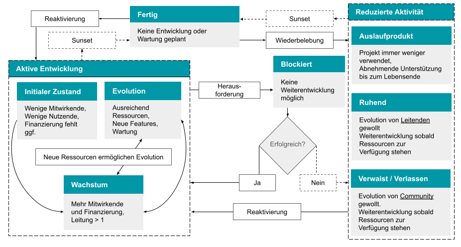
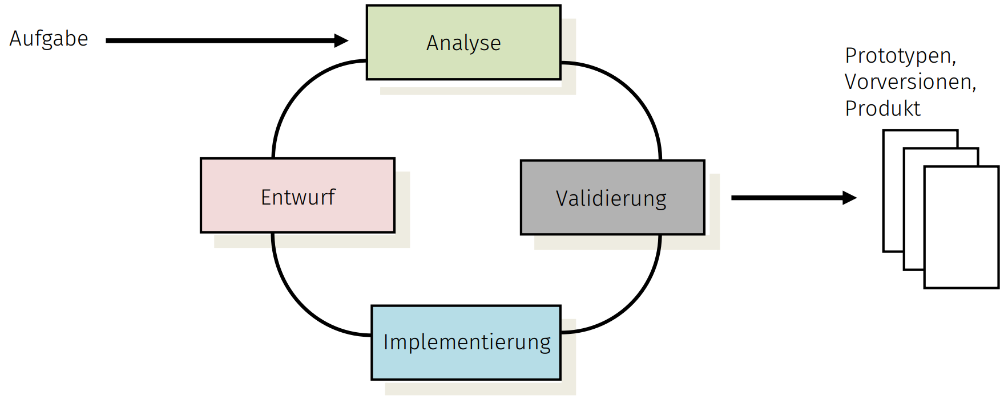

# GI- und de-RSE Muster-Leitlinie für die effiziente Entwicklung von Forschungssoftware
**FINAL V1.0**

*Status: Version 1.0 ist abgenommen und wird aktuell veröffentlicht.*
*Eine Hochglanzversion als pdf ist hier zu finden: [https://dl.gi.de/collections/e491722b-cc33-4155-bcc9-274da9073b65](https://dl.gi.de/collections/e491722b-cc33-4155-bcc9-274da9073b65).*

*Die offizielle Referenzierung:*

\[CEF+25\] A. Czerniak, A. Ehrenhofer, B. Fritzsch, M. Funk, F. Goth, R. Härhnle, C. Haupt, M. Konersmann, J. Linxweiler, F. Lörffler, A. Lürpges, S. Nielebock, B. Rumpe, I. Schieferdecker, T. Schlauch, R. Speck, A. Struck, J. P. Thiele, M. Tichy, I. Ulusoy:
GI- und DE-RSE Muster-Leitlinie zur effizienten Entwicklung von Forschungssoftware.
Gesellschaft für Informatik, Technischer Bericht, GI Leitlinien, DOI 10.18420/2025-gi\_de-rse, Gesellschaft für Informatik e.V., Jan. 2025\.

*Inhaltlich ist diese Fassung identisch (und zB als Quelle gut nutzbar)*

*\[\[Vorab erläuternde Anmerkungen: Das aktuell vorliegende Dokument enthält einen Vorschlag für Leitlinien, die zur Softwareentwicklung in Forschungsprojekten dienen sollen. Diese beinhalten fachliche Themen, aber auch organisatorische Aspekte und sind zum Teil spezifisch in Bezug auf Unterstützung durch die eigene Universität, Hochschule oder Forschungseinrichtung auszugestalten bzw. Inhaltlich anzupassen.*

*Der Arbeitskreis Leitlinien (siehe [https://fg-rse.gi.de/fachgruppe/arbeitskreise](https://fg-rse.gi.de/fachgruppe/arbeitskreise) und [https://de-rse.org/de/working\_groups.html](https://de-rse.org/de/working_groups.html)) hat dieses Dokument erstellt, um Universitäten, Hochschulen und Forschungseinrichtungen Material für eigene Versionen von Leitlinien anzubieten. Den Mitgliedern des Arbeitskreises ist bewusst, dass eine allgemeingültige Leitlinie für alle Forschungskontexte und Softwareformen nicht erstellt werden kann. Deshalb wurden explizit Varianten und optionale Texte an verschiedenen Stellen in dieses Dokument eingefügt. Darüber hinaus besteht in der „Anwendung“ dieses Dokuments immer die Möglichkeit, Texte umzugestalten.*

*Das Thema KI, insbesondere LLMs wie ChatGPT, wird natürlich zurzeit an vielen Stellen diskutiert. In den internen Diskussionen wurde festgelegt, dass das Thema noch weiterer Diskussionen bedarf und aufgrund der hohen Dynamik des Feldes aktuell stabile Leitlinien noch nicht wirklich gut möglich sind. Wir gehen davon aus, dass das Thema LLMs in und für die Softwareentwicklung, sowie das Thema KI in Softwareprodukten (und ja, das sind jeweils verschiedene Themen) eigenständig adressiert werden. Jedoch gelten für den Einbau von KI in Softwareprodukte sicherlich die gleichen Regeln wie für alle anderen Komponenten: Qualität, Korrektheit, Nachvollziehbarkeit, etc. Der neue Abschnitt 2.4. beinhaltet hierzu eine Abgrenzung.*

*Sollten Sie in der aktuellen Phase des Dokument-Reviews relevante zusätzliche Textstücke oder Verbesserungen finden, die von allgemeinem Nutzen sind, so bitten wir um entsprechende konstruktive Vorschläge (d. h. konkrete Texte, konkrete Verbesserungsvorschläge).*

*Kommentierbare und bearbeitete Quelle dieses Dokuments (bis auf weiteres):*
	*[https://docs.google.com/document/d/1cSTJcX5NMxuYFwONtPLBiLhU5ogdbh-LEZgR3-vwiEI](https://docs.google.com/document/d/1cSTJcX5NMxuYFwONtPLBiLhU5ogdbh-LEZgR3-vwiEI)*

*Letzte Historie/Aktivitäten an diesem Dokument:*

* *Gesamtfassung V0.8 wurde erstellt am 11\. Mai 2024*
* *Gesamtfassung V0.9.1 wurde erstellt am 25\. Mai 2024*
* *Fassung 0.9.3 ist aktuell weitgehend abgeschlossen*
* *Fassung 0.9.4 ist abgeschlossen und wartet auf ein Votum der Gremien*
* *de-RSE hat darüber abgestimmt und das Dokument genehmigt.*
* *der GI-Gremienlauf ist mit Version 0.9.9 unterwegs*
* *verabschiedet: V1.0 ist rausgegeben*

*Nächste Schritte / Plan:*

* *Verabschiedung und Veröffentlichung sind erfolgt*

*Ende Anmerkungen\]\]

## Inhaltsverzeichnis

[Präambel: Zweck dieser Muster-Leitlinie](#praambel-zweck-dieser-muster-leitlinie)

[Nutzung der Muster-Leitlinie & Lizenz](#nutzung-der-muster-leitlinie-und-lizenz)

[Mitwirkende und Dank für die Mitarbeit](#mitwirkende-und-dank-fur-die-mitarbeit)

[Wichtigste genutzte Quellen](#wichtigste-genutzte-quellen)

[1 Executive Summary (für Entscheidende)](#1-executive-summary-fur-entscheidende)

&ensp; [1.1. Lesehinweise](#11-lesehinweise)

[2 Einleitung](#2-einleitung)

&ensp; [2.1. Charakteristika von Software, speziell Forschungssoftware](#21-charakteristika-von-software-speziell-forschungssoftware)

&ensp; [2.2. Charakteristika von Research Software Engineering](#22-charakteristika-von-research-software-engineering)

&ensp; [2.3. Aufgaben der Leitlinie](#23-aufgaben-der-leitlinie)

&ensp; [2.4. Abgrenzung, Nicht-Aufgabe der Leitlinie](#24-abgrenzung-nicht-aufgabe-der-leitlinie)

&ensp; [2.5. Damit abgestimmte Rahmen Guidelines for Safeguarding, Good Research Practice, Code of Conduct-Bedingungen](#25-damit-abgestimmte-rahmen-guidelines-for-safeguarding-good-research-practice-code-of-conduct-bedingungen)

&ensp; [2.6. Fazit](#26-fazit)

[3 Fachliche Leitlinien der Softwareentwicklung](#3-fachliche-leitlinien-der-softwareentwicklung)

&ensp;[3.1. Einleitung](#31-einleitung)

&ensp;&ensp;[3.1.1. Forschungssoftware: Demonstrator, Produkt, Infrastruktur](#311-forschungssoftware-demonstrator-produkt-infrastruktur)

&ensp;[3.2. Kategorisierung von Forschungssoftware](#32-kategorisierung-von-forschungssoftware)

&ensp;&ensp;[3.2.1. Art der Software bzw. Softwarekomponente (Dimension Art)](#321-art-der-software-bzw-softwarekomponente-dimension-art)

&ensp;&ensp;[3.2.2. Nutzungsgrad der Software bzw. Softwarekomponente](#322-nutzungsgrad-der-software-bzw-softwarekomponente-dimension-ng)
[(Dimension Ng)](#322-nutzungsgrad-der-software-bzw-softwarekomponente-dimension-ng)

&ensp;&ensp;[3.2.3. Einordnung in die Technology Readiness Levels (TRL) entsprechend der EU](#323-einordnung-in-die-technology-readiness-levels-trl-entsprechend-der-eu)

&ensp;&ensp;[3.2.4. Anwendungsklassen](#324-anwendungsklassen)

&ensp;&ensp;[3.2.5. Status der Software](#325-status-der-software)

&ensp;&ensp;[3.2.6. Weitere Einflüsse](#326-weitere-einflusse)

&ensp;[3.3. Minimalanforderungen an Kernkompetenzen, Entwicklungsprozesse und Projektplanung in der Softwareentwicklung](#33-minimalanforderungen-an-kernkompetenzen-entwicklungsprozesse-und-projektplanung-in-der-softwareentwicklung)

&ensp;&ensp;[3.3.1. Minimalanforderungen an den Technologie-Reifegrad auf Basis des Nutzungsgrads (Ng) und der Softwareart (Art)](#331-minimalanforderungen-an-den-technologie-reifegrad-auf-basis-des-nutzungsgrads-ng-und-der-softwareart-art)

&ensp;&ensp;[3.3.2. Minimalanforderungen an Handlungsfelder und notwendige Kernkompetenzen in der Softwareentwicklung auf Basis des Technologie-Reifegrads](#332-minimalanforderungen-an-handlungsfelder-und-notwendige-kernkompetenzen-in-der-softwareentwicklung-auf-basis-des-technologie-reifegrads)

&ensp;[3.4. Methodische Grundlagen der Softwareentwicklung](#34-methodische-grundlagen-der-softwareentwicklung)

&ensp;&ensp;[3.4.1. Softwareentwicklungsprozesse](#341-softwareentwicklungsprozesse)

&ensp;&ensp;[3.4.2. Qualitätsmanagement (Testen, Validierung, etc.)](#342-qualitatsmanagement-testen-validierung-etc)

&ensp;&ensp;[3.4.3. Anforderungen verstehen](#343-anforderungen-verstehen)

&ensp;&ensp;[3.4.4. Softwarearchitektur](#344-softwarearchitektur)

&ensp;&ensp;[3.4.5. Softwaremodellierung](#345-softwaremodellierung)

&ensp;&ensp;[3.4.6. Versionierung](#346-versionierung)

&ensp;&ensp;[3.4.7. Testkonzept und -Automatisierung](#347-testkonzept-und-automatisierung)

&ensp;&ensp;[3.4.8. Management der Software-bezogenen Daten und Datengrundlage](#348-management-der-software-bezogenen-daten-und-datengrundlage)

&ensp;&ensp;[3.4.9. Best Practices, Design Pattern, Issue-Tracking, Coding Guidelines](#349-best-practices-design-pattern-issue-tracking-coding-guidelines)

&ensp;[3.5. Technische Grundlagen](#35-technische-grundlagen)

&ensp;&ensp;[3.5.1. Git Versionsverwaltungssystem](#351-git-versionsverwaltungssystem)

&ensp;&ensp;[3.5.2. Continuous Integration / Continuous Delivery](#352-continuous-integration-continuous-delivery)

&ensp;&ensp;[3.5.3. Test-Frameworks](#353-test-frameworks)

&ensp;&ensp;[3.5.4. Verbreitung / Dissemination](#354-verbreitung-dissemination)

&ensp;&ensp;[3.5.5. Software Discovery](#355-software-discovery)

[4 Lizenz-Vergabe und -Nutzung (Juristische Absicherung)](#4-lizenz-vergabe-und-nutzung-juristische-absicherung)

&ensp;[4.1. Wissenschaftliche Verwertung und Lizenzwahl -- Allgemeines](#41-wissenschaftliche-verwertung-und-lizenzwahl-allgemeines)

&ensp;[4.2. Anmerkungen zur wirtschaftlichen Verwertung](#42-anmerkungen-zur-wirtschaftlichen-verwertung)

&ensp;[4.3 Lizenz-Arten](#43-lizenz-arten)

&ensp;&ensp;[4.3.1 Open Source Lizenzen](#431-open-source-lizenzen)

&ensp;&ensp;[4.3.2 Permissive Open Source Lizenzen](#432-permissive-open-source-lizenzen)

&ensp;&ensp;[4.3.3  Copyleft Open Source Lizenzen (Best Practice Beispiele)](#433-copyleft-open-source-lizenzen-best-practice-beispiele)

&ensp;&ensp;[4.3.4  Proprietäre Lizenzen](#434-proprietare-lizenzen)

&ensp;[4.4. Beratungsangebote und Vorgehensweise zur Auswahl](#44-beratungsangebote-und-vorgehensweise-zur-auswahl)

&ensp;[4.5.  Nutzung von Software Dritter](#45-nutzung-von-software-dritter)

&ensp;&ensp;[4.5.1. Rechte und Pflichten durch Lizenzen](#451-rechte-und-pflichten-durch-lizenzen)

&ensp;&ensp;[4.5.2. Kompatibilität von Lizenzen](#452-kompatibilitat-von-lizenzen)

[5. Unterstützungsleistungen durch [[die Universität | Hochschule | das Forschungszentrum | Einrichtung]]](#5-unterstutzungsleistungen-durch-die-universitat-hochschule-das-forschungszentrum-einrichtung)

&ensp;[5.1. Personelle Unterstützung bei der Erstellung und Erweiterung von Forschungssoftware](#51-personelle-unterstutzung-bei-der-erstellung-und-erweiterung-von-forschungssoftware)

&ensp;[5.2. Unterstützungsleistungen bei der langfristigen Pflege von Software](#52-unterstutzungsleistungen-bei-der-langfristigen-pflege-von-software)

&ensp;[5.3. Unterstützungsleistungen in der Weiterbildung](#53-unterstutzungsleistungen-in-der-weiterbildung)

&ensp;[5.4. Würdigung der Research Software Engineers](#54-wurdigung-der-research-software-engineers)

&ensp;[5.5. Unterstützungsleistungen bei Lizenzen](#55-unterstutzungsleistungen-bei-lizenzen)

&ensp;[5.6. Unterstützungsleistungen durch technische Services](#56-unterstutzungsleistungen-durch-technische-services)

&ensp;[5.7. Finanzierung der Unterstützungsleistungen bei der Entwicklung und Pflege von Software](#57-finanzierung-der-unterstutzungsleistungen-bei-der-entwicklung-und-pflege-von-software)

&ensp;&ensp;[5.7.1. Übernahme auf RSE-Zentrums-Kosten (“Universitäts-Software”)](#571-ubernahme-auf-rse-zentrums-kosten-universitats-software)

&ensp;&ensp;[5.7.2 Übernahme auf Kosten der Forschungseinheit (“Instituts-Software”)](#572-ubernahme-auf-kosten-der-forschungseinheit-instituts-software)

&ensp;&ensp;[5.7.3 Ausgestaltung der Unterstützung](#573-ausgestaltung-der-unterstutzung)

&ensp;[5.8. Weitere Unterstützungsleistungen](#58-weitere-unterstutzungsleistungen)

[Referenzen](#referenzen)

[Anhang A: Kategorisierungsmöglichkeiten](#anhang-a-kategorisierungsmoglichkeiten)

[Anhang B: Checkliste für die Weitergabe von Software](#anhang-b-checkliste-fur-die-weitergabe-von-software)

[Anhang C: Grundlagen und Mitwirkende](#anhang-c-grundlagen-und-mitwirkende)

## Präambel: Zweck dieser Muster-Leitlinie

Diese Muster-Leitlinie bietet einen Rahmen für die Entwicklung, Verwaltung und Weitergabe von Software an der jeweils nutzenden Universität, Hochschule oder dem Forschungszentrum. Sie eignet sich auch für standortübergreifende Verbundforschungsvorhaben, insbesondere wenn die Projektbeteiligten der verschiedenen Universitäten, Hochschulen und Forschungszentren kompatible Fassungen nutzen.

Der Fokus der Muster-Leitlinie liegt auf dem Schaffen eines softwaretechnischen Rahmens für die Entwicklung, ohne zu sehr in fachspezifische Anforderungen einzelner Forschungsgebiete zu gehen. Sie ist vollständig kompatibel mit den Richtlinien der DFG \[DFG22\] und bietet Präzisierungsoptionen insbesondere die DFG-Handreichung zum Umgang mit Forschungssoftware \[DFG24\]. Es ist daher normalerweise sinnvoll, diese Aspekte in spezifischen Leitlinien nach den spezifischen Anforderungen der Einrichtung oder der Fachdomäne genauer auszuformulieren. Ein Beispiel hierfür sind erhöhte Anforderungen an Medizinprodukte. Andere, auch fachübergreifende Themen, die weniger dem softwaretechnischen Rahmen zuzuordnen sind, stehen hier nicht im Fokus und sollten daher vor allem in Abhängigkeit der Bedarfe der jeweiligen Institution zusätzlich betrachtet werden.

**Research Software Engineering** (kurz: RSE) ist die Verwendung von Software Engineering (SE)-Praktiken für Forschungssoftware, d. h. Software, die für wissenschaftliche Forschungsprojekte erstellt wurde und hauptsächlich in diesen verwendet wird. \[Wik24b\]

RSE ist dabei nicht einfach eine Teilmenge der klassischen Softwaretechnik, sondern beinhaltet als Schnittstellendisziplin Elemente der Informatik (insbesondere Programmierung und Softwaretechnik), der verschiedenen Fachwissenschaften und der Offenen Wissenschaft (Open Science) \[Lam24\].

Konsequenterweise bildet sich aktuell in Deutschland der Begriff „Research Software Engineers“ als eigenständiges Berufsprofil heraus \[GAB+24\], welches sich als Mischung aus der eigentlichen Forschungsdomäne (MINT, Geologie, Robotik, Medizintechnik, Soziologie, etc.) und von Software Engineering-Methoden zusammensetzt. RSE ist nicht identisch, aber verwandt zu High-Performance Computing (HPC), Computational Science and Engineering (CSE), Artificial Intelligence oder Data Science, weil es sowohl eigenständige Ziele als auch Methoden zur Zielerreichung hat.

Aufgrund der gestiegenen Relevanz und Komplexität der Forschungssoftware in einer Vielzahl an Forschungsvorhaben, sowie der häufig notwendigen Zuverlässigkeit und Langlebigkeit hat sich gezeigt, dass die effiziente und qualitativ hochwertige Erstellung von Software auch für Forschungssoftware eine Reihe von **organisatorischen, methodischen und juristischen Maßnahmen** erfordert.

Mit dem nachfolgenden Dokument wird ein Vorschlag für die Ausprägung eigener Leitlinien innerhalb von Universitäten, Hochschulen und Forschungseinrichtungen gemacht. Dieser versucht einerseits konkrete Hilfestellungen für die Definition eigener Leitlinien und andererseits den unterschiedlichen Kulturen in einzelnen Fächern und Forschungseinrichtungen durch explizite Variabilität Freiraum zur weiteren Präzisierung zu geben. Dennoch ist dieses Dokument  für Leitlinien relativ detailliert und ausführlich, weil es im Bereich RSE viel zu klären und zu verstehen gibt, sowie zahlreiche auswählbare Alternativen existieren. Die tatsächlich “selektierte” Leitlinie wird damit deutlich weniger umfangreich.

Diese Muster-Leitlinie sollte daher genutzt werden, um daraus ein eigenständiges Dokument zu selektieren und dieses in der eigenen Universität, Hochschule oder Forschungseinrichtung idealerweise zur Leitlinie zu erklären. Sie konzentriert sich ausschließlich auf den Softwareentwicklungsteil und vernachlässigt den Forschungsteil in “RSE”, der ggf. eigene Leitlinien hat, die aber wegen der hochgradigen Individualität nicht Teil dieses Dokuments sein können.

Daraus ergeben sich sowohl Konsequenzen für die Leitungen zur organisatorischen Unterstützung, als auch für die operativ in der Softwareentwicklung tätigen Personen. Diese Leitlinien wurden auf der Basis des bisher destillierten Wissens (Stand 2024\) über die Entwicklung von Software im Allgemeinen (Software Engineering) und Forschungssoftware im Speziellen (Research Software Engineering) erstellt. Es ist geplant, diese Leitlinien regelmäßig weiterzuentwickeln und neue Erkenntnisse einfließen zu lassen.

Diese variantenreiche Muster-Leitlinie zur Entwicklung von Forschungssoftware wurde seitens des gleichnamigen Arbeitskreises der gemeinsamen Fachgruppe RSE der Gesellschaft für Informatik e. V. (GI) und der Gesellschaft für Forschungssoftware e. V. (de-RSE) erarbeitet.

Die Muster-Leitlinie des de-RSE und der GI wird explizit unterstützt durch den Fachausschuss Medizinische Informatik der GMDS – Deutsche Gesellschaft für Medizinische Informatik, Biometrie und Epidemiologie e.V. und die Arbeitsgruppe Medizinische Software und Medizinprodukterecht (MSM) der TMF – Technologie- und Methodenplattform für die vernetzte medizinische Forschung e.V..

### Nutzung der Muster-Leitlinie und Lizenz

Die Personen, die zu diesem Dokument beigetragen haben, sind unter Mitwirkende aufgezählt. Soweit gesetzlich möglich, verzichten die Personen, die diese Guideline mit CC0 1.0 DEED assoziiert haben, auf alle Nutzungs- und Verwertungsrechte an dieser Guideline. Die Lizenz ist unter [https://creativecommons.org/publicdomain/zero/1.0/](https://creativecommons.org/publicdomain/zero/1.0/) zu finden.

Zwar besteht keine Zitationspflicht, jedoch würden sich die Autor:innen wünschen, auf diesem Muster-Dokument basierte Leitlinien mit dem Hinweis zu versehen: “Erstellt auf Basis der Muster-Leitlinien der GI-Fachgruppe RSE und de-RSE, Version 1.0”.

Alle Formulierungen können daher frei übernommen werden. Lücken in den Formulierungen sind mit \[\[...\]\] markiert. Stehen Alternativen zur Auswahl, so sind diese markiert mittels \[\[Text 1 | Text 2\]\], zum Beispiel in \[\[ Universität | Hochschule | Forschungszentrum \]\]. Komplette, alternative Passagen sind markiert als

\[\[Variante A1\]\]
	Text Passage 1
\[\[Variante A2\]\]
	Text Passage 2
\[\[Variante A Ende\]\]

Optionale Texte werden analog markiert:

\[\[Option B\]\]
	Optional nutzbarer Text
\[\[Option B Ende\]\]

Darüber hinaus sind gegebenenfalls \[\[Regieanweisungen\]\] in den Text eingestreut:

\[\[Anmerkung für Leitlinienerstellende/Hochschullleitungen: Die gesamte Präambel (also dieser Abschnitt 0\) ist nicht Teil der eigentlichen Leitlinie und daher zu löschen \]\]

Eine Leitlinie zur Forschungssoftwareentwicklung besteht sinnvollerweise aus den folgenden Abschnitten, ggf. ergänzt durch weitere Abschnitte, die auch verwandte Themen integrieren. Aus diesem Grund ist diese Muster-Leitlinie auch genauso organisiert. Zweck und Inhalt der Abschnitte ist jeweils:

1. Executive Summary ist **vor allem für Entscheidende und Führungspersonal**.
2. Einleitung beschreibt Software-Charakteristika, Research Software Engineering und skizziert die Aufgaben und Anwendungsbereiche der Leitlinie.
3. Methodische und fachliche Grundsätze zur Forschungssoftwareentwicklung beschreiben Definition von verschiedenen Klassifikationen (u.a., TRL-Level, Anwendungsklassen), dafür jeweils notwendige Mindeststandards und Maßnahmen methodischer und organisatorischer Art sowie die Umsetzung der Software-Weitergabe.
4. Rechtliche Fragen behandeln die Nutzung und Definition von Lizenzen und deren Konsequenzen.
5. Organisatorische Unterstützungsleistungen durch \[\[die Universität | die Hochschule | das Forschungszentrum\]\] beinhalten unter anderem methodische Unterstützung durch Expert:innen, personelle Unterstützung durch Entwickler:innen und technische Unterstützung durch Services, sowie Weiterbildungsmaßnahmen für relevantes RSE-Wissen. Fokus liegt dabei sowohl auf der Befähigung von Forschenden mit dem Ziel der Unterstützung bei der Entwicklung, als auch bei der Pflege der Software als Infrastruktur.
6. Anhang

Darüber hinaus gibt es natürlich eine Reihe von fachspezifischen Ergänzungen. Falls diese die gesamte Forschungseinheit betreffen, so bietet sich ein Einbau oder ein entsprechender Verweis innerhalb dieser Leitlinien natürlich an. Verweise auf fachspezifische Leitlinien zur Behandlung von Verlässlichkeit (Safety), Cybersecurity, etc. sind da gegebenenfalls relevant. Gibt es mehrere verschiedene fachspezifische Ergänzungen (Hinweise auf Verfahren, Normen, etc.) ist es wahrscheinlich sinnvoller, diese in eigenen, ergänzenden Richtlinien zu dokumentieren.

### Mitwirkende und Dank für die Mitarbeit

Siehe dazu Anhang C, der gern Teil einer finalen Leitlinie sein kann.

Wir freuen uns auch über eine Rückmeldung, an welcher Universität, Hochschule, Forschungszentrum der Text in welcher Form zum Einsatz kommt, welche Erfahrungen man macht, was verbessert werden kann.

### Wichtigste genutzte Quellen

In die Erstellung dieses Leitlinien-Vorschlags sind im Besonderen die folgenden Dokumente eingeflossen:

* Umgang mit Forschungssoftware im Förderhandeln der DFG. \[DFG24\]
* Guidelines for the development and distribution of software at Forschungszentrum Jülich. \[BOSS22\]
* Muster-Richtlinie Nachhaltige Forschungssoftware an den Helmholtz-Zentren. \[BBB19\]
* Research Software Engineering \- Forschungssoftware effizient erstellen und dauerhaft erhalten. \[GLHR24\]
* Software-Engineering-Empfehlungen des DLR (1.0.0) \[SMH18\]
* Nutzung von Open-Source-Software im DLR. 2022\.  \[DLR22\]
* Research Software Alliance (ReSA) Web Collection of Guidelines. \[RESA24\]

\[\[Anmerkung für Leitlinienerstellende/Hochschullleitungen: Ende der Präambel: bis hier kann gelöscht werden, denn die Präambel ist nicht Teil der eigentlichen Leitlinie. Aus diesem Grund werden relevante Teile der Präambel in der eigentlichen Einleitung wiederholt.\]\]

## **1. Executive Summary (für Entscheidende)**

\[\[Anmerkung für Leitlinienerstellende/Hochschullleitungen: Das Executive Summary soll eine kurze Zusammenfassung des Inhalts darstellen und vor allem Entscheidenden einen Überblick geben. Das Dokument ist jedoch variantenreich, was gegebenenfalls die Anpassung der Zusammenfassung erfordert\]\]

\[\[Anmerkung für Leitlinienerstellende/Hochschullleitungen: Kapitel 2\]\]

→→ Für Führungskräfte und Entscheidende (= Instituts-, Lehrstuhl-Leiter:innen) besonders relevante Teile sind im Dokument grün markiert. ←←

Software ist sowohl ein zentraler Bestandteil, ein Werkzeug als auch ein wichtiges Ergebnis der modernen akademischen Forschung. Sie sollte langlebig und nachvollziehbar nutzbar sein und besitzt aufgrund kontinuierlichen Ausbaus mittlerweile oft eine hohe Komplexität. Auch deshalb hat die DFG im Oktober 2024 die Handreichung zum Umgang mit Forschungssoftware \[DFG24\] herausgegeben, zu der diese Richtlinien als vollständig kompatible organisatorische und fachliche Präzisierung zu verstehen sind.

**Forschungssoftware** umfasst alle Formen von Beschreibungen, Dokumentation, ausführbaren Modellen, Konfigurationsdateien, darin eingebettete Daten/-sätze, Skripte und daraus generierte ausführbare Programme, die im Rahmen der Forschung oder für Forschungszwecke entwickelt und genutzt werden. \[GKL+21\]

**Research Software Engineering** (kurz: RSE) ist die Verwendung von Software Engineering (SE)-Praktiken für Forschungssoftware, d. h. Software, die für wissenschaftliche Forschungsprojekte erstellt wurde und hauptsächlich in diesen verwendet wird. \[Wik24b\]

RSE ist dabei nicht einfach eine Teilmenge der klassischen Softwaretechnik, sondern beinhaltet als Schnittstellendisziplin Elemente der Informatik (insbesondere Programmierung und Softwaretechnik), der verschiedenen Fachwissenschaften und der Offenen Wissenschaft (Open Science) \[Lam24\].

RSE adressiert daher die organisatorische, fachliche und methodische Einbettung effizienter und qualitativ hochwertiger Softwareentwicklung in den Forschungsprozess. Das bedeutet, dass alle jeweils relevanten Entwicklungsaktivitäten unter der Berücksichtigung der wissenschaftlichen-technischen Zielsetzung und jeweiliger Richtlinien und Normen so gewählt werden, dass die Qualität des Ergebnisses und Effizienz der Entwicklung (also Arbeitzeit pro Output)  adäquat adressiert werden.

Dies beinhaltet die professionelle **Qualifikation der Entwickelnden**, um gegebenenfalls **Projektplanung, fachliche Anforderungen, fachliche und informationstechnische/mathematische Korrektheit, Architektur, Entwurf, Modellierung, Konstruktion, Programmierung, Qualitätssicherung, Dokumentation, Optimierung, Evolution, Wartung, Versionierung, Bereitstellung in Varianten und Nachnutzung** ökonomisch und ökologisch effizient zu managen und damit zu nachhaltiger Forschungssoftware beizutragen. Hervorzuheben sind Aktivitäten wie:

* Projektmanagement,
* Architektur und Entwurf, also die Strukturierung der Funktionalität in modulare, wiederverwendbare und parallel entwickelbare Einheiten, sowie die kluge Einbeziehung bereits entwickelter (möglicherweise externer) Softwarekomponenten,
* das Erfassen und Festlegen der funktionalen und technischen Anforderungen von allen Stakeholdern (Entscheidende, Fördergeber, Nutzende und Entwickler:innen) an die Software,
* die Auswahl der Nutzungsbestimmungen und Lizenzen und die Absicherung der Kompatibilität der Lizenzen eigener und möglicherweise externer Softwarekomponenten sowie
* Qualitätssicherung, also Verifikation und Validierung (u.a. Korrektheit, Nutzbarkeit, Wartbarkeit) der Software und damit der wissenschaftlichen Erkenntnisse.

RSE hat ein **eigenständiges Berufsprofil** und eine eigene Fachcommunity mit den notwendigen üblichen Austauschformaten wie Konferenzen und Workshops.

Diese Leitlinie \[\[der Universität | Hochschule | des Forschungszentrums\]\] definiert einen praktischen und handlungssicheren Rahmen, in dem sich Mitarbeitende bei der Entwicklung von Software bewegen können. Sie trägt unterstützend dazu bei, qualitativ hochwertige Forschungssoftware effizient zu entwickeln, zu verwalten und damit wissenschaftliche Wirkung zu erzielen. Die Leitlinie unterstreicht die Wertschätzung für qualitativ hochwertige Software in einer sich digitalisierenden Wissenschaft und unterstützt eine Professionalisierung der Softwareentwicklung im Forschungskontext. Sie fördert die langlebige Nutzbarkeit von Forschungssoftware, deren Veröffentlichung und Weiterverwendbarkeit und damit eine gute wissenschaftliche Praxis durch Verifizierbarkeit und Reproduzierbarkeit von Forschungsergebnissen.

Die Leitlinie beinhaltet **allgemeine Richtlinien** sowie auch **konkrete organisatorische Maßnahmen** zur Entwicklung, Weiterentwicklung und Pflege der Software, die juristische **Absicherung der Lizenzierung** für die Weitergabe der Software als Forschungsergebnisse an die Öffentlichkeit bzw. die Fachcommunity und Unterstützungsleistungen der \[\[universitären Infrastruktur | Forschungseinrichtung\]\]. Gegebenenfalls sind zusätzliche fachspezifische Richtlinien und technische Normen zu beachten, die bei kritischer Software wie z.B. in der Medizintechnik eine besondere Rolle spielen.

\[\[Anmerkung für Leitlinienerstellende/Hochschullleitungen: Quelle: Kapitel 3 (allgemein gehalten weil ja Variantenreichtum, also viele Alternativen existieren\]\]

**Kapitel 3:** Die Leitlinien enthalten eine **Kategorisierung der Software** nach Nutzungsgrad, Art der Software (Demonstrator, Produkt, Infrastruktur) und Technology-Readiness (TRL gemäß EU-Klassifikation), weil diese auch die notwendigen Entwicklungsaktivitäten bestimmen. Es ist sinnvoll, die Ziele von Forschungssoftware und die langfristige Strategie frühzeitig festzulegen, um auf dieser Basis unterschiedliche Entwicklungsmethoden auszuwählen und relevante Kompetenzen  der Entwickler:innen sicherzustellen. Die Leitlinien definieren dazu **Minimalanforderungen an Kompetenzen, Entwicklungsprozesse und Projektplanung** in der Softwareentwicklung und legen so auch das Qualifikationsprofil der Beteiligten und die Verfügbarkeit technischer Services, wie etwa Versionskontrolle oder Fehlermanagementsysteme fest. Eine Ausdifferenzierung der Kompetenzen bei mehreren Projektbeteiligten ist dabei sinnvoll.

Die Leitlinien beinhalten damit eine erste Handreichung für Führungskräfte(\!) und Entwickler:innen, um ihre Software einzuordnen und daraus abzuleiten, was für die Entwicklung an Grundwissen und Fähigkeiten vorhanden sein muss und welche Techniken / Werkzeuge eingesetzt werden sollen.

\[\[Anmerkung für Leitlinienerstellende/Hochschullleitungen: Quelle: Kapitel 4 (Lizenzen)\]\]

**Kapitel 4:** Um die effiziente Entwicklung von Forschungssoftware mit hohen Qualitätsstandards zu unterstützen, gestaltet \[\[die Universität | die Hochschule | das Forschungszentrum\]\] den regulatorischen Rahmen aus und stellt \[\[Beratungs-, Unterstützungs- und Weiterbildungsangebote\]\] bereit.

Für die Auswahl der Lizenzen, unter denen eigene Forschungssoftware zur Verfügung gestellt werden kann, werden die wichtigsten vorgestellt, die einen Großteil auftretender Fälle abdecken sollten und von \[\[der Universität | der Hochschule | dem Forschungszentrum\]\] als verwendbar angesehen werden.  Dazu gehören permissivere und restriktivere Open Source Lizenzen.

\[\[Anmerkung für Leitlinienerstellende/Hochschullleitungen: Quelle: Kapitel 5 (Unterstützungsangebote)\]\]

*\[\[Anmerkung für Leitlinienersteller: Ein “RSE-Zentrum” ist nach informellen Aussagen (Stand Mai 2024\) ein auch von der DFG angeregtesKonstrukt, das die Relevanz des Themas RSE adäquat adressiert und in Kombination mit Forschungsanträgen förderfähig werden soll. Details siehe Kapitel 5.\]\]  \[\[Ende Anmerkungen\]\] \[\[Variante Zentrum\]\]*

**Kapitel 5:** Weil viele Softwareentwickler:innen ihre Heimat als Wissenschaftler:innen in der Fachdomäne sehen, ist Softwareentwicklung ein zusätzliches Qualifikationsmerkmal, das Personen-individuell unterschiedlich ausgeprägt ist. Deshalb ist die Bereitstellung und Nutzung der methodischen Hilfsangebote sowie der Werkzeuge und technischen Services \[\[der Universität | der Hochschule | des Forschungszentrums\]\] sehr wichtig, um die gesteckten Ziele der Softwareentwicklung zu erreichen. Darauf wird in der DFG-Handreichung \[DFG24\] explizit hingewiesen und dafür auch die Förderfähigkeit geklärt.

\[\[Die Universität | Die Hochschule | Das Forschungszentrum \]\] bietet deshalb kontinuierlich verbesserte und ausgebaute Angebote, die die Entwicklung unterstützen. Dazu gehören

* Konzeptionierung, Entwicklung, Weiterentwicklung und Wartung von Forschungssoftware durch professionelle Research Software Engineers in Zusammenarbeit mit Forschenden, also den Mitentwickelnden und gleichzeitig Nutzer:innen von Forschungssoftware (im Rahmen personeller Verfügbarkeit),
* die technische Aufwertung vorhandener Forschungssoftware durch Verbesserungsmaßnahmen (Architektur, Security, Safety, User Experience, etc.),
* organisatorische, fachliche und methodische Beratung für die Softwareentwicklung durch einen Expert:innen-Pool.
* Weiterbildung der in Forschungssoftware involvierten Personen und Teams,
* Beratung im Umgang mit Lizenzen (siehe Kapitel 4),
* Bereitstellung, Betrieb und Wartung technischer Ressourcen,
* Veröffentlichung von Software und
* weitere Aspekte, bspw. Cybersicherheit, Ethik und Datenschutzfragen.

\[\[Die Universität | Hochschule | Das Forschungszentrum\]\] hat für diese Zwecke \[\[das RSE-Zentrum | dezentrale RSE-Einheiten | RSE-Ansprechpartner\]\]  eingerichtet, \[\[das | die\]\] Forschende aller Fachrichtungen in den oben genannten Punkten durch Beratung und Entwicklungsleistungen unterstützt und förderfähig bei Forschungsanträgen mitfinanziert werden kann. Die \[\[Liste:Bibliothek, das Rechenzentrum, die Rechtsberatung, das Center für Doctoral Studies, die Forschungsdatenmanagementberatung und weitere forschungsnahe Dienstleistungen\]\] werden bei der Umsetzung der Leitlinie eingebunden. Die Finanzierung der RSE-Expert:innen im Bereich der Softwareentwicklung kann (a) durch Übernahme auf RSE-Zentrums-Kosten (“Universitäts-Software”) oder durch (b) Übernahme auf Kosten der Forschungseinheit (“Instituts-Software”) erfolgen und ist abhängig von der Verfügbarkeit. Details regelt ein Vergabeverfahren.

*\[\[Variante Zentrum (siehe auch Kapitel 5)\]\]*

Das RSE-Zentrum koordiniert die Aus- und Weiterbildung von Research Software Engineers sowie die aktive Mithilfe bei der Konzeptionierung, Entwicklung, Weiterentwicklung und Verwaltung von Forschungssoftware, der Etablierung neuer Werkzeuge und allen mit der Entwicklung zusammenhängenden Aktivitäten. Das RSE-Zentrum bietet insbesondere fachliche Unterstützung für dezentrale Forschungseinheiten, die sich eine eigene RSE-Stelle nicht leisten können oder wollen. Die Expert:innen des RSE-Zentrums sind entsprechend für einzelne Zeiträume buchbar und erarbeiten kollaborativ mit den Mitgliedern der Forschungseinheit zielgerichtet gute Software.

*\[\[Ende Variante Zentrum\]\]*

Wichtige technische Services für kollaborative Entwicklung, Dokumentation, Projektmanagement, Ticketverwaltung, Datenverwaltung, Kommunikation, etc. stellt \[\[die Universität | Hochschule | Das Forschungszentrum\]\] via ihren IT-Services zur Verfügung.

### **1.1. Lesehinweise**

Diese Leitlinie richtet sich

* (1) an alle **Entwickler:innen** von Forschungssoftware und
* (2) deren **Führungskräfte** bzw. **Entscheidende**, die \[\[an der Forschungseinrichtung\]\] an der Entwicklung, Verwaltung und Weitergabe von Software direkt oder indirekt beteiligt sind sowie
* (3) an die **Leitung** \[\[der Forschungseinrichtung\]\].

Für Führungskräfte bzw. Entscheidende ist insbesondere die Executive Summary gedacht, die einen Überblick über die relevanten Themen gibt und auch einen Einblick, welche Kompetenzen in den jeweiligen Forschungsprojekten vorhanden sein bzw. ausgebildet werden sollten.

Entwickler:innen erhalten einen Überblick über mögliche verwendbare Themen der Softwareentwicklung, zur Verfügung gestellte Werkzeuge und Hilfsangebote im Sinne von methodischer und Ausbildungsunterstützung sowie Hilfe bei konkreten Fragestellungen.

## **2. Einleitung**

Software ist ein zentraler Bestandteil der Forschung geworden und ist oftmals essentiell für die Durchführbarkeit von Forschungsprojekten. Hohe Datenmengen und durch immer leistungsfähigere Hardware ermöglichte Simulationen stellen Anforderungen an speziell für Forschungszwecke entwickelte Software, die wiederum die Durchführung exzellenter Forschung ermöglicht. Solche Forschungssoftware \[GKL+21\] beinhaltet alle Formen von Quellcodes, Beschreibungen, Dokumentationen, ausführbaren Modellen, Konfigurationsdateien, darin eingebetteten Daten/-sätzen, Skripten und daraus generierte ausführbare Programme, die im Rahmen der Forschung oder für Forschungszwecke \[BHK22\] entwickelt werden.  Auch deshalb hat die DFG im Oktober 2024 die Handreichung zum Umgang mit Forschungssoftware \[DFG24\] herausgegeben, zu der diese Richtlinien als vollständig kompatible organisatorische und fachliche Präzisierung zu verstehen sind.

Research Software Engineering (RSE) adressiert u.a. die Einbettung von Maßnahmen rund um die Forschungssoftware in die Forschungsarbeit. Die *Einbettung* umfasst dabei organisatorische, juristische und insbesondere fachliche und methodische Elemente. Die *Maßnahmen* beziehen sich auf qualitativ hochwertige und effiziente Softwareentwicklung sowie die Qualifikation der Forschenden im Bereich der Softwareentwicklung. Ziel ist es, die Aktivitäten zur Entwicklung der Forschungssoftware ökonomisch effizient zu managen und jene nachhaltig zu erstellen und zu nutzen. Dazu gehören Anforderungsmanagement, Architektur, Entwurf, Modellierung, Konstruktion, Programmierung, Dokumentation, Qualitätssicherung, Evolution, Wartung, Versionierung, Variantenmanagement und Vorbereitung der Nachnutzung.

Zur Definition eines praktischen und handlungssicheren Rahmens, in dem sich Mitarbeitende bei der Entwicklung von Software bewegen können, liegt für \[\[die Universität | die Hochschule | das Forschungszentrum\]\] diese Leitlinie vor, die unterstützend dazu beiträgt, Software mit hohen Qualitätsstandards effizient zu entwickeln, zu managen und damit Forschung zu stärken.

Diese Leitlinie richtet sich

(1) an alle Entwickler:innen von Forschungssoftware und

(2) deren Führungskräfte, die \[\[an der Universität | an der Hochschule | am Forschungszentrum\]\] an der Entwicklung, Verwaltung und Weitergabe von Software direkt oder indirekt beteiligt sind.

Die Leitlinie dient außerdem als Grundlage für

(3) die Verwaltung, die einen juristischen Rahmen für die Weitergabe und Lizenzierung von Forschungssoftware als komplettes oder teilweise eigenständig entwickeltes Softwarepaket \[\[der Universität | der Hochschule | des Forschungszentrums\]\] definiert und so unbürokratisch kooperative Forschungsvorhaben oder Forschungstransfer mittels Weitergabe von Software ermöglicht,

(4) forschungsnahe Serviceeinrichtungen, die einen Rahmen für Beratung, Weiterbildung und ggf. Beteiligung an langfristig nachnutzbarer Entwicklung von Forschungssoftware schaffen, und

(5) die Leitung \[\[der Universität | der Hochschule | des Forschungszentrums\]\] als Organisationsrahmen für die finanzielle und organisatorische Unterstützung der Entwicklung, Pflege und Wartung von Forschungssoftware.

Ziel dieser Leitlinie ist es, einen handlungssicheren und nachhaltigen Umgang mit selbst entwickelter/angepasster Forschungssoftware zu etablieren, die Softwarequalität zu verbessern beziehungsweise diese langfristig zu halten und damit effizientere Forschung mit besserem Impact zu ermöglichen. Dies wiederum erhöht die Wertschätzung qualitativ hochwertiger Software und die Sichtbarkeit und Akzeptanz Forschungssoftware-basierter akademischer Leistungen. Die Leitlinie unterstützt deshalb die Professionalisierung im Bereich der Softwareentwicklung und fördert die  gute wissenschaftliche Praxis im Sinne von Verifizierbarkeit und Reproduzierbarkeit von Forschungsergebnissen in Zusammenhang mit Forschungssoftware.

Diese Leitlinie beinhaltet konkrete organisatorische Maßnahmen zur Entwicklung, Weiterentwicklung und Pflege der Forschungssoftware sowie auch die juristische Absicherung der Lizenzierung für die Weitergabe der Software an die Öffentlichkeit beziehungsweise die Fachcommunity.

### **2.1. Charakteristika von Software, speziell Forschungssoftware**

**Software** beinhaltet im Allgemeinen alle Formen von Quellcodes, Beschreibungen, Dokumentationen, ausführbaren Modellen, Konfigurationsdateien, darin eingebettete/verknüpfte Daten/-sätze, Skripte und daraus generierte ausführbare Programme sowie die Tests und Testbeschreibungen zu ihrer Qualitätssicherung.

**Forschungssoftware** muss also so verstanden werden, dass sie alle Formen von Beschreibungen, Dokumentation, ausführbaren Modellen, Konfigurationsdateien, darin eingebettete/verknüpfte Daten/-sätze, Skripte und daraus generierte ausführbare Programme, die im Rahmen der Forschung oder für Forschungszwecke entwickelt und genutzt werden, umfasst \[GKL+21\].

Zur Abgrenzung wird Software klassischerweise in drei wesentliche Bereiche: Systemsoftware, Anwendungssoftware und Entwicklungswerkzeuge unterteilt. Anwendungssoftware beinhaltet zum Beispiel Office-Produkte wie Textverarbeitung und Tabellenkalkulation. Technische Software und Systemsoftware beinhalten Betriebssysteme, Datenbank- und Kommunikationssoftware und Entwicklungswerkzeuge wie Versionskontrollsysteme oder auch in anderen Softwarearten verfügbare Bibliotheken zur Visualisierung, zum Datentransfer oder zur Datenspeicherung. Sie gehören nicht unter die Kategorie Forschungssoftware, können aber dennoch wesentlicher Bestandteil des Werkzeugkastens von Wissenschaftler:innen sein.

Die Entwicklung von Forschungssoftware (im Folgenden: Software) ist meist Teil eines kreativen Prozesses und generiert in diesem Sinne ausführbares Wissen. Auch deshalb ist Software-Entwicklung im Allgemeinen eine intellektuelle und urheberrechtlich geschützte Leistung und im Kontext der Forschung ein eigenständiges Produkt der wissenschaftlichen Arbeit.

Software ist darüber hinaus ein integraler Bestandteil moderner Publikationen. Deshalb ist ein agil anpassbares Verfahren zur Veröffentlichung und Mitarbeit bei der Entwicklung und Weiterentwicklung von Software \- in Form geeigneter Lizenzen und Kooperationsverträge \-  essenziell.

Forschungssoftware kann einem langen, evolutionären Weiterentwicklungsprozess unterliegen. Neben dem Hinzufügen neuer Funktionen oder anderer Formen ausführbaren Wissens wird die Ausführungseffizienz optimiert, der Nutzungsbereich verallgemeinert oder die in Software immer vorhandenen Fehler behoben. Evolutionäre und qualitativ hochwertige Weiterentwicklung ist zeitlich aufwändig und bedarf anderer methodischer Vorgehensweisen als die initiale Erstellung.

Die bei der Entwicklung von Forschungssoftware involvierten Wissenschaftler:innen (Research Software Engineers) sind bei den Ergebnissen der wissenschaftlichen Arbeit zu würdigen. So ist gemäß den Standards guter wissenschaftlicher Praxis (vgl. Leitlinie 14 \[DFG22\]) bei Publikationen, deren Erkenntnisse wesentlich auf der Basis der Forschungssoftware entstanden sind, eine gemeinsame Autorenschaft geboten. Siehe auch Abschnitt 5.4.

### **2.2. Charakteristika von Research Software Engineering**

Die meisten Wissenschaftler:innen, die Software entwickeln, sind keine ausgebildeten Softwareentwickler:innen, sondern exzellente Forscher:innen in ihrer Fachdisziplin. Sie orientieren sich beim Software Engineering häufig an ihrem unmittelbaren Arbeitsumfeld und den Erfahrungen im Kollegium, ohne dabei zwangsläufig die Beratungsangebote, Instrumente, Best Practices und Erfahrungen \[\[der Universität | der Hochschule | des Forschungszentrums\]\] zu kennen, so sie denn existieren.

Um diese Wissenschaftler:innen in ihrer Eigenständigkeit und Handlungsfähigkeit zu unterstützen, bietet RSE ein Bündel von Maßnahmen an, das die Probleme der Softwareentwicklung im Allgemeinen, aber auch unter den akademischen Rahmenbedingungen adressiert. Dabei ist zu beachten, dass fachspezifische und wissenschaftliche Richtlinien hier außen vor gelassen werden, da sich diese Richtlinien ausschließlich auf den Softwareentwicklungsteil konzentrieren:

* Welche Qualitätsattribute sind für eine konkrete Forschungssoftware relevant?
* Wie lässt sich sicherstellen, dass die Software richtig und korrekt funktioniert?
* Wie wird die regulatorische Compliance der Software, bzw. des Softwareentwicklungsprozesses sichergestellt?
* Wie lässt sich die Software effizient entwickeln (Arbeitszeit)?
* Wie lässt sich effiziente Software entwickeln (Compute)?
* Wie kann Software weiterentwickelt und langfristig nutzbar erhalten werden?
* Wie lassen sich Zeitvorgaben und Budgetbeschränkungen einhalten?
* Wie kann Software verallgemeinert werden, um mehr Nutzer:innen zu erreichen?

RSE adressiert die organisatorische, fachliche und methodische Einbettung effizienter und qualitativ hochwertiger Softwareentwicklung unter Einbeziehung aller jeweils relevanten Entwicklungsaktivitäten des Software Engineering. Dies beinhaltet auch die Qualifikation der Entwickelnden, um Anforderungen, Architektur, Entwurf, Modellierung, Konstruktion/Programmierung, Qualitätssicherung, Dokumentation, Evolution, Wartung/Pflege, Versionen, Varianten und Nachnutzung ökonomisch effizient zu managen und damit Forschungssoftware nachhaltig zu erstellen und erhalten.

RSE adressiert dabei mehrere Besonderheiten bei der Entwicklung von Forschungssoftware: Diese ist typischerweise hochspezialisiert und erfordert sowohl in der Entwicklung als auch in der Anwendung entsprechende wissenschaftliche Expertise. Weil die Erkenntnisse fortschreiten und sich damit Forschungsfragestellungen und Versuchsbedingungen signifikant verändern, ist Forschungssoftware außerdem änderungsintensiv. Weil die Community der Nutzenden und Entwickelnden mit der Zeit wächst und sich weltweit organisieren muss, verändern sich Vorgehensweise, technische und organisatorische Rahmenbedingungen, und es potenzieren sich die Vielzahl unterschiedlicher, teilweise in Konflikt stehender und allzu oft nicht präzise ausformulierbarer Anforderungen.

Daraus entstehen spezifische Herausforderungen für die Softwareentwicklung. Die Vorgehensweise der Anforderungserhebung im RSE ist anders zu organisieren, weil diese untrennbar mit dem Forschungsprozess verzahnt ist. Dies hat deutliche Auswirkungen auf die anwendbaren Methoden, zum Beispiel der agilen Entwicklung, das oft notwendige Refactoring der Architektur oder die Qualitätssicherung durch automatisiertes Testen. Forschungsspezifische Qualitätskriterien beinhalten Transparenz und Reproduzierbarkeit der berechneten Ergebnisse und die Nachnutzbarkeit der Software selbst und damit Robustheit, Konfigurierbarkeit und Variabilität sowie die Evolutionsfähigkeit der Software.

### **2.3. Aufgaben der Leitlinie**

Diese Leitlinie bietet einen Rahmen für die Entwicklung, Verwaltung und Weitergabe von Software an \[\[der Universität | der Hochschule | dem Forschungszentrum\]\]. Sie eignet sich auch für standortübergreifende Verbundforschungsvorhaben, wenn die Projektbeteiligten kompatible Fassungen der Leitlinie nutzen. Diese Leitlinie

* legt grundsätzliche Anforderungen an die Entwicklung, Verwaltung und Weitergabe von Software fest (Kapitel 3),
* definiert das sinnvolle und notwendige Grundwissen von Wissenschaftler:innen, die Forschungssoftware in der jeweils gebotenen Qualität effizient zu entwickeln (Kapitel 3),
* beschreibt praktische sowie organisatorische Abläufe (Kapitel 3),
* liefert eine Entscheidungsgrundlage zur Wahl geeigneter Lizenzen (Kapitel 4),
* legt fest, wie \[\[die Universität | die Hochschule | das Forschungszentrum\]\] Forschende in der Entwicklung von Forschungssoftware unterstützt (Kapitel 5\) und
* präzisiert die Handreichung zum Umgang mit Forschungssoftware im Förderhandeln DFG \[DFG24\].

Diese Leitlinie behandelt wesentliche Teile des Software-Lebenszyklus, von der Softwareentwicklung und ihren Teil-Aktivitäten, wie Design, Qualitätssicherung, Abnahme, Dokumentation bis hin zur Archivierung, Weitergabe und Pflege der Software.

Die Leitlinie soll unterstützend dazu beitragen, hohe Standards bei Softwareentwicklung, Softwarequalität und Management zu ermöglichen und gleichzeitig helfen, die beschränkten arbeitszeitlichen Ressourcen der beteiligten Stakeholder effizient einzusetzen. Mit dieser Professionalisierung wird mehr Nachhaltigkeit erreicht, eine bessere Nachnutzung von Investitionen erzielt und eine gute wissenschaftliche Praxis im Sinne von Verifizierbarkeit und Reproduzierbarkeit von Forschungsergebnissen gefördert.

Diese Leitlinie richtet sich an alle Stakeholder an der Softwareentwicklung, vor allem aber an alle Entwickler:innen und Führungskräfte, die an der \[\[Universität | Hochschule | Forschungseinrichtung\]\] an der Nachnutzung, Entwicklung, Verwaltung und Weitergabe von Software direkt oder indirekt beteiligt sind. Ziel der Leitlinie ist es, einen handlungssicheren und nachhaltigen Umgang mit Forschungssoftware zu etablieren, die Softwarequalität zu verbessern, die Entwicklungseffizienz zu steigern und die Wertschätzung für qualitativ hochwertige Software zu erhöhen.

Im Sinne von Open Science sind der Zugang zu und die Nachnutzung von Software die Basis für Nachvollziehbarkeit, Verifizierbarkeit und Reproduzierbarkeit von wissenschaftlichen Ergebnissen. Die FAIR-Prinzipien (Findable, Accessible, Interoperable, Reusable) \[FAIR20\], die für Forschungsdaten gelten, sind entsprechend auch auf Forschungssoftware anzuwenden \[BHK+22\], wobei zusätzlich die Weiterentwicklung, Fehlerkorrektur, Security-Updates und Versionierung der eigentlichen Software, aber auch genutzter Softwarekomponenten, des Betriebssystems, der Firmware und gegebenenfalls der Hardware zu berücksichtigen sind. Deshalb ermutigt \[\[die Universität | die Hochschule | das Forschungszentrum\]\] die Forschenden dazu, Software nach den FAIR Prinzipien für Forschungssoftware beispielsweise als „Open Source“ mit weitgehenden Zugangs- und (Nach-)Nutzungsrechten offen zugänglich zu machen, und dabei die Weiterentwicklung, Fehlerkorrektur, Security-Updates und Versionierung der Software zu berücksichtigen.

### **2.4. Abgrenzung, Nicht-Aufgabe der Leitlinie**

Zu beachten ist, dass die Leitlinie sich nicht mit den spezifischen gesetzlichen und untergesetzlichen Regelungen von Software der Wissenschaftsdomäne befasst. Dafür sind die fachspezifischen weiterführenden Richtlinien und technischen Normen zu beachten, die bei kritischer Software wie z. B. in der Medizintechnik eine besondere Rolle spielen.

Die Leitlinie adressiert nicht die betriebswirtschaftlichen Rahmenbedingungen für den Kauf von Software oder die Kosten der Ausführung von Software auf gemieteter oder gekaufter Hardware. Total Cost of Ownership Betrachtungen zu diesem Themenkomplex finden sich in entsprechender Fachliteratur, zum Beispiel zu “Make Or Buy”-Prozessen oder dem “Not Invented Here Syndrom” der Softwareentwicklung.

\[\[Optional: Abgrenzung zur KI. \-- Dynamisches Feld erlaubt aktuell noch kaum stabile Aussagen\]\]

Das Thema KI, insbesondere die Nutzung von LLMs, wird aktuell sehr intensiv diskutiert. Je nach Betrachtungsweise kann eine LLM-basierte KI einfach nur als weiteres Werkzeug gesehen werden, das bei der Softwareentwicklung unterstützt, um schneller und effizienter Anforderungen in Modelle und Modelle in Code zu übersetzen, Testfälle zu erstellen, Qualitätsprobleme zu identifizieren, Erklärungen und Dokumentation zu generieren, etc. Die Verwendung von LLMs obliegt denselben Regeln wie jedes andere Werkzeug auch, also der Lizenzierung, der Verwertungsregelung, der Plagiat-Vermeidung, etc. Detaillierte Handreichungen hierzu werden mit einer Konsolidierung der LLM-Verwendung und nach einer besseren Klärung des Umgangs damit verfeinert. \[\[Die Universität | der Hochschule | das Forschungszentrum\]\] bietet auch hierzu Beratung und Unterstützung an (Kapitel 5).

Unabhängig davon können KI-Komponenten, also zum Beispiel Neuronale Netze oder Erklärungs-generierende LLMs, in Softwareprodukte eingebaut werden. Hier können die jeweiligen Fachexpert:innen weiterhelfen, denn auch für den Einbau von KI in Softwareprodukte gelten die gleichen Regeln wie für alle anderen Softwarekomponenten zum Thema Qualität, Korrektheit, Nachvollziehbarkeit, etc.

\[\[Option Ende\]\]

### **2.5. Damit abgestimmte Rahmen Guidelines for Safeguarding, Good Research Practice, Code of Conduct-Bedingungen**

Bei der Entwicklung der Leitlinie wurden sowohl interne Rahmenbedingungen als auch weitere Empfehlungen berücksichtigt:

\[\[Varianten: ggf. ergänzen\]\]

* der “GI- und de-RSE-Vorschlag für Leitlinien zur effizienten Entwicklung von qualitativ hochwertiger und langlebiger Forschungssoftware an Universitäten, Hochschulen und Forschungseinrichtungen” \[GI24\]
* Handreichung zum Umgang mit Forschungssoftware der Schwerpunktinitiative Digitale Information der Allianz der deutschen Wissenschaftsorganisationen \[KF18\]

* die DFG-Leitlinien zur Sicherung guter wissenschaftlicher Praxis \[DFG22\]

* die Handreichung: “Umgang mit Forschungssoftware im Förderhandeln der DFG \[DFG24\]
* \[\[Option: die Regeln zur Sicherung guter wissenschaftlicher Praxis, \[hausintern?\] \]\]
* \[\[Option: die internen Vorgaben der „Veröffentlichungsrichtlinie“, \[hausintern?\] \]\]
* \[\[Option: die „Leitlinie Forschungsdaten“, \[hausintern?\] \]\]
* die „Checkliste zur Unterstützung der Helmholtz-Zentren bei der Implementierung von Richtlinien für nachhaltige Forschungssoftware“ des Arbeitskreises Open Science der Helmholtz Gemeinschaft \[MPB+21\].

\[\[Varianten Ende\]\]

### **2.6. Fazit**

Die Implementierung dieser Software-Leitlinie \[\[der Universität | der Hochschule | des Forschungszentrums\]\] ermöglicht den Mitarbeitenden in einem praktischen und handlungssicheren Rahmen, Software mit hohen Qualitätsstandards zu entwickeln und weiterzugeben.

Durch die Einteilung gemäß mehrerer Kategorien, wie zum Beispiel Anwendungsklassen und Technology Readiness Leveln (TRLs), das Aufzeigen von Qualitätsstandards und entsprechend empfohlener Maßnahmen, der Berücksichtigung von möglichen Transferwegen beziehungsweise Lizenzarten und die damit einhergehenden rechtlichen Aspekte wird eine Professionalisierung \[\[in der Universität | in der Hochschule | im Forschungszentrum\]\] in der notwendigen Breite realisiert.

\[\[Optional: Zusagen, die eine moderne Forschungseinrichtung geben sollte\]\]

Ergänzt wird dies durch die \[\[an der Universität | an der Hochschule | am Forschungszentrum\]\] bereitgestellten Entscheidungshilfen und Beratungsangebote für organisatorische und insbesondere methodische Entwicklungsunterstützung.

Interne Schulungsangebote zu Softwareentwicklungs-Methodiken und Best Practices werden hierfür kontinuierlich ausgebaut und nach dem Stand der Technik aktualisiert, um so den wissenschaftlichen Nachwuchs zu hohen Standards in der Softwareentwicklung und Dokumentation zu befähigen.

Komplexe softwaretechnische Fragestellungen werden durch fachliche Expert:innen im Sinne eines Coachings und Trainings-On-The-Job unterstützt. Eine entsprechende Expert:innengruppe ist hierfür \[\[an der Universität | an der Hochschule | am Forschungszentrum\]\] eingerichtet. Die damit verfügbaren Expert:innen sind DFG-förderfähig.

\[\[Ende Optionen\]\]

Mit der durch diese Leitlinie generierten Wirkung wird Nachhaltigkeit und gute wissenschaftliche Praxis bei der Entwicklung und Weitergabe von Software und somit ein Mehrwert in der Gesellschaft, Wirtschaft, Wissenschaft und Politik geschaffen.

## **3. Fachliche Leitlinien der Softwareentwicklung**

Der fachliche Teil der Leitlinien ist für **Führungskräfte und Entscheidende** (= Instituts-, Lehrstuhl-Leiter:innen) sowie auch **Entwickler:innen** bestimmt, um Software effizient und nachhaltig entwickeln zu können.

→→ Für **Führungskräfte und Entscheidende** (= Instituts-, Lehrstuhl-Leiter:innen) besonders relevante Teile sind markiert. ←←

Die Leitlinien beinhalten eine Handreichung für Führungskräfte(\!) und Entwickler:innen, um ihre Software einzuordnen und daraus abzuleiten, was für die Entwicklung an Grundwissen und Fähigkeiten vorhanden sein muss und welche Techniken / Werkzeuge eingesetzt werden sollen.

### **3.1. Einleitung**

Für die Softwareentwicklung existieren sowohl themenübergreifend als auch für einzelne Aktivitäten verschiedene, jeweils gut ausgearbeitete Vorgehensmodelle, Methoden, Praktiken und Werkzeuge, um diese Aktivitäten, von der Erhebung von Anforderungen bis zur Abwicklung eines Softwaresystems, zu unterstützen. Eine umfassende (und daher nicht direkt zu empfehlende) Übersicht über diese Aktivitäten des Software Engineering bietet der „Guide to the Software Engineering Body of Knowledge“ der IEEE Computer Society \[BF14\]. Software Engineering kann gut durch entsprechende Vorlesungen oder Standard-Bücher erlernt werden. Praktische Erfahrung ist dabei sehr relevant. Gute Lesebücher für Entwickler:innen mit gewisser Erfahrung und Interesse an Vertiefung sind z.B. Lichter/Ludewig (“Software Engineering: Grundlagen, Menschen, Prozesse, Techniken”) \[LL23\] oder Sommerville (“Software Engineering”) \[Som18\], sowie ein detailliertes Nachschlagewerk von Balzert/Ebert (“Lehrbuch der Softwaretechnik”) \[Bal25\]. Zahlreiche themenspezifische Bücher sind ebenfalls hilfreich.

→→ Für **Entscheidende** ←←

Auf Basis der besonderen Herausforderungen für Forschungssoftware ist es notwendig, die Ziele von Forschungssoftware und die langfristige Strategie frühzeitig festzulegen, um auf dieser Basis unterschiedliche Methoden zu Erstellung und Management auszuwählen und relevante Entwickler-Kernkompetenzen  sicherzustellen. Wichtiges Element ist dabei, die potentiell unterschiedlichen Ziele aller Stakeholder (u.a. Entwickler:innen, Entscheider:innen, Förderorganisationen und Forschungseinheiten) zu akzeptieren und gemeinsam zu antizipieren. Beispiele sind kurzfristiger Erfolg mit wissenschaftlichen Publikationen versus langlebige, nachhaltig verfügbare Infrastruktur (im Sinne von Forschungssoftware) für weitere Forschungsaktivitäten; diese stehen zum Teil im Widerspruch und können vor allem durch die Anwendung von Techniken im Software Engineering-Portfolio adressiert werden.

Schritt 1: Ziele der Software/des Projekts gemeinsam festlegen. Dazu dienen die in den folgenden Abschnitten definierten Formen der Einordnung bzw. Kategorisierung der Software.

\[\[Anmerkung: manche der vier Schritte sind zu streichen, wenn der entsprechende Abschnitt gestrichen wurde; zum Beispiel ist die Auswahl der Anwendungsklasse nicht mehr notwendig, wenn Dimension und Soll-TRL gewählt wurden.\]\]

→→ Für **Entscheidende** zur Übersicht ←←

Es folgen noch drei weitere Schritte, die Entscheidende durchführen sollten, um die Randbedingungen für die Entwicklungsergebnisse sowie auch die Vorgehensweise zu klären. Die Schritte sind in den nachfolgenden Abschnitten erklärt:

Schritt 2: Klassifikation der Software vornehmen: welche Dimension (Art) und (Ng) soll die Software nach/bei Projektende(\!) haben? Dabei ist auch der bisherige Software-Bestand zu berücksichtigen und geeignete Softwarekomponenten sind effizient weiter zu nutzen bzw. weiterzuentwickeln. (siehe 3.2.2)

Schritt 3: Soll-TRL festlegen oder Vorgabe vom Fördergeber übernehmen und dabei die konkreten Kriterien zu Robustheit, Skalierung, Anbindung an Nachbarsysteme, flexible Erweiterbarkeit, Security, usw. definieren.  (siehe 3.2.3)

Schritt 4: Gewünschte Anwendungsklasse identifizieren. (siehe 3.2.4)

#### **3.1.1. Forschungssoftware: Demonstrator, Produkt, Infrastruktur**

Software, die in Forschungsprojekten entsteht und für darauf aufbauende Forschung weiterverwendet werden soll, nimmt mittelfristig die Rolle von Infrastruktur für die Forschung ein. Nicht jede Software wird Infrastruktur, sondern hat ggf. nur eine beschränkte Reichweite. Deshalb ist frühzeitig zu überlegen, welchen Reifegrad (TRL, siehe unten) die Software erzielen soll. Neben der Festlegung eines Softwareentwicklungsprozesses kann ein Software Management Plan (SMP) helfen, Strukturen und Ziele zu definieren, sodass die Entwicklung einer langlebigen und nachnutzbaren Software gestützt wird.

Die Qualität und Reproduzierbarkeit der mit langlebiger Software erzeugten Forschungsergebnisse hängt ebenso von der eingesetzten Software und ihrer Qualität ab, wie die darauf aufbauenden Arbeiten. Damit bildet diese Art von Software eine durchaus teuer erstellte und deshalb langfristig zu erhaltende Forschungsinfrastruktur, die systematisch, diszipliniert und professionell entwickelt, fortlaufend gewartet und betrieben werden muss (oder eben abgekündigt wird). Software ist immer in einem technischen Kontext im Einsatz: z. B. ist sie für ein Betriebssystem und ggf. eine bestimmte Hardwarearchitektur entwickelt. Sie nutzt idealerweise existierende Programmbibliotheken und Frameworks. Der technische Kontext wird unabhängig vom Forschungsvorhaben laufend weiterentwickelt und steht in der verwendeten Konfiguration irgendwann nicht mehr zur Verfügung. Dadurch entsteht die Notwendigkeit, Forschungssoftware auch aktiv zu warten, wenn Forschungsergebnisse reproduzierbar zu halten sind. Ist die Software nicht wartbar, ist weder die Reproduzierbarkeit der Forschungsergebnisse noch die langfristige Weiternutzung gewährleistet.

Wird Forschungssoftware als Infrastruktur geplant und gewartet, erhöht sich die Effektivität und Effizienz der Forschung. So können wiederkehrende technische Aufgaben schneller entwickelt werden. Neben der Einsparung von Entwicklungsaufwand kann auch der Lernaufwand von Forschenden für die Bedienung und Entwicklung einer Forschungssoftware verringert werden, wenn wiederkehrende oder ähnliche Aufgaben nicht immer neu und anders umgesetzt werden. Durch fortlaufende Qualitätssicherungsmaßnahmen der Forschungssoftware wird die interne Validität des Forschungsprozesses gestärkt.

### **3.2. Kategorisierung von Forschungssoftware**

Forschungssoftware nimmt vielfältige Formen an und kann je nach ihrem Anwendungsbereich und ihrer Zweckbestimmung unterschiedlichen Kategorien zugeordnet werden. Diese Kategorisierung hat eine entscheidende Bedeutung, da sie hilft, die Anforderungen an die Software zu bestimmen und damit eine Grundlage für die Auswahl geeigneter Software Engineering-Methoden bietet. Wir empfehlen die Kategorisierung entlang folgender Dimensionen vorzunehmen:

\[\[Nicht benutzte Teile rausnehmen (siehe nachfolge Varianten 1-4):

* Die Art der Forschungssoftware (Art),
* den Nutzungsgrad (Ng),
* den Reifegrad (Technology Readiness Level gemäß EU-Einteilung (TRL)) und
* der Anwendungsklasse (Ak).

\]\]

\[\[Variante 1: Die Nutzung der Kategorisierung ist optional; spätere Definitionen basieren jedoch darauf\]\]
Fördergeber, wie die DFG in \[DFG24\], empfehlen bei der Antragstellung eine explizite Einordnung des Softwaretyps/der Kategorie und die daraus ableitbare Vorgehensweise beim Entwicklungsprozess und der Pflege der Software.

#### **3.2.1. Art der Software bzw. Softwarekomponente (Dimension Art)**

Eine Dimensionsvariante definiert sich durch die Art der Software, oder stark verwandt damit der Zweckbestimmung der Software. Eine detaillierte Kategorisierung ist in \[HDB+24\] zu finden, deshalb folgt hier nur sehr grobe Unterscheidung, die nicht immer trennscharf ist:

| | |
| :---- | :---- |
| (Art:MSD) | Modellierung/Simulation/Datenanalyse: Software, die Modellierungen von Systemen oder Prozessen darstellt, Simulationen oder komplexe Datenanalysen durchführt. |
| (Art:PoC) | Technology Research Software: Software, die als Proof-Of-Concept (Prototyp) für ein in Erfindung oder Entwicklung befindliches System oder einen Prozess genutzt wird. |
| (Art:Ctrl) | (Embedded) Control Software: Software, die in Maschinen, Sensoren oder ähnlichen Geräten eingebettet ist und deren Steuerung und Regelung übernimmt, um Experimente durchzuführen und Daten zu sammeln. |
| (Art:Tool) | Software-Werkzeuge, \-Bibliotheken und \-Frameworks, die zur Entwicklung und zum Betrieb von Software genutzt werden. |
| (Art:User) | User Apps, um Interaktion mit menschlichen Probanden und Nutzenden zu erlauben. |

Komplexe Software kann durchaus Komponenten mehrerer Arten beinhalten. Die Art der Software hat Einfluss auf Aspekte wie Kritikalität (siehe Anhang A), Security und Privacy, Usability and Accessibility oder den notwendigen Reifegrad (TRL).

\[\[Ende Variante 1\]\]

\[\[Variante 2: Die Nutzung der Software-Arten ist optional; spätere Definitionen basieren jedoch darauf; sie benötigt/ergänzt Variante 1\]\]

#### **3.2.2. Nutzungsgrad der Software bzw. Softwarekomponente (Dimension Ng)**

| | |
| :---- | :---- |
| (Ng:TI) | Technische Infrastruktur: Weitgehend ausgereifte Software, die als grundlegende Forschungsinfrastruktur dient, beispielsweise für Daten-, Konfigurations-, Change-Management, Modellierungswerkzeuge, allgemeine Tools oder bereitgestellte Bibliotheken. |
| (Ng:FI) | Fachliche Infrastruktur: Weitgehend ausgereifte Software, die fachliche Funktionalitäten zur Verfügung stellt, die für verschiedene Zwecke wiederverwendet werden kann. Sie kann durch externe Nutzende unabhängig von den Entwickelnden angewendet werden. |
| (Ng:Growing) | Software zur Anwendung durch externe Nutzende vorgesehen; sie hat aber aktuell nur eine begrenzte Nutzer:innenschaft außerhalb der ursprünglichen Auftraggebenden/Kernentwickelnden. Die Anwendung durch externe Nutzende unabhängig von den Entwickelnden ist nur eingeschränkt möglich. |
| (Ng:Ind) | Individualsoftware: In einem begrenzten (Forscher:innen-)Kreis im Einsatz befindliche Software. |
| (Ng:Dem) | Demonstration Software: Demonstration von Software-Funktionen und/oder  Konzepten bzw. von Simulationsansätzen/mathematischen Modellen in erster laufender Software, ohne bereits in Produktionsumgebungen angewandt zu werden. |

(Ng:Ind) hat möglicherweise das Potenzial über den Zwischenschritt (Ng:Growing) zur Infrastruktur zu werden, ist aber aktuell nur im lokal begrenzten Einsatz und erlaubt es noch, direkt mit Nutzenden zu interagieren, diese auf Defizite im Einsatz hinzuweisen, zu schulen, und auf weitere Anforderungen einzugehen. Die Phase (Ng:Growing) benötigt explizite Dissemination, Community-Bildung und Nutzenden-Training und kann typischerweise nur erfolgreich sein, wenn Robustheit im Einsatz, Anpassbarkeit und Erweiterbarkeit der Software durch fremde Entwickelnde, und einige weitere Qualitätsattribute adressiert sind. Dies ist aber frühzeitig zu planen, weil auch in der Software nachträgliche Qualitätssteigerung nur schwer zu erreichen ist. Spätestens für die Phase (Ng:TI) bzw. (Ng:FI) sind hier auch organisatorische Maßnahmen notwendig, um Verantwortlichkeiten adäquat zu definieren und ggf. die Software als Service oder Werkzeug zur Verfügung zu stellen. Dies ist eine organisatorische wie auch eine Finanzierungsfrage, die unter Unterstützungsleistungen in Abschnitt 5 zu diskutieren ist.

(Ng:Dem)-Software wird von vornherein so gebaut, dass sie schnell ihren Demonstrationszweck erfüllt und typischerweise danach entsorgt wird. Es liegt in der Natur von (Ng:Dem), keine vernünftige innere Architektur und damit auch nicht die Fähigkeit zur Weiterentwicklung mit sich zu bringen.

→→ Für **Entscheidende** ←←
Ggf. für Komponenten individuell zu klärende Frage:

* Welche Kategorie soll der Software am Ende der aktuell geplanten Entwicklungsphase zugeordnet sein?

Schritt 2: Klassifikation der Software vornehmen: welche Dimension (Art) und (Ng) soll die Software nach/bei Projektende(\!) haben? Dabei ist auch der bisherige Software-Bestand zu berücksichtigen und geeignete Softwarekomponenten sind effizient weiter zu nutzen bzw. weiterzuentwickeln.

\[\[Ende Variante 2\]\]

\[\[Variante 3: Die Nutzung von TRLs ist optional; spätere Definitionen basieren jedoch darauf\]\]

#### **3.2.3. Einordnung in die Technology Readiness Levels (TRL) entsprechend der EU**

Der **Technology Readiness Level** (**TRL**) (deutsch: Technologie-Reifegrad, \[DIN20\]) ist eine von Fördergebern wie z.B. der EU verwendete Skala zur Bewertung des aktuellen oder anvisierten Entwicklungsstandes von Technologien. Die TRLs werden auch auf Software und konkret auf Forschungssoftware angewendet. Siehe z.B. die Einordnung seitens des Earth Science Technology Office (ESTO) der NASA \[NAS20\]. Konkret gibt sie auf einer Skala von 1 bis 9 an, wie einsatzfähig, auf Basis von definierten Kriterien, eine Forschungssoftware ist.

Bei TRLs wird die Einstufung typischerweise auf Basis der aktuellen bzw. geplanten Anwendungsform der Forschungssoftware getroffen, z.B. ist bereits im praktischen Einsatz, und stellt nicht direkt ein Gütesiegel für die Software selbst dar. Die Forschungssoftware muss üblicherweise evolutionär alle Grade bis zum geforderten TRL durchlaufen. Agile Entwicklungsmethoden sorgen allerdings für frühzeitige hohe TRLs und bauen die Software dann sukzessive aus.

Die Zuordnung von Software zu TRLs ist individuell für jede Forschungssoftware zu prüfen und es kann in begründeten Ausnahmefällen von der Zuordnung zu TRLs abgewichen werden. Bei größeren Änderungen der Software ist der TRL neu zu bestimmen, denn er kann sowohl steigen als auch abnehmen.

Die Tabelle der TRL für Forschungssoftware:

| Tabelle der Technology Readiness Levels (TRLs) für Research Software |
| :---- |
| **TRL 7-9: Auslieferung & Nutzung** |
| 9: Stabiles Produkt unter fortlaufender Qualitätskontrolle im allgemeinen Einsatz |
| 8: Stabile Version verfügbar; Software robust und qualitätsgesichert |
| 7: Beta Version für externe Nutzende erfolgreich im kontinuierlichen produktiven Einsatz  |
| **TRL 4-6: Entwicklung & Härtung** |
| 6: Beta Version durch ausgewählte Nachnutzende unter kontrollierten Bedingungen getestet |
| 5: Alpha Version außerhalb des Entwicklungsteams in einem externen Forschungs-Lab getestet und validiert  |
| 4: Alpha Version intern von Entwicklungsteam erfolgreich genutzt  |
| **TRL 1-3: Exploration und Prototyping** |
| 3: Erster Prototyp (Proof Of Concept)       			 |
| 2: Technologie (Software Stack) und wichtigste Anforderungen geklärt  |
| 1: Erste Ideen entwickelt  |

→→ Für **Entscheidende**  ←←
Ggf. für Komponenten individuell zu klärende Fragen:

* Welche Kategorie soll der Software nach der aktuell geplanten Entwicklungsphase zugeordnet sein? Was ist der Soll-TRL?
* Wenn die Softwareentwicklung bereits gestartet ist: Welche Kategorie (also Ist-TRL) hat die Software aktuell? (Konsequenz: Was ist zu tun, um ausgehend vom Ist-TRL den Soll-TRL zu erreichen?)

TRL-1 bis TRL-3 der Forschungssoftware bedeuten, dass diese den Stand eines experimentellen Prototyps erreicht hat, der das prinzipielle Funktionieren der Grundideen der Forschungssoftware nachweist. Dieser hat allerdings nur limitierte Funktionalität und nicht die Robustheit, die für eine allgemeine, zuverlässige Anwendung im Forschungskontext notwendig ist (Ng:Dem). Zumeist fehlen Schnittstellen und die Aufbereitung von  Ergebnissen. Für die Nutzung der Forschungssoftware zur Erzielung von reproduzierbaren, korrekten Forschungsergebnissen in einem Lab (also (Ng:Ind)) sind mindestens TRL-5 bis TRL-6 notwendig, wobei das “relevante, kontrollierte Forschungs-Lab” typischerweise das auftraggebende Forschungsteam aus \[\[ der | dem \]\] eigenen \[\[Universität | Hochschule | Forschungszentrum\]\] darstellt, und damit Entwickelnde und Nutzende kommunikative Kanäle besitzen oder sogar dieselben Personen sind. Forschungssoftware (Ng:Ti) und (Ng:FI), die langfristig genutzt werden soll, muss ein TRL-7 bis TRL-9 erreichen, wobei “mehrere Forschungs-Labs” insbesondere fremde Labs einschließt, die keine beratende Unterstützung bei der Anwendung von Software haben. Bei TRL-9 nutzen fremde Labs die Software selbständig als vertrauenswürdiges Werkzeug.

Ein Soll-TRL klärt die notwendigen Konsequenzen für den Entwicklungsprozess und die zu verwendenden Aktivitäten und Werkzeuge, denn hohe TRL erfordern andere Methoden zur Entwicklung, Test- und Validierungskonzepte, sowie Softwarearchitekturen zur Sicherung der Qualität und Anwendbarkeit. Wichtig ist dabei, dass beides frühzeitig in die Software eingebaut werden muss und sich nicht oder nur schwer nachträglich anpassen lässt.

Ein Software Management Plan hilft dabei, diese Zielsetzungen frühzeitig zu konzipieren und dann strukturiert umzusetzen. Vertrauenswürdige Forschungsergebnisse benötigen sichere, anwendbare, robuste und korrekte Software. Extern wiederverwendbare Software sollte TRL-8 erreicht haben, erste Forschungsergebnisse im eigenen Lab sind ab TRL-4 verlässlich publizierbar. Fachspezifische TRL-Definitionen können im Einzelfall massiv davon abweichen (siehe Beispiel Medizintechnik).

Man beachte:

* Der TRL hängt von zwei Kriterien ab: (a) dem Entwicklungszustand und der Robustheit der Software und (b) von dem extern validierten Nachweis, dass Software erfolgreich im Einsatz ist.
* In TRL 1-3 ist die Definition der Software stark verzahnt mit dem eigentlichen Forschungsprozess, während ab TRL 4 der Fokus mehr auf der Softwareentwicklung selbst und der praktikablen Anwendung im Forschungsprozess liegt.

Schritt 3: Soll-TRL festlegen oder Vorgabe vom Fördergeber übernehmen und dabei die konkreten Kriterien zu Robustheit, Skalierung, Anbindung an Nachbarsysteme, flexible Erweiterbarkeit, Security, usw. definieren.

\[\[Ende Variante 3\]\]

\[\[Variante 4: Optional: Anwendungsklassen passen z.B. zu Großforschungseinrichtungen; sie bilden eine starke Vereinfachung z.B. im Vergleich zu den TRLs der Fördergeber, Empfehlung: ggf. nicht beides inkludieren\]\]

\[\[Anmerkung zu Variante 4: In Diskussionen bei der Erstellung dieser Leitlinie wurde festgehalten, dass diese Anwendungsklassen vor allem in Großforschungseinrichtungen mit der Kapazität, alles Inhouse zu entwickeln, nutzbar sind. Für Universitäten/Hochschulen, die mehr mit externen Partnern arbeiten, sind sie weniger geeignet, denn sie aggregieren einerseits mehrere Dimensionen, sind aber in dieser Aggregation insbesondere für verteilte Entwicklung und verteilte Verantwortung unvollständig, was zu einem unglücklichen Gesamtbild führen kann.\]\]

#### **3.2.4. Anwendungsklassen**

In Anlehnung an \[SMH18\] lässt sich eine Skala von vier Anwendungsklassen definieren, die eine grobe, linearisierte Einordnung mehrerer Metriken für Software, aktuelle und geplante Nutzung sowie die Entwickler:innen-Basis darstellen und für kritische Softwarekategorien gegebenenfalls nicht geeignet sind.  Die Erklärungen in diesem Abschnitt werden weitgehend aus \[SMH18\] übernommen.

Die Anwendungsklassen (AK) helfen, geeignete Maßnahmen hinsichtlich der Software-Qualität festzulegen. Sie erlauben es, Aktivitäten und Werkzeugeinsätze bedarfsgerecht zu gestalten, die notwendigen Entwicklungskills für die Entwickler:innen zu identifizieren, und strukturieren die Kommunikation der Beteiligten zu Anforderungen, Randbedingungen und Qualität. Den Anwendungsklassen zugeordnet sind jeweils Empfehlungen, die teilweise aufeinander aufbauen, teilweise sich aber auch ersetzen müssen, um eine angemessene Entwicklungs-Effizienz und Ergebnisqualität sicherzustellen. Sie adressieren den Investitionsschutz, Minderung von Risiken, Wissenserhalt und die langfristige Erhaltung und Nutzbarkeit der entstandenen Software.

Es folgt die Unterteilung in vier Anwendungsklassen 0-3, wobei typischerweise der Grad der Qualität und der notwendigen Maßnahmen steigen. Maßgeblich für die Einordnung ist der Aspekt “Fokus”, Umfang und Maßnahmen ändern sich ggf. nur zum Teil im Gleichklang damit.

**Definition Anwendungsklassen**

*Anwendungsklasse Ak0:*

* Fokus: Persönlicher Gebrauch und keine Weitergabe der Software geplant, vereinzelte Detaillösungen von Forschungsinhalten
* Umfang der Software: Gering
* Maßnahmen: Selbstbestimmt mit Beachtung der guten wissenschaftlichen Praxis
* Beispiel: Skripte zur eigenen Organisation von Daten

*Anwendungsklasse Ak1:*

* Fokus: An der Entwicklung unbeteiligte Forschende sollen die Software in definiertem Rahmen nutzen können
* Umfang der Software: Wenige Funktionalitäten bzw. geringer Funktionsumfang, der seitens der Forschungseinrichtung bereitgestellt bzw. weiterentwickelt werden soll
* Maßnahmen: Mit Zielsetzung auf Nachvollziehbarkeit und Reproduzierbarkeit, d. h. unter anderem, dass Anforderungen und Probleme bekannt sind
* Beispiel: Datenanalyseskripte für Publikationen; Software aus Abschlussarbeiten bzw. Projekten, die nicht für eine längerfristige Nutzung geplant sind

*Anwendungsklasse Ak2:*

* Fokus: Längerfristige Weiterentwicklung und Wartbarkeit, Nutzbarkeit für neue Szenarien, umfangreicherer Nutzerkreis
* Umfang der Software: Größerer Umfang der Software, die längerfristig seitens \[\[der Universität | der Hochschule | der Forschungseinrichtung\]\] bereit gestellt und weiterentwickelt werden soll
* Maßnahmen: Randbedingungen, Anforderungen sowie Qualitätsstandards sind in einer angemessenen Softwarearchitektur festzuhalten,
* Beispiel: Frameworks, die für mehrere Forschungsgruppen relevant sind

*Anwendungsklasse Ak3:*

* Fokus: Für die Einrichtung relevante oder kritische Forschungssoftware, typischerweise ein hohes Risiko für die Einrichtung bei Fehlfunktionen der Software, umfangreicher Nutzendenkreis, die bei Fehlfunktion kritisch betroffen sein können
* Umfang der Software: Großer Umfang mit Produktcharakter
* Maßnahmen: Risikominimierung, Fehlerreduktion für den Betrieb der Software, hoher Grad der Nachvollziehbarkeit der Funktionalität
* Beispiel: Kritische Software für aeronautische Missionen

Diese Klassifizierung bildet mehrere Kriterien auf vier Klassen ab und lässt dabei Spielraum bei der Einordnung. Zum Beispiel ist ein kompaktes Skript (eigentlich Ak0) für aeronautische Missionen dann nach Ak3-Kriterien einzuordnen. Weitere Einflussgröße ist die Verteilung der Entwickler:innen-Basis von institutsintern bis international verteilt. Es ist auch zu unterscheiden zwischen aktueller und geplanter Ziel-Anwendungsklasse.

Anwendungsklassen stellen einen einfachen Ansatz dar, Forschungssoftware zu kategorisieren, um daraus Anforderungen für den Entwicklungsprozess abzuleiten. Sie nutzen bei der Einschätzung der Klasse primär inhärente Charakteristika und externe Anforderungen, bspw. Kritikalität, potenzielle Nutzende oder geplante Nutzungsdauer. Somit sind die Kriterien zur Einschätzung der Anwendungsklassen und der in \[DIN20\] definierten TRLs nicht deckungsgleich. Beispielsweise kann jede Software der Ak0 bis Ak3 einen TRL-9 erreichen, aber auch bei TRL-3 verbleiben.

→→ Für **Entscheidende**  ←←

Die Definition der gewünschten Anwendungsklasse ist eine Projektion in die Zukunft und damit abhängig von der Planung der Entscheider.

Schritt 4: Gewünschte Anwendungsklasse identifizieren.

\[\[Ende Variante 4\]\]

\[\[Variante 5\]\]

#### **3.2.5. Status der Software**

Folgendes Bild zeigt verschiedene Zustände, die eine Software bzw. ihr Entwicklungsprojekt einnehmen kann, siehe auch: \[YGJ24\]:

Auch dieser Ansatz kann zur Festlegung von Entwicklungsaktivitäten und Methoden beitragen.
\[\[Ende Variante 5\]\]

#### **3.2.6. Weitere Einflüsse**

Einfluss auf den Entwicklungsprozess haben zudem:

* Community Scope: Beschaffenheit und Größe der Nutzendenbasis: von kleinen Forschungsteams bis hin zu globalen, diversen Gemeinschaften.
* Developer Scope: Die Anzahl, Hintergründe und organisatorische Zugehörigkeit der beteiligten Entwickler:innen: einzelne:r Doktorand:in, ein Institut oder weltweit verteilte Open Source Gemeinschaft. Wichtig ist hier insbesondere, ob eine hierarchische oder eine föderative Projektstruktur und damit gewisse Unsicherheiten bezüglich der Personalstruktur vorliegen.
* Kritikalität: adressiert die Auswirkungen von Problemen mit der Software, also Risiken wie die Fehleinschätzung der Entwicklungskomplexität auf die Kosten, bis hin zur Stilllegung eines Institutsbetriebs, Sach- und Personenschäden, oder die Zerstörung eines Experiments (siehe auch Anhang A).
* Komplexität und Zukunftsfähigkeit des zu nutzenden Software-Stacks und der zur Verfügung stehenden Hardware-Varianten.

\[\[Variante 6: Optional alle oben nicht verwendeten Basis-Kategorisierungsgrößen können als Einflussfaktoren hier aufgelistet werden\]\]

* \[\[nicht Variante 1, dann:\]\] Art der Software
* \[\[nicht Variante 2, dann:\]\] Nutzungsgrad der Software: Wie viele interne und vor allem externe Nutzer hat die Software und müssen daher im Projekt beachtet werden?
* \[\[nicht Variante 3, dann:\]\] Technology Readiness Levels (TRL) entsprechend der EU
* \[\[nicht Variante 4, dann:\]\] Anwendungsklassen laut DLR-Report
* \[\[nicht Variante 5, dann:\]\] (Ziel-)Status der Software

\[\[Ende Variante 6\]\]

→→ Für **Entscheidende**  ←←

Die Kategorisierung von Forschungssoftware ermöglicht eine bessere Einschätzung, welche Werkzeuge des Software Engineerings benötigt werden. Es ist wichtig zu beachten, dass die Perspektive der kategorisierenden Person die Kategorisierung beeinflusst, denn die Festlegung der  SOLL-Kategorien ist eine Projektion in die Zukunft und damit abhängig von der Planung der Entscheidenden.

### **3.3. Minimalanforderungen an Kernkompetenzen, Entwicklungsprozesse und Projektplanung in der Softwareentwicklung**

Die oben und im Anhang A genannten Klassifikationen, die geplante zukünftige Nutzung sowie die beteiligten Stakeholder (Nutzer:innen, Entwickler:innen und Finanzmittelgeber) bilden die Grundlage für die Auswahl an notwendigen anzuwendenden Software Engineering Praktiken. Diese adressieren organisatorische, methodische und technische Maßnahmen, um die Software zu realisieren, weiterzuentwickeln und einzusetzen. Solche Maßnahmen bieten daher **Investitionsschutz** und dienen der **Minimierung von Risiken** und dem Erhalt und der Weitergabe von Wissen. Und es leiten sich Vorgaben und Abnahmekriterien für die Erstellung von Forschungssoftware durch Externe (z.B. Softwareentwicklungsfirmen) sowie Vorgaben und Bewertungskriterien für studentische Arbeiten ab. Die hier eingeführten Praktiken sind eine Ausgestaltung der in \[DFG24\] definierten leitenden Prinzipien bei der Entwicklung von Forschungssoftware.

Aufgrund der vielen Einflussfaktoren sollte die Maßnahmenauswahl von erfahrenen Research Software Engineers vorgenommen oder zumindest vorgeschlagen werden. Die Software Engineering Praxis zeigt, dass zum Beispiel agile Methoden sehr effizient sind, aber nur mit einem Mindestmaß an Erfahrung der Beteiligten funktionieren. Es gibt außerdem Abhängigkeiten zwischen den Maßnahmen, die aufeinander aufbauen oder sich ausschließen.

Die Rollenverteilung in Team-basierten Projekten erlaubt die unterschiedliche Ausprägung von Kompetenzen bei den Projektbeteiligten. “Scientists who code”, also Wissenschaftler:innen, deren Hauptfokus der wissenschaftliche Erkenntnisgewinn (Publikation) in der eigenen Domäne ist, kommen unter Umständen damit aus, grundlegende Algorithmen formulieren zu können, wenn sie von einem oder mehreren erfahrenen Research Software Engineers unterstützt werden. Dennoch ist zumindest die Kenntnis der Existenz und des Zwecks von Software Engineering Methoden, wie Refactoring, auch für “scientists who code” hilfreich.

Schritt 5: Aus der bisherigen Klassifikationen gemeinsam mit erfahrenen Softwareentwicklungs-Manager:innen des Supports (siehe Kapitel 5\) die notwendigen Software Engineering Practices (siehe folgende Abschnitte) ableiten.

Die nachfolgenden Kataloge stellen ausdrücklich nur eine erste Hilfestellung für eine solche Sammlung von Maßnahmen dar.

#### **3.3.1. Minimalanforderungen an den Technologie-Reifegrad auf Basis des Nutzungsgrads (Ng) und der Softwareart (Art)**

Dieser Abschnitt verbindet Nutzungsgrad (Ng) und Softwareart (Art) mit den dann normalerweise gebotenen TRLs und skizziert Einschränkungen dieser Zuordnung.

| | | |
| :---- | :---- | :---- |
| (Ng:TI) | TRL-8+ | Technische Infrastruktur: Tools sollten TRL-8 erreicht haben. Sonst kann ein Tool kaum als Infrastruktur bezeichnet werden.  |
| (Ng:FI) | TRL-8+ | Fachliche Infrastruktur: Komplette Systeme: TRL-8.  |
| (Ng:Growing) | TRL-7+ | Software zur Anwendung durch externe Nutzende vorgesehen; sie hat aber aktuell nur eine begrenzte Nutzer:innenschaft außerhalb der ursprünglichen Auftraggebenden/Kernentwickelnden. Die Anwendung durch externe Nutzende unabhängig von den Entwickelnden ist nur eingeschränkt möglich. |
| (Ng:Ind) | TRL-6 | Individualsoftware: Da der Nutzendenkreis begrenzt ist, können ggf. bestimmte Defizite akzeptiert werden  |
| (Ng:Dem) | TRL-5 (TRL-3) | Demonstration: Für empirische Validierung ist TRL-5 notwendig. Ohne Validierung würde TRL-3 reichen. |

Software startet oft in Kategorie (Ng:Dem) als Proof-of-concept und bleibt auf dieser Stufe. Während einer Wachstumsphase (Ng:Growing) und letztlicher Übernahme in die Infrastruktur (Ng:TI,Ng:TF) benötigt sie eine substantielle und damit normalerweise auch zeitintensive technische Überarbeitung. In der industriellen Praxis geht man davon aus, dass von TRL-5 zu TRL-8 also die Härtung der Software zur Produktreife etwa der Faktor 3 an Aufwand anfällt. Eine solche Härtung zur Produktreife kann auch durch Weiterbearbeitung als Open Source Software mit zunächst niedrigerem TRL verfolgt werden, aber dies ist keine Garantie für eine Verbesserung.

Die TRL-Einordnung gilt grundsätzlich für Systeme, kann aber im Allgemeinen auf deren Komponenten, Frameworks und Programmbibliotheken übertragen werden, wenn diese Komponenten, Frameworks und Bibliotheken in einem System eingebaut sind und dadurch intensiv genutzt werden.

Jede Art von Software kann auf jedem TRL stehen. Vertrauen sollte man Software aber erst nach ausreichender Qualitätssicherung, weshalb normalerweise TRL-6 mindestens zu erreichen ist. Bei modernen Softwarekomponenten (z.B. solche, die KI-gestützt sind), müssen spezielle Strukturen zur Kontrolle von zum Beispiel Bias, Reproduzierbarkeit und Datenschutz oft erst entwickelt werden. KI-Kolleg:innen können hier helfen.

| | | |
| :---- | :---- | :---- |
| (Art:MSD)(Art:PoC) | TRL-6+ | Simulation/Analyse/Data Processing/Proof-Of-Concept: kann auf jedem TRL stehen, vertrauen sollte man ihr aber erst nach ausreichender Qualitätssicherung (TRL-6). |
| (Art:Ctrl) | TRL-8+ | (Embedded) Control Software: Abhängig von der Kritikalität (Risiko); es ist oft TRL-8 üblich. Safety-relevante eigenständige Klassifizierungen und Normen existieren (z.B. Safety Integrity Level).  |
| (Art:Tool) | TRL-6+ | Software-Werkzeuge: Bei hoher Kritikalität ggf. auch höher. Wenn der Werkzeuganwendung eine anderweitige Qualitätssicherung des Ergebnisses folgt, so ist auch ein niedrigerer TRL-4/5 ausreichend. |
| (Art:User) | TRL-9 | User Apps: Wenn externe User die Software (z.B. als Handy-App) nutzen, ist TRL-9 relevant. DSGVO, Security, Safety und vor allem User Experience-Themen sind hier besonders zu adressieren. |

#### **3.3.2. Minimalanforderungen an Handlungsfelder und notwendige Kernkompetenzen in der Softwareentwicklung auf Basis des Technologie-Reifegrads**

Für Softwareentwicklung ist das SWEBOK (Software Engineering Body of Knowledge, \[BF14\]) die wesentliche Referenz aller zu beachtenden Aktivitäten, Fähigkeiten, nützlichen Werkzeuge und Vorgehensweisen.  Typische SE-Bücher (s.o.) basieren darauf und bereiten die jeweils wichtigsten Aktivitäten und Kernkompetenzen für die praktische Nutzung auf.

Nachfolgend eine Zuordnung, welche der 15 Handlungsfelder des SWEBOK wie relevant in welchem der TRLs sein sollten. Die wichtigsten dieser Handlungsfelder sind in den Abschnitten 3.4 und 3.5 skizziert. Die so beschriebenen Kompetenzen sollten in der Forschungsgruppe existieren und zum Einsatz kommen. Dabei kann eine abhängig von der Entwicklungsmethodik heterogene Verteilung der Rollen und Fähigkeiten sinnvoll sein. Manche Fähigkeiten können auch durch Expert:innen der Softwaretechnik als Coaching partiell hinzugezogen werden (siehe Kap. 3.4 und Kapitel 5 zu Unterstützungsleistungen). Die konkrete Ausprägung der Kernkompetenzen hängt natürlich auch von gewählten Entwicklungsmethoden, Programmiersprachen und Werkzeugen ab. Der Bedarf an mathematischen, algorithmischen und informationstechnischen Grundlagen hängt stark von der Art der Software und dem Forschungsproblem ab.

| SWEBOK-Handlungsfelder | TRL 1-3 | TRL 4-6 | TRL 7-9 |
| :---- | :---- | :---- | :---- |
| Software Requirements | \+ | \+ | \+ |
| Software Design | \+ | \+ | \++ |
| Software Construction | \++ | \++ | \++ |
| Software Testing | \+ | \++ | \++ |
| Software Maintenance |  | \+ | \++ |
| Software Configuration Management | \+ | \++ | \++ |
| Software Engineering Management |  | \+ | \++ |
| Software Engineering Process | \+ | \+ | \++ |
| Software Engineering Models and Methods | \+ | \+ | \++ |
| Software Quality |  | \+ | \++ |
| Software Engineering Professional Practice |  | \+ | \++ |
| Software Engineering Economics | ? | ? | ? |
| Computing Foundations | ? | \+ | \+ |
| Mathematical Foundations | ? | ?? | ?? |
| Engineering Foundations |  | \+ | \+ |

Legende: 	?: möglicherweise zu beachten (themenabhängig)
		??: möglicherweise stark zu beachten (themenabhängig)
\+: zu beachten
\++: stark zu beachten

→→ Für **Entscheidende**  ←←

* Haben die beteiligten Entwickler:innen die gebotenen Kernkompetenzen in Methodik und Tooling? Welche Schulung, Weiterbildung, Hinzuziehung von externen, ausgebildeten Research Software Engineers ist sinnvoll? Sind gegebenenfalls spezielle herstellerspezifische Zertifizierungen für Entwickler:innen notwendig (und diese von verschiedenen Personen zu adressieren)?

### **3.4. Methodische Grundlagen der Softwareentwicklung**

Im nachfolgenden Teil werden die für RSE wichtigsten SE-Aktivitäten und SE-Kernkompetenzen skizziert. Sie ersetzen keine echte Ausbildung. Grundsätzlich gilt, dass eine Fähigkeit praktischer Erfahrung bedarf, um sie adäquat und flexibel einzusetzen. Coaching durch erfahrene Mitarbeitende oder externe Unterstützung sollte, wann immer möglich, hinzugezogen werden.

Anbei werden nur die wichtigsten, eher generell wirkenden methodischen Grundlagen diskutiert. Für vertiefende Techniken des Software Engineering, wie etwa Traceability, Usability-Management, Risikomanagement, Validierung und Verifikation, Machbarkeitsanalysen, exploratives Prototyping, etc. wird auf die Literatur des Software Engineering und Weiterbildungsangebote verwiesen.

#### **3.4.1. Softwareentwicklungsprozesse**

\[SWEBOK: Software Engineering Process | Software Engineering Models and Methods\]

**Warum ist das wichtig?** Die Etablierung eines adäquaten Softwareentwicklungsprozesses ist die Kerngrundlage für effiziente, zielgerichtete Entwicklung. Bei komplexer Software mit verschiedenen User- und rechtlichen Anforderungen sind besser angepasste Methoden notwendig.

**Was ist das?** Softwareentwicklungsprozesse beschreiben das Vorgehen bei der Entwicklung von Software, um möglichst effizient zum qualitativ ausreichenden Ziel zu kommen.

Kurzlebige Einzelpersonenprojekte (bspw. Skripte) bedürfen keiner gesonderten Methodik. Entwickler:innen können – unter Berücksichtigung der FAIR-Prinzipien und der guten wissenschaftlichen Praxis (Reproduzierbarkeit) –  selbst entscheiden, welche Qualität ein derartiges Projekt haben sollte. Für längerfristige Projekte und solche mit einer größeren Zahl von Stakeholdern (insbesondere auch studentische Arbeiten, die nachgenutzt werden sollen) empfehlen sich agile Methoden, um effektiv die Ziele zu erreichen. Für Großprojekte ist Agilität zu reduzieren und aus dem Pool von vorhandenen validierten Entwicklungsprozessen ein adäquates Vorgehen zu wählen. Ein derartiger Plan kann im Rahmen eines Softwaremanagementplans beim Initiieren eines Forschungsprojekts bereits mit den Stakeholdern verhandelt werden.

Hohe Agilität ist für RSE oft am geeignetsten: Das Ziel und der Lösungsweg der Software werden während der Entwicklung oft erst iterativ exploriert, Forschung und Softwareentwicklung sind daher stark verzahnt.

Kurze Inkremente (sog. „Sprints“) von wenigen Wochen iterieren die Entwicklung, es wird primär am Code und an den gleichzeitig definierten, automatisierten Tests gearbeitet \[Pic08\]. Es gilt Common Code Ownership mittels eines gemeinsamen Repositories, wenig Dokumentations-Overhead, Refactoring-Techniken zum inkrementellen Architekturerhalt, agile Anpassung der Ziele, Planung und Change Management-Unterstützung auf Basis von Tickets. Es gibt dazu mittlerweile sehr gute Werkzeuge (siehe GitLab, GitHub, Unit-Testframeworks, CI/CD).

#### **3.4.2. Qualitätsmanagement (Testen, Validierung, etc.)**

\[SWEBOK: Software Testing | Software Quality\]

**Warum ist das wichtig?** Ohne ausreichende Qualität kann nicht gewährleistet werden, dass Forschungsergebnisse korrekt und reproduzierbar sind (vgl. FAIR-Prinzipien). Außerdem ist die Wiederverwendbarkeit der Software eingeschränkt.

**Was ist das?** Unter Softwarequalität versteht man die Gesamtheit der Merkmale und Merkmalswerte eines Softwareprodukts, die sich auf dessen Eignung beziehen, festgelegte oder vorausgesetzte Erfordernisse zu erfüllen \[Wik24c\]. In der Softwareentwicklung unterscheidet man zwischen Produktqualität und Prozessqualität und definiert zumeist ein Netz von konkreten Qualitätsattributen, wie zum Beispiel Verstehbarkeit des Codes, Codekomplexität, Security, Privacy, Robustheit, Nutzbarkeit sowie natürlich funktionale Korrektheit und Ausführungseffizienz (Performance) \[ISO23\].

Teile der Produktqualität sind schwer zu messen. Es besteht  jedoch eine starke Korrelation zur Prozessqualität. Deshalb ist die adäquate Wahl und Ausübung eines Entwicklungsprozesses wichtig.

Je nach Softwarearten (Art), TRLs und  des Levels der Kritikalität (siehe Anhang A) werden passende Qualitätsziele definiert, um daraus Entscheidungen für Architektur, Testformen und deren Automatisierungsgrade, Review-Prozesse, etc. festzulegen. Eine gesonderte Betrachtung ist notwendig für die Qualitätsbewertung einzubindender Fremdsoftware wie z.B. Bibliotheken sowie die Qualitätssicherung in gemeinschaftlichen Entwicklungsprozessen ohne gemeinsame Projektleitung.

#### **3.4.3. Anforderungen verstehen**

\[SWEBOK: Software Requirements\]

**Warum ist das wichtig?** Die Anforderungen zu verstehen ist von entscheidender Bedeutung, damit sichergestellt wird, dass ein System die Bedürfnisse und Erwartungen seiner Nutzenden erfüllt. Modernes Requirements Engineering (RE) adressiert die Perspektiven aller Stakeholder, darunter den Entwickelnden, den Nutzenden, den Projekt- bzw. Fördergebern, aber auch relevante rechtliche Vorschriften und wissenschaftliche Anforderungen.

RE hilft, Missverständnisse zwischen Entwicklungsteam und Entscheidenden zu reduzieren und kann sehr agil und effizient ausgeführt werden.

**Was ist das?** Requirements Engineering ist ein strukturierter Prozess mit dem Ziel, die Anforderungen an ein System systematisch zu verstehen und zu verwalten.

RE beinhaltet funktionale Aspekte (“Was soll die Software können?”) aber auch technische Aspekte (“Welcher Hardware/Software-Stack?”, Performanz-Anforderungen) oder Anforderungen an den Entwicklungsprozess (Programmiersprache, Lizenzen, Werkzeuge) und externe, rechtliche Rahmenbedingungen.

Neben der Identifikation der Anforderungen ist auch die Priorisierung, das Erkennen von Konflikten in Anforderungen und die Harmonisierung von Anforderungen verschiedener Stakeholder ein wesentliches Grundelement. Im Projektverlauf sind diese Anforderungen effizient zu managen.

Bei RSE ist die Anforderungsermittlung intrinsisch verzahnt mit dem eigentlichen Forschungsprozess. Dies ist in der zu wählenden Entwicklungsmethodik zu reflektieren. Techniken der agilen Entwicklung passen oft gut, weil sie gut mit sich verändernden Anforderungen umgehen können und wenig organisatorischen Overhead produzieren. Nichts führt zu mehr Entwicklungseffizienz als frühzeitiges gutes Verstehen der Anforderungen. Größe von Software und Team sowie die Kritikalität induzieren den nötigen Präzisionsgrad des Anforderungsmanagements.

Ältere Formen des RE basierten auf einem zu dokumentierenden Pflichtenheft. Dies ist in agilen Formen des RE durch kommunikative Workshops und Ticket-Sammlungen ersetzt worden.

#### **3.4.4. Softwarearchitektur**

\[SWEBOK:  Software Design\]

**Warum ist das wichtig?** Die Struktur eines Softwaresystems wird als Architektur bezeichnet. Um eine hohe Effektivität und Effizienz der Softwareentwicklung zu erreichen, ist eine saubere Struktur notwendig. Nur hierdurch sind leichte Änderbarkeit, hohe Produktqualität, Wiederverwendung, parallele Entwicklung durch mehrere Entwickler:innen und die Weiterentwicklung einzelner Komponenten, ohne das gesamte System kennen zu müssen, möglich. Dies erfordert meist klare und minimale Schnittstellen, die neben den zuvor genannten Aspekten zudem die Fehleranfälligkeit reduzieren und zu wesentlich einfacheren Teststrategien führen.

**Was ist das?** Softwarearchitektur bezieht sich auf die grundlegenden Strukturen eines Softwaresystems. Diese Strukturen bestehen aus den Softwarekomponenten und deren Beziehungen untereinander sowie ihren Eigenschaften. Wichtig sind klare und eindeutige Aufgaben einzelner Komponenten sowie minimale und klar definierte Schnittstellen zwischen den Komponenten. Dementsprechend umfasst Softwarearchitektur die Entscheidungen über das Design und die Organisation eines Systems, die das Erfüllen gegebener Anforderungen sicherstellen. Architektur ist damit ein wesentlicher Treiber für Produktqualität. Das Software Engineering bietet Architekturmuster und \-stile, im Sinne  wiederverwendbarer Lösungen für wiederkehrende Probleme \[Som18\]. Wesentliche Hilfsmittel sind die Separierung von Softwarefunktionen in Komponenten mit loser Kopplung, die explizite Festlegung von stabilen Schnittstellen zur ausschließlichen Nutzung durch andere Komponenten und explizite Deprecation-Prozesse zur Entfernung alter Schnittstellen. Dedizierte Erweiterbarkeit wird durch den Einsatz von Erweiterungsmechanismen wie Hot Spots in Frameworks, Template-Hook Design Patterns oder Plugin-Architekturen gefördert. Ein Projekt benötigt normalerweise eine:n weisungsbefugte:n Softwarearchitekt:in. Für Details wird auf entsprechende Literatur \[Mar17, Fow19\] verwiesen. Bei kritischen Systemen wird durch die Separation/Kapselung in unabhängige Komponenten auch ein risikoadaptiertes Qualitätsmanagement möglich.

#### **3.4.5. Softwaremodellierung**

\[SWEBOK: Software Engineering Models and Methods\]

**Warum ist das wichtig?** Komplexe Systeme lassen sich am besten beherrschen, wenn man abstrakte Modelle zu ihrer Beschreibung benutzt. Dies gilt auch für Software. Deshalb ist es sinnvoll, sich für komplexe Datenstrukturen, Abläufe, Interaktionsprotokolle, Zustandsmodelle oder Workflows, entsprechende Modelle anzulegen.

**Was ist das?** Die Unified Modeling Language (UML) bietet hierfür eine Sammlung von geeigneten Modellierungssprachen. UML-Modelle beschreiben verschiedene Aspekte einer Software und sind deshalb geeignet, um die Architektur, die Datenstrukturen, etc. von Software zu entwerfen, zu verstehen und zu pflegen. Des Weiteren unterstützen sie, die dabei entstehenden Probleme schneller zu erkennen und zu beheben. Der Industriestandard UML besteht aus 14 Modellarten, von denen Klassen- und Workflow-Diagramme am hilfreichsten sind. Modellierungswerkzeuge helfen, Modelle zu erstellen, Modelle aus Code zu extrahieren, oder Code und Testfälle zu generieren. Moderne Low Code/No Code-Methoden und \-Werkzeuge basieren darauf, dass sie explizit formulierte Modelle als Ersatz für langwierige und fehleranfällige Programmiertätigkeiten nutzen.

#### **3.4.6. Versionierung**

**Warum ist das wichtig?** Versionierung ist die Grundlage für Kollaboration, sichere, verlustfreie Verwaltung von Arbeitsständen und fördert die Nachvollziehbarkeit und Reproduzierbarkeit von Forschungsergebnissen. Versionierung erlaubt effizientes Release-Management, Variantenmanagement (d.h. mehrere verschiedene Softwarestände sind im Einsatz) sowie Versionshistorien und bildet damit  eine Grundlage für die Qualitätsanalyse. Ohne Versionierung ist es enorm schwierig, auftretende Fehler systematisch zu beheben.

**Was ist das?** Versionierung von Software bedeutet, dass unterschiedliche Stände einer Software eindeutig bezeichnet werden und jederzeit rekonstruierbar sind. Das sichert Nachvollziehbarkeit sowie auch Vergleichbarkeit von modifizierten Ergebnissen, die gegen ältere Versionen abgeglichen werden können. Später eingebaute Fehler können so identifiziert, betroffene Ergebnisse erkannt und Fehlerursachen behoben werden. Kollaboratives, also gemeinsames Arbeiten am selben Code wird durch projektspezifische Verfahren zur Planung von Releases, temporären Abspaltung von Branches und automatisierbaren Merge-Verfahren wesentlich vereinfacht. Damit erlauben Versionierungssysteme auch das parallele Arbeiten an verschiedenen Softwareversionen. Die Versionierungssysteme machen die Änderungen zwischen Versionen transparent und erlauben so auch die Nachvollziehbarkeit der Versionsunterschiede. Insbesondere im Publikationsprozess ermöglicht die Versionierung eine erweiterte Nachvollziehbarkeit der eigenen Ergebnisse, z.B. bei Wiederholungen von Simulationen während des Review-Prozesses, als auch eine Reproduzierbarkeit durch Außenstehende, sofern die genutzten Versionen auch in der Veröffentlichung dokumentiert sind.   Als Werkzeug zur Versionsverwaltung (vgl. Abschnitt 3.5.1) ist aktuell Git stark verbreitet. Dabei sind öffentliche Dienste wie etwa die von github.com oder gitlab.com von an Universitäten lokal gehosteten Instanzen (z.B. gitlab) zu unterscheiden, die jeweils Vor- und Nachteile beispielsweise bei der Integration in Veröffentlichungswerkzeugen aufweisen.

#### **3.4.7. Testkonzept und \-Automatisierung**

\[SWEBOK: Software Testing | Software Configuration Management\]

**Warum ist das wichtig?** Während eine Software (weiter-)entwickelt wird, wird die Qualität der Software inklusive der Funktionsfähigkeit der Algorithmen durch Tests überprüft; eine Automatisierung macht diesen Vorgang einfach wiederholbar. Testen ist die primäre Aktivität zur Qualitätssicherung, (a) die Qualität der Software (z.B. Korrektheit, Performanz) nachzuweisen und (b) um ggf. Fehler zu finden. Automatisierte Tests können jederzeit wiederholt werden und so bei Modifikationen der Software die Korrektheit nachhaltig sicherstellen und ggf. neu entstandene Fehler schnell aufzeigen. Werden Tests als Ausgangspunkt der Entwicklung von Softwarekomponenten genommen, spricht man auch von Test-driven Development.

**Was ist das?** In Tests werden jeweils ausgesuchte Teile der Software bzw. die gesamte Software auf Testszenarien und \-daten angewendet und das erhaltene Ergebnis auf (Software-)Korrektheit, Sicherheit, Robustheit, etc. geprüft. Ein Testkonzept kann skizzieren, welche Tests durchgeführt werden sollen. Die Automatisierung der Tests kann auch die Automatisierung der Ergebnisprüfung beinhalten, womit eine regelmäßige, unbeaufsichtigte Ausführung der Tests möglich wird (zum Beispiel in einer Continuous Integration über Nacht oder bei jedem Commit). Das Vertrauen der Entwickler:innen und Stakeholder in die Softwareentwicklung und \-anpassungen steigt, wenn Tests rigoros durchgeführt werden. Werkzeuge zur automatischen Messung der Testabdeckung helfen abzuschätzen, wie gut die Testqualität tatsächlich sein kann.

Die folgenden Teststufen sind bei Forschungssoftware üblicherweise zu unterscheiden:

* Unit-Tests prüfen unabhängig voneinander einzelne Einheiten des Systems, z.B. einzelne Methoden, Klassen oder Komponenten, sie dienen zur Fehlersuche bzw. zum Nachweis der Abwesenheit von Fehlern.
* Integrationstests prüfen die Integration der voneinander abhängigen Einheiten, z.B. ob das Zusammenspiel zweier Pakete oder Subsysteme funktioniert wie erwartet.
* Systemtests (und Usertests) prüfen, ob die Integration aller Einheiten des Systems funktioniert wie erwartet.
* Akzeptanztests prüfen, ob die (ursprünglichen) Anforderungen an die Software erfüllt sind (sie werden von Endnutzenden durchgeführt und können eine Teilmenge der Systemtests sein)).

Das Testkonzept legt die Grundlage zur Qualitätssicherung und Continuous Integration. Eine Automatisierung der Tests ist unabdingbar, um diese regelmäßig durchzuführen und Testergebnisse unter gleichbleibenden Bedingungen zu reproduzieren. Automatisierte Tests können auch direkt zur Reproduktion der veröffentlichten Forschungsergebnisse aufgesetzt werden.

#### **3.4.8. Management der Software-bezogenen Daten und Datengrundlage**

\[SWEBOK: Data Persistence | Data Structures | Database Management | Data-Centered Design | Data Safety, Security, Integrity, Protection, and Controls | Data Privacy\]

**Warum ist das wichtig?** Daten sind die operationelle Grundlage jeder Software. Daten werden von Software erzeugt, verarbeitet, laufend ergänzt bzw. ggf. aktuell gehalten und verwaltet. Neben Forschungsdaten sind auch Metadaten, Stammdaten, Transaktionsdaten, Referenzdaten, Strukturdaten und Inventardaten sowie Ablaufprotokolle oder Konfigurationsdaten und viele weitere Datenarten in der Softwareentwicklung relevant. Relevante Daten dürfen nicht verloren gehen und bedürfen daher besonderer Aufmerksamkeit. Für Forschungsdaten wird dies mit den FAIR-Prinzipien \[FAIR20\] nochmal besonders betont \[DFG15\] und ist ein eigenständiges, hier nicht vertieftes Thema.

**Was ist das?** Je nach Art und Volumen der Daten sowie den primären Verwendungszwecken sind grundlegende Eigenschaften relevant: Korrektheit, Vollständigkeit, Genauigkeit, Konsistenz, Aktualität, Relevanz, Zeitnähe, Auffindbarkeit, Verfügbarkeit, Langlebigkeit, Glaubwürdigkeit, Objektivität, Datensparsamkeit, Datentransparenz, Zugriffssicherheit, und mehr. Abhängig von den Zielen der Software ist eine dafür adäquate Datenqualität zu identifizieren und organisatorische und softwaretechnische Maßnahmen zu ergreifen, um diese Qualitätsziele zu gewährleisten. Dazu stehen verschiedene Speicher-, Backup- und Daten-Finde-Systeme lokal, remote oder in der Cloud zur Verfügung:  Dateisysteme, Datenbanken, Repositories und virtualisierte Speicher der Cloud sowie darauf aufgesetzte Sicherungsmechanismen gegen Datenverluste (z.B. vollständiges und inkrementelles Backup), Konsistenzsicherung (z.B. Transaktionskonzept), eindeutige Kennzeichnung (z.B. UUID) und passende Formen von Metadaten sind im Einsatz. Zum Effizienzgewinn bei der Softwareausführung kommen verschiedene Hilfsstrukturen, wie etwa Caches und Daten-Indizes, auf verschiedenen Ebenen zum Einsatz. Sie alle haben gemeinsam, dass die Ausführungszeit dadurch deutlich reduziert werden kann, aber die Komplexität der nun redundant zu verwaltenden Daten und damit auch der Software steigt. Datenbankmanagementsysteme und Repositories bieten hier gute Unterstützung für jeweils bestimmte Arten von Daten.
Im Bereich der Forschungsdatenmanagement-Initiativen entsteht speziell für Forschungsdaten eine Reihe von Services und weiterführenden Materialien, die entsprechend genutzt werden können, um auch die förderungspolitischen Aspekte des Datenmanagements zu betrachten. Eine Übersicht findet sich in
	https://forschungsdaten.info/

*\[\[Anmerkung für Leitlinienersteller: eine detaillierte Liste an Services, Materialien, Unterstützungen, die die eigene Forschungseinheit bzw. das Bundesland oder deutschlandweit angeboten wird kann hier oder unter Abschnitt 5.6 eingebracht werden, oder alternativ (und damit dynamischer erweiterbar) auf der RSE-Seite abgelegt werden.\]\]  \[\[Ende Anmerkung\]\]*

### **3.4.9. Best Practices, Design Pattern, Issue-Tracking, Coding Guidelines**

\[SWEBOK: Computing Foundation | Software Construction | Software Design | Software Engineering Professional Practice | Software Configuration Management | Software Maintenance\]

**Warum ist das wichtig?** Es gibt eine Vielzahl von kleineren Methoden, Best Practices für verschiedene Aktivitäten der Softwareentwicklung sowie für die Architektur geeignete Entwurfsmuster, Architektur-Pattern, die je nach konkreter Situation zum Einsatz kommen können und deshalb nicht ganz unbekannt sein sollten.

**Was ist das?** Im Folgenden sind kurze Beispiele aufgezeigt, für Details wird auf entsprechende Literatur \[WAB+14, WBC+17\] bzw. Kurse verwiesen.

* Es gibt eine große Sammlung von Best Practices, die teilweise spezifisch zur verwendeten Software, Programmiersprache oder den genutzten Werkzeugen sind.
* Eine **Best Practice-Sammlung** anlegen. Dies ist selbst eine Best Practice: In komplexeren Projekten entstehen mit der Zeit eigene Erfahrungsschätze, die zu dokumentieren für nachfolgende Projektmitglieder immer hilfreich ist. Wikis wurden 1995 von Softwaretechnikern genau dafür erfunden.
* **Software Management Pläne** (SMP) nutzen. Ein SMP hilft, Entwicklungsziele, \-strategien und Strukturen festzulegen, und kann während des Forschungsprojektes zur Evaluation und Festlegen von Meilensteinen dienen und ggf. angepasst werden. Er kann auch als eigenständiges Antragsdokument für eine Projektförderung eingereicht werden. Nach Projektende unterstützt ein SMP mit Informationen bei der langfristigen Erhaltung von Software.
* **Design Patterns** kodieren Softwarestrukturen, mit denen sich bestimmte Probleme geschickt lösen lassen. Sie erleichtern den Bau  erweiterbarer, konfigurierbarer und adaptierbarer Software und gehören zum Grundwissen der Softwareentwicklung.
* **Technische Schulden** (“Technical Debt”): Diese Metapher beschreibt den Mehraufwand (Zinsen), der bei der Entwicklung durch noch nicht korrigierte ungünstige Strukturen der Software (Schulden) entsteht. Jede funktionale Ergänzung oder Änderung an der Software hat die Tendenz, die technischen Schulden zu vergrößern.
* **Refactoring** der Software vereinfacht die Ergänzung weiterer neuer Funktionalität, hält die Architektur gut strukturiert, erhöht das Programmverständnis und reduziert technische Schulden. Es ist deshalb möglichst kontinuierlich durchzuführen.
* **Kodierungsrichtlinien** (“Coding Conventions”) sind wichtig, denn Software wird wesentlich öfter gelesen als geschrieben. Deshalb ist Software aus der Sicht der Lesenden zu schreiben. Gemeinsame Kodierungsrichtlinien sind die Grundlage kollaborativen Arbeitens und schließen vernünftige Namensgebung, Strukturierungsformen, aber auch Layout mit ein. Es existieren Tools, die automatisiert Konformität mit Teilen der Kodierungsrichtlinien überprüfen oder sogar erzeugen können (Linter, Code Formatter).
* **Ticket-Verwaltung** ist das allgemeine Verfahren, um sowohl Anforderungen in kleinen, realisierbaren Portionen, als auch Fehlerberichte, sowie Defizite und Probleme aller Art effizient digital zu managen. Explizite Issue-Verwaltung kann dabei genauso eingesetzt werden wie eine vereinfachte, aber Editor-unterstützte Markierung mit “TODO” oder “FIXME”.
* **Dokumentation** sollte in adäquater Form, also mit Augenmaß und projektabhängig vom intendierten Nachnutzungsgrad der Software entstehen. Inhalte können sowohl reine Entwicklungsdokumentation relevanter Entscheidungen, aber auch Dokumentation zur Installation, zum zulässigen Anwendungsbereich, den Schnittstellen, usw. sein. Auch die Kommentierung von Code ist eine Form der Dokumentation. Es gibt je nach Programmiersprache und Entwicklungsumgebung Werkzeuge, die die Dokumentationserstellung aus Kommentaren automatisieren. Kommentare sollten gut geschriebenen selbsterklärenden Code kompakt ergänzen.
* **Variantenmanagement** wird dann notwendig, wenn mehrere verschiedene Versionen der Software parallel im Einsatz sind und gegebenenfalls parallel weiterentwickelt, gewartet oder betrieben werden müssen. Das Produkt wird dann zur Produktlinie mit unterschiedlichen Feature-Konfigurationen. Die Softwaretechnik bietet hierfür eigene Techniken.
* **Glossar** ist ein Teil der Dokumentation, der anfangs erstellt wird und es den verschiedenen, gegebenenfalls heterogenen Gruppen von Entwickler:innen erlaubt, eine gemeinsame Sprachbasis zu entwickeln. Ist die Entwickler:innengruppe außerdem über Wissenschaftsdisziplinen hinweg aufgestellt, bietet sich die Entwicklung einer Ontologie an.
* **Software- und Hardware-Stack klar verstehen** und reproduzierbar machen. Dazu gehören ggf. der Einsatz von Containern, die Klärung aller Abhängigkeiten zu Laufzeitumgebungen, das Testen der Software auf verschiedenen Betriebssystemen und unter Nutzung verschiedener Compiler-Versionen und \-Varianten/-Flags, und weiteres.

### **3.5. Technische Grundlagen**

Die in einer Methodik gegebenen Aktivitäten sind oft stark verzahnt mit entsprechenden technischen Werkzeugen, die größere Teile der Aktivität automatisieren und damit wiederholter Anwendung zugänglich machen. Werkzeuge sind wichtige Hilfsmittel zur Effizienzsteigerung. Dazu gehören Editoren, Compiler, Workflow- und Pipeline-Manager mit iterativer, inkrementeller Ausführungslogik, Versionsverwaltung, Refactoring-Tools, Code-Analyse-Tools, Modellbasierte Codegeneratoren, Test-Metriken, etc. Die Wahl der richtigen Tools im Team ist Aufgabe des initialen Projekt-Setups. Hier eine Auswahl:

#### **3.5.1. Git Versionsverwaltungssystem**

\[\[Anmerkung für Leitlinienersteller: Git ist nicht das einzige Versionsverwaltungssystem, aber z. Z. so dominant und verbreitet, dass sich eine explizite Nennung hier lohnt. Einsatz eines anderen Systems ist natürlich möglich.\]\]

**Warum ist das wichtig?** Git ist ein sehr flexibles und mächtiges Versionsverwaltungssystem. Es ist seit vielen Jahren erfolgreich im Einsatz und ausgereift. Versionsverwaltung ist wie oben erklärt die Grundlage für moderne Softwareentwicklung.

\[\[Anmerkung für Leitlinienersteller: Variante\]\]

Allen Wissenschaftler:innen und Studierenden steht grundsätzlich unter der \[\[einrichtungszentralen| universitätszentralen| institutionszentralen\]\] Adresse

	\[\[https://gitlab….\]\]

eine Installation der Gitlab-Services zur Verfügung, die für wissenschaftliche Zwecke genutzt werden kann. Weitere Details dazu auch in Kapitel 5\.

\[\[ende Variante\]\]

**Was kann das?** Git kann Versionen verwalten und parallele Entwicklung auch an denselben Dateien unterstützen. Weiterhin ermöglicht Git, Änderungen zwischen Versionen effizient nachzuvollziehen, Branches zu managen und damit Releases, Haupt- und Nebenentwicklung, Experimente, u.ä.m. weitgehend zu automatisieren. Viele Editoren und Programme bieten eine einsteigerfreundliche Integration von Git.

Git-Repositorien werden häufig mit Hilfe von Web-Frontends verwaltet, die zusätzlich effiziente Ticket-Verwaltung, Wikis, Rechteverwaltung und vieles mehr in die Codeverwaltung integrieren. Gitlab und Github sind die bekanntesten Anbieter. Einige der Angebote werden in der Cloud angeboten (z.B. Github), während andere lokal betrieben werden können (z.B. Gitlab). Als besonders hilfreich sind hier die Automatisierungstechniken zur kontinuierlichen Prüfung der Codequalität, der Testausführung und der Integration (Continuous Integration) zu betrachten. Viele Editoren und Programme bieten eine einsteigerfreundliche Integration von Git.

Abgesehen von Git gibt es weitere Versionskontrollsysteme, zum Beispiel Subversion oder Mercurial.

\[\[Optional\]\]

Repositories können im Prinzip auch Forschungsdaten verwalten, sind aber nicht für große Datenmengen aufgestellt. (Passive) Forschungsdaten benötigen normalerweise auch keine Versionierung. Quellcode-Versionen können aber in GitLab- und GitHub-Repositories gemäß Forschungsdatenmanagement-Richtlinien gespeichert werden. Genaueres regeln die \[\[einrichtungszentralen| universitätszentralen| institutionszentralen\]\] Richtlinien \[\[des Forschungsdatenzentrums\]\].

\[\[ende Optional\]\]

#### 3.5.2. Continuous Integration / Continuous Delivery

**Warum ist das wichtig?** Continuous Integration und Continuous Delivery (CI/CD) sind Praktiken der Softwareentwicklung, bei denen Änderungen am Code regelmäßig automatisiert in einer gemeinsamen Umgebung getestet und in die Produktion überführt werden, um schnell und zuverlässig neue Features und Updates bereitzustellen.

Diese Praktiken sind wichtig, weil sie Entwickelnden ermöglichen, Software schneller, effizienter und mit weniger Risiko für Fehler zu entwickeln und zu veröffentlichen, indem sie den Entwicklungs- und Bereitstellungsprozess automatisieren und optimieren. Sie fördern auch eine kollaborative Arbeitsweise, die die Softwarequalität verbessert und die Zeit bis zur Nutzung in der Forschung verkürzt.

**Was kann das?** Wenn ein:e Entwickler:in eine in sich abgeschlossene möglichst kleine Entwicklungsarbeit mittels des Versionierungssystems in das Produkt übernimmt, wird automatisch der Code kompiliert und die Qualität der Änderungen geprüft, z. B. durch notwendige  Code-Analyse sowie Ausführung von automatisierten Tests (Continuous Integration). Im Erfolgsfall wird die Software als Snapshot zum Download aktualisiert oder z. B. bei webbasierten Systemen direkt für den Nutzer verfügbar gemacht (Continuous Deployment/Delivery). GitLab und GitHub haben diese Ansätze durch sogenannte “Build Pipelines” gut integriert.

#### **3.5.3. Test-Frameworks**

**Warum ist das wichtig?** Ein Test-Framework unterstützt die effiziente Entwicklung und effektive Ausführung automatisierter Tests. Durch die gute Integration in die jeweilige Programmiersprache ist der Aufwand zur Testfallerstellung deutlich gesunken, sodass direkt parallel zur eigentlichen Entwicklung oder sogar vorher (“Test First” Ansatz, ”Test-Driven Development”) automatisierte Tests als einfache Methoden/Funktionen geschrieben werden können. Speziell für Unit-Tests, Integrationstests bis hin zu System-Tests sind xUnit-Frameworks der entsprechenden Programmiersprachen (JUnit, unittest/pytest, cppunit, etc.) geeignet. Für Akzeptanztests gibt es auch andere Frameworks, die z. B. GUI-User-Interaktionen simulieren (z. B. Selenium).

**Was kann das?** Ein Test-Framework hilft, Tests für Software zu erstellen, auszuführen, Tests in Sammlungen zu organisieren und Testergebnisse zu berichten, wodurch der Prozess der Softwareentwicklung effizienter und effektiver wird.

Ergänzende Test-Werkzeuge erlauben das Aufsetzen von Hilfsstrukturen für Tests, zum Beispiel Mocks für die Emulation von Umgebungskomponenten.

Die Idee von "Testen durch automatisches Ausführen" kann zum Beispiel mit Jupyter Notebooks auf User-Dokumentation und auf (reproduzierbare) Forschungsergebnisse erweitert werden \[BTK+21\].

#### **3.5.4. Verbreitung / Dissemination**

**Warum ist das wichtig?** Software ist in ausführbare Form gegossenes Wissen und daher genau wie wissenschaftliche Texte und Daten als Artefakte des wissenschaftlichen Prozesses zu publizieren. Das entspricht guter wissenschaftlicher Praxis und in Teilen den Anforderungen der Forschungsförderorganisationen. Open Science und Open Source sind konzeptuell eng verzahnt.

**Was kann das bewirken?** Erst eine Publikation ermöglicht die Nachnutzung von Forschungssoftware z. B. zur Reproduktion wissenschaftlicher Ergebnisse. Gleichzeitig macht eine Publikation die Softwarefunktionalität bekannt und kann Mehrfachentwicklungen verhindern. Außerdem kann auf entsprechenden Plattformen eine (internationale) Kollaboration zur Weiterentwicklung initiiert werden. Eine Publikation in zitierbarer Form kann zudem die Anerkennung als wissenschaftliches Ergebnis befördern. (Siehe auch Findability in \[BHK+22\].)

Ein Bibatex-Softwarepaket \[DC20\] unterstützt Forschende, Software als Veröffentlichung zu zitieren.

**Wie kann man vorgehen?** Es haben sich verschiedene Bereitstellungsformen etabliert, z. B. als Quellcode in git-basierten Repositories wie GitHub oder DOI-fähigen Publikationsplattformen wie Zenodo, als ausführbare Dateien, containerisierte Umgebungen oder in programmiersprachenorientierten Paketmanagementplattformen. Forschungssoftware zur Nachnutzung in anderen Experimenten (Reproduzierbarkeit) zur Verfügung zu stellen, erfordert oft eine umfangreichere Publikation (Quellen, Dokumente, Tickets, etc.) und die Software ist teils komplexer, weil Qualitätskriterien wie Robustheit, Erweiterbarkeit und Anpassbarkeit wichtiger werden. Eine Publikation erfolgt unter Beachtung der in Abschnitt 4 beschriebenen  \[\[einrichtungszentralen | universitätszentralen | institutionszentralen\]\] Lizenz- und Veröffentlichungsrichtlinien.

\[\[Optional: In Abschnitt 5 werden Unterstützungsleistungen der Einrichtung bei der Publikation besprochen.\]\]

#### **3.5.5. Software Discovery**

**Warum ist das wichtig?** Die Suche nach existierender Software bzw. Funktionalität kann unnötige Mehrfachentwicklung verhindern, alternative Problemlösungen inspirieren und einen Überblick zum Stand der Forschung schaffen.

**Was kann das bewirken?** Die Nachnutzung gefundener Forschungssoftware kann ressourcenschonender sein, auch wenn diese einer Evaluierung bedarf.

**Wie kann man vorgehen?** Ähnlich den heterogenen Publikationsplattformen sind auch die Ansätze zur Software Discovery vielfältig und teils vom Forschungsfeld und der Forschungseinrichtung (In House-Nutzung) abhängig. Generische Suchmaschinen und das soziale Forschungsnetzwerk können einen Einstieg darstellen. Einige Disziplinen stellen online Kataloge oder Registries bereit, die Softwareveröffentlichungen an verschiedenen Standorten erschließen (z. B. swMATH.org, ASCL.net) und so einfacher zugänglich machen. In der Literatur vieler Disziplinen werden regelmäßig Reviews bekannter Software veröffentlicht. \[\[Optional: Die Universität | Die Hochschule | Das Forschungszentrum\]\] betreibt \[\[eine Gitlab-Instanz | einen jeweilig verfügbarer Versionsservice\]\], auf \[\[dem | der \]\] öffentliche Projekte zu finden sind.

Verschiedene Standorte, uneinheitliche Metadaten und Terminologien/Ontologien erschweren bisher die Suche. Die Unüberbrückbarkeit von Technologien (verschiedene Programmiersprachen, Bibliotheksversionen, Softwarestacks, etc.) oder Lizenzprobleme stellen manchmal Hindernisse in der Nachnutzbarkeit dar. Schwer zu klären ist die Frage der Qualität und wie weit Software angepasst bzw. erweitert werden kann. Hier helfen eine robuste Architektur, gut eingearbeitete Entwurfsmuster sowie eine ausgeprägte Sammlung an Tests für die Grundfunktionalität oder auch das Vertrauen in die Reputation der bisherigen Entwickler:innen (soweit sie bekannt sind).

Die Beschaffung von Software oder Dienstleistungen wie Wartung sind nicht Teil dieses Dokuments und erfordern ggf. eine Einbindung des Einkaufs \[\[der Universität | der Hochschule | des Forschungszentrums\]\].

\[\[Optional: In Abschnitt 5 werden Unterstützungsleistungen bei der Suche nach Software und deren Evaluierung besprochen.\]\]

## 4. **Lizenz-Vergabe und \-Nutzung (Juristische Absicherung)**

*\[\[Anmerkung für Leitlinien-Ersteller: Von den Autoren/Autorinnen wird betont, dass diese Informationen keine Rechtsberatung darstellen und nur als Anregung dienen. Die Nutzung erfolgt auf eigene Gefahr und es wird keine Haftung übernommen. Die Informationen haben den Stand des Dokuments und werden nicht notwendigerweise aktualisiert.\]\]*

→→ Für **Entscheidende** ←←

Um die effiziente Entwicklung von Forschungssoftware mit hohen Qualitätsstandards zu unterstützen, gestaltet \[\[die Universität | die Hochschule | das Forschungszentrum\]\] den regulatorischen Rahmen aus und stellt \[\[Beratungs-, Unterstützungs- und Weiterbildungsangebote\]\] bereit. Dabei beziehen sich Beratung und Informationen auf alle Phasen des Software-Lebenszyklus, inklusive der Einbindung fremder Software, und die Nachnutzung bzw. Weitergabe der Software.

Die Leitlinie adressiert oder ersetzt keinerlei Anwendungs- und fachspezifische gesetzliche und untergesetzliche Regelungen, Normen und Richtlinien für die Erstellung von Software. Dementsprechend sind auch alle fachspezifischen weiterführenden Richtlinien und technischen Normen zu beachten, die bei kritischer Software wie z.B. in der Medizintechnik eine besondere Rolle spielen.

Der regulatorische Rahmen ergibt sich u. a. aus der Guten Wissenschaftlichen Praxis \[DFG22\], hier die

* Leitlinie 7 (“Der Quellcode von öffentlich zugänglicher Software muss persistent, zitierbar und dokumentiert sein”),
* Leitlinie 12 (“Qualitätssicherung bezieht sich insbesondere auf … die Auswahl und Nutzung von Forschungssoftware, deren Entwicklung und Programmierung”; “Bei der Entwicklung von Forschungssoftware wird der Quellcode dokumentiert.”) und vor allem
* Leitlinie 13 (“Dazu gehört es auch, soweit dies möglich und zumutbar ist, die den Ergebnissen zugrunde liegenden Forschungsdaten, Materialien und Informationen, die angewandten Methoden sowie die eingesetzte Software verfügbar zu machen und Arbeitsabläufe umfänglich darzulegen. Selbst programmierte Software wird unter Angabe des Quellcodes öffentlich zugänglich gemacht.”).

Diesen Rahmen füllt \[\[die Universität | die Hochschule | das Forschungszentrum\]\] weiter, um lokalen Anforderungen zu entsprechen und den Wissenschaftler:innen praktikable Regeln zu geben. \[\[Optional: \[\[ Die Universität | Die Hochschule | Das Forschungszentrum \]\] betont, dass diese Informationen keine Rechtsberatung darstellen. \]\]

Ein Leitgedanke der Ausgestaltung ist dabei die im Dokument schon mehrfach erwähnte Offene Wissenschaft (Open Science).

Die verschiedenen Angebote zum Thema Software werden in ausführlicher Form auf \[\[der RSE-Webseite der Einrichtung (zum Beispiel https://research-se.X-university.de)\]\] dokumentiert und regelmäßig aktualisiert. Diese Informationen werden zentral und gemäß aller geltenden Richtlinien abgestimmt und inhaltlich primär von Expert:innen für Softwareentwicklung gestaltet, sodass eine pragmatische und schnelle Entscheidungsfindung vorgenommen werden kann.

	\[\[https://research-se.X-university.de\]\]

Forschungssoftware, die von mehreren Personen genutzt und gegebenenfalls gemeinsam entwickelt und weiterentwickelt werden soll, bedarf einer Definition adäquater Lizenzen. Eine solche Lizenz muss verschiedene unten genannte Einflussfaktoren reflektieren. Lizenzen sind Regelwerke, die definieren, wie Software, die unter diesen Lizenzen veröffentlicht wird, verwendet, modifiziert und geteilt werden kann.

Die rechtlichen und organisatorischen Rahmenbedingungen \[\[ der Universität | der Hochschule | des Forschungszentrums \]\] werden anhand dieses Dokuments in Form von Leitlinien fixiert. Darüber hinaus werden konkrete Entscheidungshilfen und Best Practice Beispiele gegeben.

### **4.1.	Wissenschaftliche Verwertung und Lizenzwahl \-- Allgemeines**

\[\[Die Universität | Die Hochschule | Das Forschungszentrum\]\] unterstützt und befürwortet die Veröffentlichung von Software als Open Source Software, um so zu einer Stärkung von „Open Science“ beizutragen und dadurch einen effektiveren und offeneren Informationsaustausch innerhalb der Wissenschaft zu ermöglichen und den Transfer der Ergebnisse in die Gesellschaft zu fördern. Dabei kann auch eine freie Verwertung durch wirtschaftliche Unternehmen, die Verwaltung, und Andere sinnvoll sein.

\[\[Die Universität | Die Hochschule | Das Forschungszentrum\]\] empfiehlt \[\[permissive Lizenzen | Copyleft Lizenzen | eine Reihe von durch die Open Source Initiative anerkannten Lizenzen \[OSI22\] | die durch die Open Source Initiative anerkannten Lizenzen \[OSI22\] | NAMENSNENNUNG\]\], aus denen präferiert nach den Anforderungen des Projekts ausgewählt wird. Die Nutzung dieser wird empfohlen, außer es hat sich in der (wissenschaftlichen disziplinären) Ziel-Community bereits eine bestimmte Lizenz etabliert. In diesem Fall sollte diese nach Möglichkeit übernommen werden. Der/Die Wissenschaftler:in / Research Software Engineer muss im Einzelfall die Lizenzentscheidung mit der entsprechenden berechtigten Stelle abstimmen (bzw. mitteilen) und dies dokumentieren.

\[\[Optional: In den Fällen, in denen eine kommerzielle Verwertung der Software möglich und eine solche wirtschaftliche Verwertung im wissenschaftlichen und sonstigen Interesse der Softwareentwickler:innen und des Instituts liegt, empfiehlt \[\[die Universität | die Hochschule | das Forschungszentrum\]\] eine kommerzielle Verwertung. Sie gibt dabei den Weg der wirtschaftlichen Verwertung vor und hat die Aufteilung der Erlöse geregelt.

Durch ein Dual-Licensing-System (also die Vergabe zweier (oder mehr) verschiedener Lizenzen an Nutzergruppen) können die freie wissenschaftliche Verwendung und die kommerzialisierte wirtschaftliche Verwertung parallel existierende Bausteine einer abgestimmten Verwertungsstrategie für eine Software sein und damit die Interessen der Software-Entwickler:innen und des Instituts für die Erstellung und Weitergabe von Software bestmöglich wahren. \]\]

Die Lizenzart ist idealerweise frühzeitig in der Softwareentwicklung und durch die entsprechend berechtige Stelle der Institution in Abstimmung zwischen Software-Entwickler:innen und Projektverantwortlichen festzulegen. Einflussfaktoren, die teils feste Vorgaben, teils individuell zu gewichten sind, sind oft eine Kombination aus:

* \[\[der  Universität | der Hochschule | des Forschungszentrums\]\] bzw. der Inhaber der Verwertungsrechte,
* mögliche Verwertungsrechte Dritter von bestehender Software,
* kooperierende Projektpartner bzw. Konsortialverträge,
* der rechtliche Rahmen, i.W. Projektanträge und Vorgaben des Fördermittelgebers,
* Lizenzbedingungen von eingebundener Software,
* die zusicherbare Qualität der Software,
* der Technology-Readiness-Level (TRL),
* die intendierte Nutzer:innen-Zielgruppe (kommerziell vs. wissenschaftlich, einzelne Lizenzvergaben bzw. generell, öffentlich als Infrastruktur verfügbar),
* die langfristig intendierte Form der Weiterentwicklung und Pflege und die daran Beteiligten,
* die Art und Weise der Weitergabe (technische Verfügbarkeit).

Nur wenn \[\[die Universität | die Hochschule | das Forschungszentrum\]\] bzw. die eigenen Einheiten alle notwendigen Nutzungs- und Verwertungsrechte an der Software besitzen, kann diese unter Beachtung ggf. vorbestehender Lizenzbedingungen weitergegeben werden. Bei gemeinsam entwickelten Werken ist eine Weitergabe zum Beispiel im Konsortialvertrag bzw. mit Projektpartnern abzustimmen.

Die Wahl der Lizenz obliegt dabei der Inhabenden der Verwertungsrechte. Je nach Vertragsverhältnis ist dies \[\[die Universität | die Hochschule | das Forschungszentrum\]\] oder die Urheber:innen z.B. im Falle eines verbeamteten Hochschullehrenden \[BMBF23\]. Das Recht der Lizenzwahl und der Veröffentlichung kann bei Bedarf an die Projektverantwortlichen, Führungskräfte und Software-Entwickler:innen delegiert werden. Bei Fragen und Unklarheiten zur Weitergabe von Software oder zur Lizenzwahl können sich Software-Entwickler:innen und Projektbeteiligte an die auf \[\[der RSE-Webseite\]\] genannten Ansprechpersonen \[\[der Universität | der Hochschule | des Forschungszentrums\]\] wenden, um gemeinsam die jeweilige Situation zu analysieren und die bestmögliche Lösung zu finden.

Sowohl bei Softwareabhängigkeiten als auch bei mehreren Parteien, die existierende Software in eine Zusammenarbeit einbringen, ist es notwendig, auf die Kompatibilität der Lizenzen zu achten. Wenn möglich, sollten deswegen gleiche Lizenzen gewählt werden. Wird Software in Kooperationsprojekte eingebracht, ist diese entweder allgemeingültig oder projektspezifisch vor der Weitergabe an Partner mit einer Lizenz zu versehen, da Software auch in Kooperationen nicht ohne Einräumung expliziter Nutzungsrechte genutzt werden darf.

Regelungen zu Verwertungsrechten der Beitragenden an der Software in Kooperationsprojekten können in einem Contributor License Agreement (CLA) festgelegt werden; bzw. (eher in Sonderfällen) einer Vereinbarung zur Übertragung von ausschließlichen Verwertungsrechten in einem Copyright Assignment Agreement (CAA). Dies ermöglicht den Einbringenden von Software in Kooperationsprojekte die gesamten Verwertungsrechte auch im Fall von Beiträgen Dritter beizubehalten, um eine spätere Umlizensierung zu vereinfachen. Solche Regelungen haben jedoch eine abschreckende Wirkung auf Beitragende, da eine Umlizenzierung ggf. nicht in ihrem Interesse ist. Weiterhin bringt das Eingehen solcher Vereinbarung verwaltungstechnischen Aufwand mit sich.

### **4.2. Anmerkungen zur wirtschaftlichen Verwertung**

Bei der Wahl der Lizenzierung und vor allem der Restriktionen sollten mehrere Einflussfaktoren beachtet werden:

1. Die Erlöse aus der Verwertung können der Finanzierung der eigenen Forschung dienen.
2. Eine wirtschaftliche Verwertung in Zusammenarbeit mit der Industrie fördert den Transfer von Forschungsergebnissen in die Praxis.
3. Eine wirtschaftliche Verwertung von Software bringt so gut wie immer eine Gewährleistungspflicht mit sich, die wissenschaftliche Einrichtungen regelmäßig nicht erbringen können oder wollen.
4. Eine proprietäre Lizenzierung kann die praktische Reproduzierbarkeit von wissenschaftlichen Ergebnissen unter Benutzung dieser Software durch andere erschweren.
5. Eine reine kommerzielle Lizenzierung diskriminiert Wissenschaffende mit weniger finanziellen Mitteln, z.B. in verschiedenen Teilen der Welt.

Einer der heute üblichen und durchaus empfohlenen Vermarktungswege für Software im kommerziellen Bereich ist es, die Software kostenlos allgemein zur Verfügung zu stellen, um so einen Nutzendenstamm aufzubauen und damit die Software erst auszuhärten, abzusichern und ggf. dabei zu verallgemeinern. Ein Startup kann dann auch Ergänzungen, Weiterentwicklungen oder Support kommerzialisieren, ohne die Kernsoftware selbst vermarkten oder besitzen zu müssen.

Software funktioniert in der Kommerzialisierung anders als viele andere Produkte. Im Bereich von Software-Startups gilt ein massiver und globaler Verdrängungswettbewerb, weshalb “Größe vor Revenue” steht und oft in größeren Ausmaß Investoren nötig sind, um die Software als robustes Produkt verfügbar zu machen, die über die ersten Jahre hinweg keine Erträge erwarten. Dies ist in Deutschland leider aktuell nicht sehr ausgeprägt, und für den beschränkten Markt wissenschaftlicher Software noch komplexer, weshalb empfohlen wird, Impact direkt über Open-Source-Lizenzen zu generieren und allenfalls eine duale Lizenzierung (siehe 4.3.4) oder den Open Core Ansatz für ein Startup zu nutzen. Revenue wird von Seiten \[\[der Universität | der Hochschule | des Forschungszentrums\]\] in so einem Fall nicht erwartet.

### **4.3 Lizenz-Arten**

Es werden freizügige (permissive) Open Source Lizenzen, Copyleft Open Source Lizenzen sowie proprietäre Lizenzen und ihre Auswirkungen auf die Verwendbarkeit von Software skizziert. Die Creative Commons Lizenzen sind nicht für Software geeignet und werden daher nicht behandelt. \[CC24\]

#### **4.3.1 Open Source Lizenzen**

Open Source Lizenzen haben als Ziel, den Quellcode zugänglich zu machen und die Zusammenarbeit zwischen Entwickler:innen zu fördern. Hier sind einige Kernpunkte, welche Open Source Lizenzen abdecken \[OSI06\]:

1. **Zugänglichkeit des Quellcodes**: Der Quellcode muss für die Öffentlichkeit oder mindestens allen Nutzenden zugänglich sein, sodass jede:r ihn einsehen, verwenden und verändern kann.
2. **Modifikationen:** Nutzende dürfen den Code modifizieren und diese Modifikationen weitergeben. Die Bedingungen dafür können je nach Lizenz variieren.
3. **Weitergabe:** Nutzende können die Software frei verbreiten. Einige Lizenzen verlangen, dass veränderter Quellcode unter einer kompatiblen Lizenz weitergegeben wird (Copyleft), während andere dies nicht erfordern.
4. **Nutzung:** Die Lizenz darf die Freiheit zur Nutzung der Software nicht einschränken, selbst wenn sie kommerziell genutzt wird.
5. **Nutzungsgebühren:** Der Zugang zu Open Source Software kann kostenlos oder kostenpflichtig sein.

Wichtig ist, zwischen permissiven und Copyleft Open Source Lizenzen zu unterscheiden. Copyleft-Lizenzen (z.B. GPL, LGPL) stellen sicher, dass Derivate unter den gleichen Rahmenbedingungen verfügbar sind wie der Code, von dem sie abgeleitet sind. Permissive Lizenzen (z.B. Apache 2.0, MIT und BSD 4/3/2-Clause) erlauben eine allgemeine Nachnutzung und können als Grundlage von Closed-Source-Produkten verwendet werden.

In der Praxis hat sich gezeigt, dass unternehmensnahe Softwareentwicklung oft vor der Einbindung von Software unter Lizenzen mit der Verpflichtung, die Weiterentwicklung unter eine kompatible Lizenz zu stellen (Copyleft, z.B. GPL), zurückschreckt (bspw. begründet durch erschwerte kommerzielle Nachnutzung).

Die am weitesten verbreiteten Lizenzen werden in diesem Kapitel kurz vorgestellt. Die Nutzung dieser Lizenzen wird empfohlen, da sie sich aufgrund ihrer wesentlichen Eigenschaften als meistgenutzte Lizenzen durchgesetzt haben und Entwickler:innen am ehesten bekannt sind, diese somit ein Verständnis der Pflichten und Rechte haben.

Ist es im Projekt wichtig, dass möglichst viele Partner unkompliziert und schnell Code in ihren Projekten verwenden können und/oder dass Partner bzw. Dritte auf der Software aufbauende Derivate proprietär verbreiten dürfen, dann spricht vieles für eine Lizenz mit allen Rechten, aber möglichst wenig Pflichten (permissiv). Ist es gewollt oder sogar wichtig, dass Weiterentwicklungen stets Open Source bleiben, ist oft eine Copyleft-Lizenz die richtige Wahl. Die wichtigsten Kategorien sind hier anhand von Fragen dargestellt:

1. Wie wird die Software weitergegeben (Source Code oder nur ausführbare Binärdateien)?
2. Wer darf die Software nutzen? Wer darf die Software weiterentwickeln?
3. Müssen Veröffentlichungen von Weiterentwicklungen die gleiche Lizenz benutzen?
4. Wie ist die Nutzung zu dokumentieren (Veröffentlichung zitieren, Lizenz nennen)?

Auf der oben genannten RSE-Webseite sind Lizenztexte und aktuelle Informationen zu den empfohlenen Open Source Lizenzen sowie Tools für Kompatibilitätschecks verlinkt.

\[\[Variante A1\]\]
Es wird dringend davon abgeraten, neue Lizenzen zu definieren oder von vorhandenen Lizenztexten ohne wichtigen Grund abzuweichen. Angepasste Lizenztexte dürfen den Namen der Standardlizenz nicht mehr verwenden. Die Verwendung einer neuen Lizenz führt leicht zu Inkompatibilitäten mit den Lizenzen anderer Software, Reputationsverlust durch "noch eine neue Lizenz" oder Hürden, weil neue Lizenzen von potentiellen Nutzenden erst noch geprüft werden müssen.
\[\[Variante A2\]\]
Neue Lizenzen oder Lizenzänderungen müssen mit der Rechtsabteilung bzw. dem Justiziariat abgesprochen werden.
\[\[Ende Varianten A\]\]

### **4.3.2 Permissive Open Source Lizenzen**

Apache 2.0, MIT und BSD Lizenzen sind drei der beliebtesten permissiven Open Source Lizenzen, die leicht unterschiedliche Anforderungen und Freiheiten bieten. Sie alle erlauben die Integration und Nutzung des Codes in proprietären Projekten. Hier ist ein detaillierterer Überblick über jede dieser Lizenzen:

**BSD 2-Clause License**

Es gibt verschiedene Varianten der BSD-Lizenz, die unterschiedlich viele Klauseln enthalten:

* **BSD 2-Clause License** (FreeBSD/Simplified): Diese Version erlaubt nahezu jede Nutzung, solange der Lizenztext und der Urheberrechtshinweis erhalten bleiben.
* **BSD 3-Clause License** (Modified/New BSD): Diese Version ist ähnlich zur 2-Klausel-Version, jedoch mit einer zusätzlichen Klausel, die verbietet, den Namen des Urhebers oder der Organisation für Werbezwecke ohne vorherige schriftliche Genehmigung zu verwenden.

**MIT License**

Diese Lizenz erfordert lediglich, dass der Lizenztext in allen Kopien oder substantiellen Teilen der Software enthalten ist. Wesentliche Merkmale der MIT-Lizenz sind:

* **Einfachheit und Breite:** Sie hat sehr wenige Einschränkungen, was sie zu einer der freizügigsten verfügbaren Lizenzen macht.

**Apache License 2.0**

Die Apache License 2.0 wird von der Apache Software Foundation verwaltet. Wesentliche Merkmale der Apache-Lizenz sind:

* **Patentschutz:** Sie gewährt explizit automatisch Patentlizenzen von den Beitragenden an die Nutzenden.
* **Schutz vor Markenansprüchen:** Sie verbietet Nutzenden die Verwendung markengeschützter Aspekte zu Werbezwecken.
* **Zustandsänderungen:** Änderungen am Code müssen in modifizierten Dateien dokumentiert werden.

Weitere Merkmale umfassen die Beibehaltung von Attributions- und Rechtsvermerken zur lizenzierten Software, Weitergabe von "NOTICE" Textdateien bei der Distribution; Änderungen der Software dürfen explizit unter anderen Lizenzbedingungen verbreitet werden, solange die Bedingungen der Apache Lizenz 2.0 für die unter dieser lizenzierten ursprünglichen Softwarekomponenten erfüllt werden.

Diese Lizenzen sind alle sehr darauf ausgerichtet, den Code leicht nutzbar und anpassbar zu machen, wobei sie unterschiedliche Grade an Schutz und Anforderungen bieten, um den Bedürfnissen verschiedener Entwickler und Organisationen gerecht zu werden. In diesem Sinne wird auch davon gesprochen, dass permissive Lizenzen versuchen, die Freiheit der Entwickelnden (im Gegensatz zu denen der Nutzenden; siehe Copyleft) so wenig wie möglich einzuschränken.

#### **4.3.3 	Copyleft Open Source Lizenzen (Best Practice Beispiele)**

Die GNU General Public License (GPL), die GNU Lesser General Public License (LGPL) und die GNU Affero General Public License (AGPL) sind drei verwandte, aber unterschiedlich ausgerichtete Lizenzen, die von der Free Software Foundation veröffentlicht wurden \[FSF19\]. Jede dieser Lizenzen vergibt ähnliche Rechte wie die der permissive Lizenzen, stellt aber spezifische Bedingungen, die darauf abzielen, die Freiheiten der Benutzenden zu schützen, also um sicherzustellen, dass der Code und seine Derivate frei zugänglich bleiben. Die Lizenzen reflektieren unterschiedliche Grade von Freiheit und Schutz im Open Source Bereich und wurden entwickelt, um den Bedürfnissen verschiedener Entwicklungsmodelle gerecht zu werden, von einzelnen Bibliotheken bis hin zu vollständigen Anwendungen, die auf Servern oder in der Cloud laufen. Hier ist eine Erläuterung jeder dieser drei Lizenzen:

**GNU General Public License (GPL) Version 3**

Die GPL v3 ist eine Copyleft-Lizenz, die es \- wie alle Open Source Lizenzen \-  allen erlaubt, die Software zu verwenden, zu studieren, zu teilen (kopieren) und zu modifizieren. Wird ein abgeleitetes Werk weitergegeben, muss dies unter derselben Lizenz geschehen, wodurch der Quellcode und seine Änderungen zugänglich bleiben. Wesentliche Merkmale der GPL v3 sind:

* **Starker Copyleft:** Alle modifizierten Versionen der Software sowie Software, welche diese einbindet, müssen im Falle der Weitergabe ebenfalls unter der GPL lizenziert werden.
* **Schutz vor Tivoisierung**: Die Lizenz verbietet, dass Maßnahmen ergriffen werden, so dass modifizierte Versionen nicht genutzt werden können (zum Beispiel bei Hardware, die das Ausführen modifizierter Versionen verhindert).
* **Patentrechte**: Die GPL v3.0 gewährt explizit Patentlizenzen von den Beitragenden an alle Nutzer der Software, was Patentklagen verhindert.

**GNU Lesser General Public License (LGPL)**

Die LGPL ist eine weniger strenge Version der GPL v3.0, die speziell für Softwarebibliotheken entwickelt wurde. Während GPL-lizenzierte Software verlangt, dass im Falle der Weitergabe jedes abgeleitete Gesamtwerk unter der GPL lizenziert wird, erlaubt die LGPL, dass die Bibliotheken in nicht-freien Programmen verwendet werden können, solange Änderungen an der LGPL-Komponente selbst unter der LGPL bleiben. Wesentliche Merkmale der LGPL sind:

* **Schwaches Copyleft**: Nur die LGPL-Komponente selbst muss bei Modifikationen unter der LGPL bleiben; das Gesamtprogramm kann unter einer anderen Lizenz stehen.
* **Förderung der Nutzung**: Sie ermöglicht die Nutzung von Open Source Bibliotheken in sonst proprietären, nicht-freien Softwareprojekten.

**GNU Affero General Public License (AGPL)**

Die AGPL ist der GPL sehr ähnlich, fügt jedoch eine wichtige Klausel hinzu, die speziell für Software gedacht ist, die über ein Netzwerk ausgeführt wird, wie Webanwendungen oder Cloudservices. Wesentliche Merkmale der AGPL sind:

* **Netzwerkklausel**: Jede modifizierte Version der Software, die über ein Netzwerk an andere Benutzer bereitgestellt wird, muss ihren Quellcode unter der AGPL verfügbar machen. Das schließt Software ein, die auf einem Server läuft und Nutzenden über das Internet zugänglich gemacht wird.
* **Schutz der Nutzerfreiheit**: Diese Lizenz soll sicherstellen, dass Benutzer:innen von netzwerkbasierten Anwendungen die gleichen Freiheiten erhalten, die sie hätten, wenn sie die Software direkt auf ihren eigenen Computern ausführen würden.

#### **4.3.4 	Proprietäre Lizenzen**

Wird eine stärker individuell ausgestaltete Lizenz angestrebt, weil z. B. die Weitergabe des Codes bzw. die Art der Verwendung der Software eingeschränkt werden soll, empfiehlt \[\[die Universität | die Hochschule | das Forschungszentrum\]\] dafür entweder nur eine einzige proprietäre Lizenz zu verwenden oder im Dual-Licensing eine solche neben einer Open Source Lizenz anzubieten.

Eine **Proprietäre Lizenz** ist eine individuell definierte Regelung, die alle aktuellen und zukünftig möglichen Nutzungsformen sowie Weitergaben, Konfigurations- und Entwicklungsoptionen adressiert. Sie beschreibt i.A. auch individuelle Pflichten der Gewährleistung, der Nachbesserung und der Aktualisierung durch neue Softwareversionen.

Möglich sind dabei auch Kombinationen (Dual License), die z.B. der Forschung und Lehre eine Open Source Lizenz mit Copyleft zur Verfügung stellen und für eine kommerzielle Nutzung kostenpflichtige Vertragsmodelle definieren. Solche Dual License Modelle können im Bedarfsfall auch ergänzend gebildet werden, nachdem zunächst eine Open Source Lizenz gewählt wurde und später doch der Wunsch nach einer Kommerzialisierbarkeit auftritt. Für eine Umlizenzierung müssen aber alle Entwickelnden, die zu der Software beigetragen haben, zustimmen, soweit kein CLA oder CAA vorliegt.
Bei der Nutzung von Software unter einer Dual License ist jedoch Vorsicht geboten. Wenn Forschungsprojekte kommerziellen Charakter annehmen, können ggf. Lizenzgebühren anfallen.

Die Erstellung und Verhandlung jeglicher Lizenzverträge, die eine proprietäre Nutzung einräumen, werden \[\[an der Universität | an der Hochschule | am Forschungszentrum\]\] federführend von \[\[Unternehmensentwicklung | Juristische Abteilung | Drittmittelabteilung | Transferabteilung \]\] verantwortet. Ist eine proprietäre Lizenzierung gewünscht, wird gemeinsam mit \[\[dem Institut | der Forschungseinrichtung\]\] über mögliche Lizenzkonditionen, vertragliche Rahmenbedingungen, die Situation geistigen Eigentums usw. beraten und ein entsprechender Lizenzvertrag aufgesetzt. \[\[Das Institut | die Forschungseinrichtung\]\]  kann dabei einen Vorschlag erstellen oder eine Vorlage nutzen.

### **4.4. Beratungsangebote und Vorgehensweise zur Auswahl**

\[\[Optional A: wenn Beratungsunterstützung zur Verfügung steht\]\]

Bei Fragen und Unklarheiten im Umgang mit selbst entwickelter Software kann ein persönliches Beratungsgespräch mit den Ansprechpersonen vereinbart werden, deren aktuelle Kontaktdaten auf der oben genannten RSE-Webseite zu finden sind. In den Beratungsgesprächen werden dabei Fragen geklärt z.B. welche Wirkung die Software entfalten soll, welcher Transfer- oder Publikationsweg geeignet ist (z. B. Open Source Software oder proprietäre Software) und welche (Urheber-)rechtlichen Rahmenbedingungen gegeben sind beziehungsweise berücksichtigt werden müssen. Bei einer gewünschten proprietären Lizenzierung der Software werden in einem diesbezüglichen Beratungsgespräch die Rahmenbedingungen geklärt und anschließend ein geeigneter Lizenzvertrag erarbeitet. Bei einer gewünschten Open Source Lizenzierung wird eine passende Lizenz ausgewählt und deren Umsetzungsbedingungen erläutert.

Wenn notwendig, stehen vertragliche Regelungen für eine zu vereinbarende proprietäre Lizenz zur Verfügung, die von \[\[zuständige Stelle hier eintragen\]\] erfragt werden kann.
\[\[Ende der Option A\]\]

\[\[Alternative B1: es wurden Vorbilder gezeigt (Best Practices); und es besteht Wahlfreiheit durch die Wissenschaftler:innen   (“Humboldt-Uni-Option” [https://www.cms.hu-berlin.de/de/dl/dataman/teilen/rechtliche-aspekte/lizenzen](https://www.cms.hu-berlin.de/de/dl/dataman/teilen/rechtliche-aspekte/lizenzen) )\]\]

Jede:r Wissenschaftler:in kann die Lizenz für entwickelte Forschungssoftware frei wählen  und diese unverändert übernehmen, solange keine Rechte Dritter an der Software verletzt werden. Die Verwendung einer \[\[Optional: permissiven | Copyleft | (leer)\] / NAMEN / Liste von durch die Open Source Initiative anerkannten Lizenzen | Open Source Initiative anerkannten\] Open Source Lizenz wird explizit empfohlen. Eine Vorgehensweise ist es, sich aus den in dieser Leitlinie genannten Lizenzen eine passende auszusuchen und diese zu verwenden (siehe 4.1).

Weitere Optionen, Best Practices und Fragen auf  zu häufig gestellten Fragen bietet \[\[die Universität | die Hochschule | das Forschungszentrum\]\] auf der oben genannten RSE-Webseite.

\[\[Alternative B2: Absprache mit Abteilung zur Forschungsverwertung (“Mainz-Option”)\]\]

Eine Software kann unter einer Open Source Lizenz veröffentlicht werden, wenn (1) keine Rechte Dritter verletzt werden, (2) eine Zustimmung seitens aller Verwertungsrechteinhabenden vorliegt. Dies kann je nach Vertragsverhältnis die \[\[ Universität | Hochschule | Forschungszentrum\]\] oder der/die Urheber:innen sein. Sowie (3) eventuelle Drittmittelgeber einer solchen Veröffentlichung zustimmen.
\[\[Ende der Alternativen B\]\]

Bei der gemeinsamen Softwareentwicklung in großen Communities, deren Parteien existierende Software in die Zusammenarbeit einbringen, sollten sich alle Parteien absprechen um eine gemeinsame Lizenz zu bestimmen. Die hauseigene Rechtsabteilung wird hier bei Bedarf unterstützen.

### **4.5. 	Nutzung von Software Dritter**

Wenn in der entwickelten Software Komponenten oder Codestücke enthalten sind, die durch Dritte geschrieben wurden, sind diese urheberrechtlich geschützt und werden in den meisten Fällen bereits eine Lizenz haben. Ist keine Lizenz vergeben, so werden auch keine Rechte eingeräumt. Die Komponente bzw. der Code darf daher nicht genutzt werden. Es besteht die Gefahr, dass der Rechteinhaber Schadensersatz gegen den Nutzer von nicht lizenzierter Software geltend macht.

#### **4.5.1. Rechte und Pflichten durch Lizenzen**

Wie jeder Vertrag regeln Lizenzen Rechte und Pflichten, welche für gängige Open Source Lizenzen in 4.3 beispielhaft beschrieben sind. Es ist wichtig, neben der erlaubten Nutzung auch immer die Pflichten im Auge zu behalten und einzuhalten.

Bei Nicht-Einhalten der Pflichten handelt es sich nicht nur um die Verletzung der guten wissenschaftlichen Praxis, sondern um einen Lizenzverstoß. Die Nutzungsrechte entfallen und der Lizenzinhaber kann zivilrechtliche Schritte einleiten (Schadensersatz). Eine gerichtliche Verfolgung ist bisher nur bei Lizenzverstößen von kommerziellen Verwertern bekannt. Allgemein üblich ist die Bitte um Behebung des Lizenzverstoßes.

Bei Open Source Lizenzen greifen die Pflichten erst bei der Weitergabe von Software (dazu zählt ggf. auch die Bereitstellung als Service). Der “Use” erlaubt die bestimmungsgemäße Nutzung der Software (Ablaufenlassen), ohne dass daran bereits Lizenzpflichten anknüpfen. \[\[Universitäten | Hochschulen | Forschungszentren\]\] sind normalerweise als juristische Person in Gesamtheit dazu berechtigt, so dass eine Weitergabe zwischen den Abteilungen erlaubt ist.

Trotzdem sollte die Lizenz bereits zum Zeitpunkt der Entscheidung des Einbaus von Software Dritter berücksichtigt werden, da diese die Möglichkeit zur Weitergabe der Software beeinflusst.

#### **4.5.2. Kompatibilität von Lizenzen**

Bei der Nutzung von Softwarekomponenten mit unterschiedlicher Lizenz muss auf die Kompatibilität aller Lizenzen geachtet werden. Spätestens im Fall der Weitergabe oder Veröffentlichung kann es hier zu konkurrierenden Pflichten kommen. Vereinfacht lässt sich sagen: Es kann die Schnittmenge aller Rechte genutzt und es muss die Summe aller Pflichten eingehalten werden. So entbindet z.B. die Kombination von Komponenten unter permissiver und starkem Copyleft nicht davon, dass das gesamte Resultat unter starkem Copyleft veröffentlicht werden muss. Ebenso verhindert eine einzige Komponente, die eine Veröffentlichung ihres Quellcodes nicht erlaubt, die Veröffentlichung des Quellcodes als Gesamtpaket.

Eine genaue Prüfung ist in jedem Falle notwendig, da selbst Open Source Lizenzen miteinander inkompatibel sein können. Dies betrifft permissive sowie Copyleft und proprietäre Lizenzen, wobei Copyleft und proprietäre häufiger zu Inkompatibilitäten bzw. Einschränkungen bzgl. der Lizenzwahl führen können. Unterstützen können hierbei Kompatibilitätstabellen (wie z. B.  \[Wik24\]) oder auch Tools für Kompatibilitätschecks, wie sie auf der RSE-Webseite zu finden sind.

Im Zweifelsfall empfiehlt sich eine Beratung durch die auf der RSE-Webseite \[\[der Universität | Hochschule | des Forschungszentrums\]\] genannten Ansprechpartner.

## **5\. Unterstützungsleistungen durch \[\[die Universität | Hochschule | das Forschungszentrum | Einrichtung\]\]**

→→ Für **Entscheidende** ←←

Software ist ein zentraler Bestandteil der akademischen Forschung. Sie wird innerhalb \[\[der Universität | Hochschule | des Forschungszentrums \]\] in der Regel durch \[\[ Institute | Lehrstühle | Forschungseinrichtungen \]\] verantwortet. \[\[Die Universität | Die Hochschule | Das Forschungszentrum \]\] nimmt im Rahmen  der Entwicklung von Forschungssoftware die essentielle Rolle ein, Strukturen und Angebote zu schaffen, die die Entwicklung unterstützen.

Je nach Software-Stadium (s. Kap. 3\) erfordert gute Forschungssoftware und deren Konzeption bzw. Management unterschiedliche Unterstützungsleistungen, die im Folgenden unterteilt werden in

* Erstellung und Erweiterung von Forschungssoftware,
* Wartung und Pflege von Forschungssoftware,
* Weiterbildung der in Forschungssoftware involvierten Personen und Teams,
* Beratung im Umgang mit Forschungssoftware,
* Beratung im Umgang mit Lizenzen (siehe Kapitel 4),
* Bereitstellung, Betrieb und Wartung technischer Ressourcen,
* Veröffentlichung von Software und
* weitere Aspekte, bspw. Cybersicherheit, Ethik und Datenschutzfragen.

\[\[Die Universität | Die Hochschule | Das Forschungszentrum\]\] nimmt diese Verantwortung wahr, indem \[\[es | sie\]\] für jeden der oben genannten Bereiche im Rahmen der zur Verfügung stehenden Möglichkeiten Unterstützungsangebote anbietet. Hiermit etabliert \[\[die Universität | die Hochschule | das Forschungszentrum\]\] einen stabilen organisatorischen Rahmen, der auf den hier definierten Leitlinien basiert.

*\[\[Anmerkung für Leitlinienersteller: Aktuell ist die tatsächliche bzw. geplante Unterstützung an den verschiedenen Hochschulen sehr divers. Deshalb ist zu erwarten, dass die konkreten Leitlinien Ihrer Hochschule bzw. Forschungsinstituts sehr unterschiedlich ausfallen. Entsprechend ist der nachfolgende Text eine Sammlung von Bausteinen, aus denen gewählt und ergänzt werden kann. Jede Hochschule muss nach ihren Fähigkeiten, verfügbaren Ressourcen und Plänen mit besserer Forschungssoftware in Zukunft bessere Forschungsarbeit zu leisten eigene Varianten entwickeln\]\]*

*\[\[Anmerkung für Leitlinienersteller: Ein “RSE-Zentrum” ist nach der Handreichung \[DFG24\]  auch von der DFG ein gern gesehenes Konstrukt, das die Relevanz des Themas RSE adäquat adressiert und in Kombination mit Forschungsanträgen förderfähig ist. Ein “Zentrum” ist eine eigenständige Einheit, mit Finanzverantwortung, wissenschaftlicher Leitung, Geschäftsführung und Personal. Dies heißt ggf. in manchen Forschungseinrichtungen anders und ist dann zu ersetzen.*

*Beispiele zeigen, dass sich Investitionen in ein RSE Zentrum sehr schnell amortisieren (DOI: 10.5281/zenodo.10867903).*

*Ob das RSE-Zentrum eigenständig in der Universität/Hochschule verankert wird oder als Teil z. B. der Bibliothek, der Informatik oder des Rechenzentrums wird und wie die wissenschaftliche Leitung ausgestaltet wird, ist den lokalen Gegebenheiten anzupassen. Ob das RSE-Zentrum neben der Weiterbildung der Teams auch die Lehre der Studierenden vornimmt, bleibt hier unbehandelt.*
*Ein eigenständiges RSE-Zentrum entspricht im Folgenden der Text-\[\[Variante Zentrum\]\]. Sollte es nur möglich sein, eine koordinierende RSE-Einrichtung zu starten, so wäre dies Text-\[\[Variante B\]\]. Die GI RSE empfiehlt Einrichtung eines RSE-Zentrums.*

*Der nachfolgende Grundtext zur Auswahl und Gestaltung entsprechender Texte wurde weitgehend aus Sicht eines etablierten RSE-Zentrums formuliert\]\]  \[\[Ende Anmerkungen\]\]*

Bereits vorhandene Infrastruktur wie die Bibliothek, das Rechenzentrum, die Rechtsberatung, und weitere forschungsnahe Dienstleistungen wie existierende Beratungs- und Schulungsangebote zu Forschungsdatenmanagement oder High-Performance-Computing werden bei der Umsetzung der Leitlinie eingebunden. Die zentrale koordinierende Anlaufstelle ist dabei \[\[das RSE-Zentrum | die RSE-Einrichtung | das Rechenzentrum | die Bibliothek | die Rechtsberatung | die Innvovations-Stelle | …\]\].

### **5.1. Personelle Unterstützung bei der Erstellung und Erweiterung von Forschungssoftware**

\[\[Die Universität | Hochschule | Das Forschungszentrum\]\] bietet Forschenden Beratungs- und direkte Unterstützungsleistungen in den Bereichen

* der Konzeptionierung, Entwicklung und Weiterentwicklung von Forschungssoftware durch professionelle, ausgebildete Research Software Engineers in Zusammenarbeit mit Forschenden,
* der technischen Aufwertung vorhandener Forschungssoftware durch Verbesserung der Performanz und Einbindung etablierter Praxis (z. B. durch Test-Abdeckung, Continuous Integration, Modularisierung),
* der Verbesserung der Nutzbarmachung von Forschungssoftware durch Generalisierung, Benutzeroberflächen, breitflächiger Verfügbarkeit (Einrichten eines Servers und Webinterface zum Hosten und Nutzen der Software), Verbesserung der Dokumentation, Publikation der Software sowie Verbesserung der Reproduzierbarkeit von virtuellen Experimenten durch z. B. Containerisierung.

Damit fördert \[\[die Universität | Hochschule | das Forschungszentrum\]\] aktiv sowohl den verantwortungsvollen Einsatz von Personal- und Sachmitteln als auch die Reproduzierbarkeit der Forschung im digitalen Kontext.

\[\[Variante Zentrum\]\]
\[\[Die Universität | Hochschule | Das Forschungszentrum\]\] hat für diese Zwecke das RSE-Zentrum eingerichtet, das Forschende aller Fachrichtungen in den oben genannten Punkten durch Beratung und Entwicklungsleistungen unterstützt und dessen Personal zwar (zum Teil) verstetigt im Haushalt \[\[der Universität | der Hochschule | des Forschungszentrums\]\] vorgesehen ist, jedoch auch förderfähig bei Forschungsanträgen mitfinanziert werden kann. Das RSE-Zentrum koordiniert die Aus- und Weiterbildung von Research Software Engineers sowie die aktive Mithilfe bei der Konzeptionierung, Entwicklung, Weiterentwicklung und Verwaltung von Forschungssoftware, der Etablierung neuerer Werkzeuge und allen mit der Entwicklung zusammenhängenden Aktivitäten. Das RSE-Zentrum bietet insbesondere auch fachliche Unterstützung für dezentrale Forschungseinheiten ohne eigene RSE-Stellen. Die Expert:innen des RSE-Zentrums sind entsprechend für Zeiträume buchbar, bzw. betreuen und begleiten auch mehrere Projekte in Bezug auf spezifische technische, organisatorische oder Management-Fragestellungen. Es wird Wert darauf gelegt, kollaborativ mit den Mitgliedern der Forschungseinheit zielgerichtet gute Software zu erschaffen. Wie die Softwareentwicklung aufgeteilt wird, ist im Einzelfall agil zu entscheiden.

\[\[Variante B\]\]
\[\[Die Universität | Hochschule | Das Forschungszentrum\]\] unterstützt das dezentrale Modell, in dem Research Software Engineers eigenfinanziert in den einzelnen Forschergruppen angesiedelt sind und dort domänenspezifisch an der Entwicklung teilnehmen. Zur Koordination der Research Software Engineers dient eine zentrale Anlaufstelle und Seminare, zu denen alle Software-entwickelnden Wissenschaftler:innen (scientists who code) und alle Research Software Engineers \[\[der Universität | Hochschule | des Forschungszentrums | der Einrichtung\]\] regelmäßig eingeladen sind. Eine domänenspezifische fachliche Beratung im Projekt kann nicht erfolgen.

Der optionale Aufbau eines dezentralen Pools an Research Software Engineers für mehrere Forschergruppen obliegt den jeweiligen Forschungseinheiten (also dem Institut oder der Fakultät).
\[\[Ende Variante\]\]

Durch die Unterstützung der Research Software Engineers erkennt \[\[die Universität | die Hochschule | das Forschungszentrum\]\] die Wichtigkeit von RSE in software-basierter, qualitativ hochwertiger Forschung an und ermöglicht einen Wissenstransfer – einmal innerhalb \[\[des RSE-Zentrums | der Gruppe der RSEs\]\] an \[\[der Universität | der Hochschule | dem Forschungszentrum\]\], und darüber hinausgehend von den Research Software Engineers an die Forschenden. Das Wissen zum Thema RSE wird so durch \[\[die Universität | Hochschule | das Forschungszentrum\]\] verwaltet und bleibt auch bei personellen Wechseln besser erhalten.

→→ Für **Entscheidende und Leitende** ←←
Die Leitenden der Forschergruppen sind angehalten, die Teilnahme ihrer Research Software Engineers auch an lokalen Community Events möglich zu machen und den Austausch der Research Software Engineers zwischen den Forschungsgruppen und den an der \[\[Universität | Hochschule | Forschungseinrichtung\]\] vorhandenen Fachexpertinnen und Fachexperten aktiv zu unterstützen.

Durch die Vernetzung erhalten die Forschergruppen Zugang zu einem breiteren Wissensspektrum und Expertenwissen, auf das sie in ihrem Forschungsalltag zurückgreifen können.

Zur konkreten personellen Unterstützung von RSE-Projekten bietet \[\[die Universität | die Hochschule | das Forschungszentrum\]\] verschiedene Formen der Unterstützung:

* *\[\[Variante Zentrum\]\]* Organisatorische, fachliche und methodische Beratung für die Softwareentwicklung durch einen Expert:innen-Pool des RSE-Zentrums.
* *\[\[oder Variante B\]\]* Vermittlung eines gegenseitigen organisatorischen, fachlichen und methodischen Austauschs der lokalen RSE-Community.
* *\[\[Variante Zentrum\]\]* Basierend auf Verfügbarkeit, Kapazität zur konstruktiven Mithilfe bei der Entwicklung, durch einen Pool an RSE-Entwickler:innen des RSE-Zentrums.
* *\[\[Variante Zentrum mit wissenschaftlicher Informatikanbindung\]\]* Auf Basis studentischer Projekte organisiert das RSE-Zentrum Praktika, Bachelor- und Master-Arbeiten in \[\[dem Bereich | den Bereichen\]\]  \[\[Informatik | Software Engineering | Software Systems Engineering | Research Software Engineering | Computational Science and Engineering\]\] passende Entwicklungstätigkeiten für Forschungssoftware.
* *\[\[Variante Zentrum und Variante B mit RSE-Lehre\]\]* Den Wissenschaftler:innen werden Mikrozertifikate für die Teilnahme an Weiterbildungsmaßnahmen im Bereich RSE für die eigene Karriereentwicklung angeboten. Federführend ist hier \[\[das Zentrum für Lehre und Weiterbildung | die Doctoral Graduate School \]\] in Kooperation mit dem RSE-Zentrum.

*\[\[Ende Varianten\]\]*

Aktuelles zu Dienstleistungen, Ansprechpartnern und Informationshilfen findet sich auf der RSE-Webseite:

		\[\[https://research-se.X-university.de\]\]

### **5.2. Unterstützungsleistungen bei der langfristigen Pflege von Software**

*\[\[Variante Zentrum\]\]*

\[\[Der Universität | Der Hochschule | Dem Forschungszentrum\]\] ist bewusst, dass im Einsatz befindliche Software anders als passive (gesammelte) und archivierbare Daten eine permanente Pflege und Aktualisierung benötigt. Die Veränderung des Software-Stacks, die Integration an neuen Schnittstellen, extern entwickelte Erweiterungspakete, neue Nachbarsysteme, aber auch Regularien und Cybersecurity erfordern aktive Pflege.

Grundsätzlich ist im Sinne der DevOps-Methodik (=”Integrierter Development und Operations-Lifecycle der Software”) der Übergang zwischen aktiver Entwicklung und langfristiger Pflege sowie die phasenweise immer wieder auftretende aktive Ergänzung fließend, weshalb sinnvollerweise zwischen Entwicklung und Pflege aus Sicht der Unterstützungsleistungen nicht grundsätzlich unterschieden wird. Das in Kapitel 3 eingeführte Zustandsmodell für Software zeigt die jeweiligen Zustandsoptionen. Ist die Software-Infrastruktur am Ende ihres Lebenszyklus angekommen, wird sie adäquat außer Dienst gestellt und langfristig nachhaltig archiviert.

Häufig ist die erwünschte Lebenszeit der Software deutlich länger als die finanzielle Förderung des Projekts, in dem sie entwickelt wurde. Für die Etablierung von Forschungssoftware als langfristig verfügbare Infrastruktur bietet das  RSE-Zentrum personelle Kapazitäten, um Software langfristig lauffähig und damit nachnutzbar zu halten.

*\[\[Ende Variante Zentrum\]\]*

### **5.3. Unterstützungsleistungen in der Weiterbildung**

Weiterbildungsangebote für Entwickler:innen finden sich auf der oben genannten RSE-Webseite.

Die Weiterbildungsangebote beinhalten unter anderem Einstiegsthemen wie Einführung in das Programmieren für in der Wissenschaft häufig verwendete Programmiersprachen, Versionskontrollsysteme, Erstellen und Strukturieren von Tests, Einführung in Continuous Integration und Kernthemen des Software Engineering zur effizienten Entwicklung, Nutzung von KIs/Copilots, Management von Reviews und Introspektionen, Architekturprinzipien, Agiler RSE-Entwicklungsmethodik auf Basis von z. B. Scrum, Umgang mit Verwaltungswerkzeugen wie GitLab/GitHub, Nutzung von Forschungs-Software-Management-Plänen, und Veröffentlichung und Dissemination von Forschungssoftware (s. Kapitel 3 zur Auswahl der Themen). Diese Softwareentwicklungs-Themen werden komplementiert durch andere fachübergreifende Angebote der oben genannten kooperierenden Einrichtungen.

Auf die Möglichkeit, viele dieser Weiterbildungsangebote bereits als Studierende wahrzunehmen, um so eine fundierte Ausbildung als Research Software Engineer in Kombination mit der eigentlichen Forschungsdomäne zu erhalten, wird hingewiesen. Nicht nur Studierende, auch Doktoranden und Postdoktoranden können \[\[ interne bis hin zu wissenschaftlich oder industriell anerkannte \]\] Zertifikate erwerben und so ihre Position und Wahrnehmung als Research Software Engineers stärken. Details hierzu finden sich auf der RSE-Webseite
	\[\[https://research-se.X-university.de\]\]
 bzw. der Webseite \[\[des Zentrum für Lehre und Weiterbildung | der Doctoral Graduate School \]\].

### **5.4. Würdigung der Research Software Engineers**

\[\[Die Universität | Hochschule | Das Forschungszentrum\]\] unterstützt die Anerkennung der Leistungen der Research Software Engineers (RSEs), also der Personen, die professionell Forschungssoftware entwickeln, betreiben, weiterentwickeln und warten; und ihre akademische Leistungen zu Teilen oder vollständig der Forschungssoftware widmen. Viele RSEs sind selbst Wissenschaffende und planen eine akademische Karriere im eigenen Fachgebiet. Die Wertschätzung der Leistungen dieser RSEs ist auch daher wichtig und kommt diesem Fachgebiet zugute.

*\[\[Ausbaubar und ergänzbar: Nachfolgend exemplarisch Maßnahmen, die in der RSE Community als wertschätzend angesehen werden.\]\]*

* \[\[Die Universität | Hochschule | Das Forschungszentrum\]\] unterstützt gemäß \[DFG24\] die Anerkennung der Leistungen der RSEs je nach Beitragsleistung explizit durch die Sichtbarmachung der Ergebnisse in Form einer Nennung oder **Co-Autorenschaft in wissenschaftlichen Publikationen**. Unterstützt wird dies durch die Berücksichtigung von Software- und Datenpublikationen im wissenschaftlichen Reporting.

* \[\[Die Universität | Hochschule | Das Forschungszentrum\]\] unterstützt organisatorisch die Gründung von **wissenschaftlichen Nachwuchsgruppen** zu großen, langfristig angelegten Softwareprojekten mit entsprechenden Karrieremöglichkeiten für RSEs.

* \[\[Die Universität | Hochschule | Das Forschungszentrum\]\] bietet Schulungen mit professionellen **Zertifikaten** und unterstützt so die persönliche Entwicklung der RSEs.

* Durch das Herausstellen der RSEs und ihrer Software-Errungenschaften auf einer passenden Webseite oder in Research Software Directories wird die **Sichtbarkeit** der Leistungen und Beiträge der RSEs öffentlich gemacht und wertgeschätzt.

* \[\[Die Universität | Hochschule | Das Forschungszentrum\]\] fordert **Berufungskommissionen** auf, bei der Bewertung von Kandidat:innen eine explizite Einbeziehung von exzellenter Forschungssoftware als wissenschaftliches Ergebnis vorzunehmen.

* Durch die Vergabe jährlicher **RSE-Preise** in \[\[der Universität | Hochschule | dem Forschungszentrum\]\]  wird die Qualität der Software-Ergebnisse und das Engagement in der Community gewürdigt.

* Sowohl \[\[die Universität | Hochschule | das Forschungszentrum\]\] als auch die Forschergruppen, die RSEs einstellen, erkennen an, dass durch eine **Vernetzung** und bessere Integration der RSEs in die wissenschaftliche Community die Qualität der Forschungssoftware – und damit der Forschungsergebnisse – fundamental verbessert wird.

* In Absprache mit Fördergebern empfiehlt \[\[die Universität | Hochschule | das Forschungszentrum\]\] die explizite Nennung von Softwareentwicklungs-Anteilen in Anträgen ("Wir beantragen Research Software Engineer" statt nur "wir beantragen Doktorand:in who Codes").

* \[\[Die Universität | Hochschule | das Forschungszentrum\]\] bemüht sich, durch adäquate Bezahlung und ansprechende Arbeitsbedingungen ohne überbordende Bürokratie und mit einer gewissen wissenschaftlichen Freiheit exzellente RSEs langfristig im Wissenschaftssystem zu halten. Dabei erkennt \[\[die Universität | die Hochschule | das Forschungszentrum\]\] an, dass es sich bei RSEs um wissenschaftliches Personal handelt.

* \[\[Die Universität | Hochschule | das Forschungszentrum\]\] erkennt Research Software Engineering als eigene Fachdisziplin an. Dies schließt den auch in anderen Disziplinen üblichen regelmäßigen **Austausch mit der Fachcommunity** außerhalb der Einrichtung ein. Daher wird zu Dienstreisen oder aktiver Vorbereitung von Konferenzen, Workshops, oder Ähnlichem explizit ermutigt.

* Ein wichtiger Bestandteil der Arbeit eines RSE besteht in der **Vertrautheit mit modernen Methoden, Werkzeugen und Softwareframeworks**. Daher sollten RSEs \[\[ der Universität | Hochschule | des Forschungszentrums\]\] sich im Rahmen ihrer vertraglichen Arbeitszeit selbständig in ebensolche **einarbeiten** und damit weiterbilden.

*\[\[Ende Ausbau\]\]*

### **5.5. Unterstützungsleistungen bei Lizenzen**

In Abschnitt 4.4. werden die Unterstützungsleistungen bei der Wahl von Lizenzen erklärt. Ansprechpartner und Empfehlungen sind der RSE-Webseite zu entnehmen.

### **5.6. Unterstützungsleistungen durch technische Services**

Als technische Services werden im Wesentlichen Software-Services, Computing-Kapazitäten und Rechner-Infrastruktur bezeichnet, die kostenlos oder gegen eigene Aufwands-Kosten betrieben, gewartet und zur Verfügung gestellt werden und für die wissenschaftliche Softwareentwicklung genutzt werden können. Zum einen wird hier interne Infrastruktur und Support des Rechenzentrums zur Verfügung gestellt, zum anderen können – unter Beachtung der DSGVO und notwendiger Sicherheitsaspekte –  bestimmte, im Netz verfügbare Services für wissenschaftliche Zwecke genutzt werden.

*\[\[Anmerkung für Leitlinienersteller: hier konkrete Webseiten einfügen; nicht angebotene Services gegebenenfalls ablehnen und streichen (oder auch erklären, warum sie nicht angeboten werden: das erspart ggf. Nachfragen); angegeben sind die Links zu öffentlich verfügbaren Services; lokale Alternativen sollten integriert werden. Die Services sind mit absteigender Wichtigkeit sortiert, angefangen von Diensten die unbedingt zur Verfügung stehen müssen, bis hin zu optionalen Services\]\]*

* Kollaboratives Arbeiten mit Versionskontrollsystemen und Kontrolle unterschiedlicher Varianten \[\[[https://git.uni-x.de/](https://github.com/) | https://codebase.helmholtz.cloud\]\]
* Runner für Continuous Integration verschiedener OS \[\[[https://git.uni-x.de](https://github.com/)\]\]
* Dokumentation von Software \[\[[https://git.uni-x.de](https://github.com/)\]\]
* Ticketsystem \[\[[https://git.uni-x.de](https://github.com/)\]\]
* Projektmanagement \[\[[https://git.uni-x.de](https://github.com/)\]\]
* Publikation und Archivierung von Software \[\[[https://www.softwareheritage.org/](https://www.softwareheritage.org/), domänenspezifische Repositorien z. B. bei [https://www.re3data.org/](https://www.re3data.org/), Archive of Formal Proofs [https://www.isa-afp.org/](https://www.isa-afp.org/), [https://zenodo.org/](https://zenodo.org/)\]\]
* Suchmaschinen für Forschungssoftware oder Katalog von verfügbarer Forschungssoftware \[\[z. B. [https://base-search.net/](https://base-search.net/), Betty’s (Re)Search Engine, Research Software Directory\]\]
* kollaborative Schreibumgebung für wissenschaftliche Papiere auf LaTex-Basis: \[\[[https://www.overleaf.com/](https://www.overleaf.com/), lokale ShareLaTeX Instanz\]\]
* kollaborative Schreibumgebung im Word-like Stil: \[\[[https://nextcloud.uni-x.de](https://nextcloud.uni-x.de)\]\] oder ohne Extras: \[\[[https://pad.uni-x.de/](https://pad.gwdg.de/)\]\]
* Kommunikationsplattformen wie
  * Matrix  [https://matrix.org/](https://matrix.org/),
  * Slack  [https://slack.com/intl/de-de/](https://slack.com/intl/de-de/),
  * LinkedIn  [https://www.linkedin.com/](https://www.linkedin.com/)
* Services zur Verwaltung von Forschungsdaten (RDM, NFDI) wie zum Beispiel
  * DIM.Ruhr  https://www.dim-ruhr.de/
  * HERMES  https://hermes-hub.de/
  * SODa  https://sammlungen.io/de
  * KODAQS  https://www.gesis.org/forschung/drittmittelprojekte/projektseite-kodaqs
  * DataNord  https://www.bremen-research.de/en/datanord
  * DKZ.2R  https://www.dkz2r.de/
  * QUADRIGA  https://www.quadriga-dk.de/de/
  * Come2DATA  https://tu-dresden.de/zih/forschung/projekte/Come2Data
  * WiNoDa  https://winoda.de/
  * DACE  https://dace-info.de/
  * de.KCD  [https://datenkompetenz.cloud/](https://datenkompetenz.cloud/)
* \[\[ Optional: weitere  relevante Services nennen \]\]

Die Zusammenstellung der Services ist auch auf der bereits genannten RSE-Webseite gelistet.
Daneben gibt es zusätzliche disziplinspezifische Services.

### **5.7. Finanzierung der Unterstützungsleistungen bei der Entwicklung und Pflege von Software**

*\[\[Anmerkung für Leitlinienersteller/Hochschullleitungen: Die konkrete Ausgestaltung der Unterstützungsleistung und deren Finanzierung obliegt der Hochschule/ Forschungseinrichtung, ggf. in Koordination mit Land und Bund. Beispiele in den Niederlanden (eScience Center), UK (Sustainable Software Institute) existieren, sind aber universitätsübergreifend organisiert.\]\]*

→→ Für **Entscheidende und Leitende** ←←
\[\[Der Universität | Hochschule | Dem Forschungszentrum\]\] ist bewusst, dass Entwicklung, Pflege und Weiterentwicklung von Software ähnlich wie technische Infrastruktur (z. B. Gebäude, Anlagen) anders als passive, gesammelte Daten einen deutlichen, vor allem personellen Aufwand haben.

*\[\[Variante Zentrum\]\]*

Für die Etablierung von Forschungssoftware als langfristig verfügbare Infrastruktur bietet das  RSE-Zentrum personelle Kapazitäten, um Software über längere Zeit lauffähig und damit nachnutzbar zu halten. Zu der aktuell vorherrschenden und weiterhin nutzbaren Lösung, der Finanzierung kompletter Research Software Engineers innerhalb der Forschungseinrichtung ergänzt \[\[die Universität | Hochschule | das Forschungszentrum\]\] das Angebot zentral buchbarer RSE-Expert:innen des RSE-Zentrums.

Die Buchungsgrößen können sich auf wenige Tage Beratung bis hin zur langfristigen Abstellung kompletter Personen auf z. B. der Basis ganzer, halber und 20%-Stellen, beziehen und sind mit dem RSE-Zentrum abzusprechen. Die auftraggebende Forschungseinheit und RSE-Zentrum nehmen ein Pooling der Ressourcen für die langfristige Stellen- und Projektplanung vor. Gegenüber dem Fördergeber gelten die RSE-Expert:innen als Personalstellen und können als solche in Projekten beantragt werden.

Das RSE-Zentrum stellt diese Expert:innen im Bereich der wissenschaftlichen und technischen Softwareentwicklung mit unterschiedlich ausgeprägten Fähigkeiten zu den Aktivitäten des Programmierens, des Managements, der Pflege, der Qualitätssicherung und der (teilweise interdisziplinären) Kommunikation. Daneben werden Aktivitäten für die Weiterbildung unterstützt. Eine hohe forschungsfachliche Expertise ist wegen der hohen domänenspezifischen Diversität der Forschungsthemen im RSE-Zentrum nur begrenzt vorhanden und es wird erwartet, dass diese weiterhin in der Forschungseinheit verbleibt. Die Methodik zur erfolgreichen und effizienten Kollaboration und die Vertrautheit mit dem Ablauf wissenschaftlicher Projekte bringen die RSE-Expert:innen mit.

Zur Finanzierung der RSE-Expert:innen gibt es grundsätzlich folgende Optionen:

#### **5.7.1. Übernahme auf RSE-Zentrums-Kosten (“Universitäts-Software”)**

Die originär erstellende Forschungseinrichtung stellt einen Antrag (siehe Antragsformular) an das RSE-Zentrum zur Übernahme der Softwarepflege. Abhängig von den in Kapitel drei beschriebenen Einordnungen (vor allem TRL, Nutzungsgrad) sowie weiteren Kriterien, wie Qualität und Verständlichkeit der Software und der strategischen Relevanz für die Universität wird aus der Menge der gestellten Anträge jährlich die leistbare Menge an Procurements für jeweils 5 Jahre übernommen. Am Ende der 5 Jahre wird neu entschieden. Die Auswahl übernimmt das RSE-Auswahlgremium.

#### **5.7.2 Übernahme auf Kosten der Forschungseinheit (“Instituts-Software”)**

Das RSE-Zentrum bringt substantielle personelle Ressourcen in die Pflege, Weiterentwicklung, Bug-Fixing und deren Management ein. Finanziert werden diese Ressourcen aber durch ein oder mehrere Institute/Forschungseinheiten. Bei der zu erwartenden Vielzahl an potentiellen Projekten muss auch hier eine Auswahl nach Verfügbarkeit und thematischer Expertise durch das RSE-Auswahlgremium stattfinden.

Es besteht die Möglichkeit, die hier zu buchenden Ressourcen in (1) Berufungs- oder Bleibeverhandlungen, (2) Forschungsanträgen an DFG, EU, BMBF, etc., (3) Stiftungen oder (4) direkt aus F\&E-Verträgen mit industriellen Auftraggebern zu integrieren. Insbsondere ist die DFG-Handreichung zum Umgang mit Forschungssoftware \[DFG22\] im Förderhandeln beachtenswert.

#### **5.7.3 Ausgestaltung der Unterstützung**

Unabhängig von der Finanzierung gibt es in Absprache zwischen RSE-Zentrum und Forschungseinheit(en) eine Reihe von organisatorischen Ausgestaltungsoptionen:

1. Wer trägt die zukünftige Verantwortung für entwickelte Forschungssoftware?  Die Forschungseinheit (bevorzugt), oder übernimmt die Pflege-Verantwortung das RSE-Zentrum.
2. Wer managt die Entwicklung/Pflege? Obwohl i.d.R. Forschende dies selbst tun, kann das RSE-Zentrum auf Wunsch und ggf. mit finanzieller Absicherung die organisatorische Durchführung in agiler Entwicklung (und damit eine Teilprojektleitung) übernehmen oder Research Software Engineers in ein vorhandenes Projekt entsenden.
3. Dissemination, Community Building: primär in der Fachcommunity durch die Forschungseinheit, ggf. mit Unterstützung des RSE-Zentrums
4. Ruhendes/Auslauf-Produkt: ist dann eine gemeinsame Entscheidung.

*\[\[Ende Variante Zentrum\]\]*

### **5.8. Weitere Unterstützungsleistungen**

Weitere durch \[\[die Universität | die Hochschule | das Forschungszentrum | die Einrichtung\]\] angebotene Unterstützungsleistungen umfassen:

1. Beratung und Hilfestellung bei der Publikation von Forschungssoftware \[\[RSE-Webseite\]\]. \[\[Die Bibliothek | Das RSE-Zentrum | Die Beratungsstelle\]\] bietet Hilfe bei der Veröffentlichung von Forschungssoftware, von der Vorbereitung der Bereitstellung über die Auswahl des geeigneten Publikationsmediums bis zu domänenspezifischen Publikationsplattformen.
2. Bereitstellung, Weiterbildung und Unterstützung im Erstellen sowie Umsetzung von Softwaremanagement-Plänen (SMPs). SMPs dienen der Projektplanung, aber auch den Berichtspflichten denen Forschende nachkommen müssen (https://www.software.ac.uk/guide/writing-and-using-software-management-plan). \[\[Die Universität | Die Hochschule | Das Forschungszentrum\]\] stellt eine Plattform \[\[z.B. RDMO https://rdmorganiser.github.io/\]\] zur Erstellung neuer SMPs bzw. Nutzung von SMPs-Templates zur Verfügung. Das RSE-Zentrum bietet Unterstützung zum effektiven Management sowie Training bzw. Trainingsmaterial zu deren Nutzung \[\[RSE-Webseite\]\].
3. Sicherheitsfragen bei Forschungssoftware werden durch \[\[ das IT-Center | das RSE-Zentrum | Stelle nennen\]\] unterstützt \[\[Webseite/Kontakt\]\]
4. Die Datenschutzbeauftragten sind unter \[\[Webseite/Kontakt\]\] erreichbar.
5. Ethische Fragen können an \[\[Webseite/Kontakt\]\] gestellt werden.

\[\[ 6\. Weitere Punkte ergänzt durch die Universität | die Hochschule | das Forschungszentrum. \]\]

## **Referenzen**

\[Bal25\]	Helmut Balzert, Christof Ebert. Lehrbuch der Softwaretechnik. Springer-Verlag, 2025 (Neue Auflage, in Erscheinung).

\[BBB19\]	Felix Bach, Oliver Bertuch, Christian Busse, Wolfgang zu Castell, Sabine Celo, Michael Denker,Stefan Dinkelacker, Stephan Druskat, Claas Faber, Ants Finke, et al. Muster-Richtlinie Nachhaltige Forschungssoftware an den Helmholtz-Zentren, 2019\. [https://doi.org/10.2312/os.helmholtz.007](https://doi.org/10.2312/os.helmholtz.007).

\[BHK+22\] 	Michelle Barker, Neil P Chue Hong, Daniel S Katz, Anna-Lena Lamprecht, Carlos Martinez-Ortiz, Fotis Psomopoulos, Jennifer Harrow, Leyla Jael Castro, Morane Gruenpeter, Paula Andrea Martinez, et al. Introducing the FAIR Principles for research software. Sci Data, 9(1):622, 2022\. [https://doi.org/10.1038/s41597-022-01710-x](https://doi.org/10.1038/s41597-022-01710-x).

\[BF14\]	Pierre Bourque und Richard E Fairley. SWEBOK V3.0: Guide to the Software Engineering Body of Knowledge. IEEE Computer Society, 2014\.

\[BMBF23\]	Till Kreutzer und Georg Fischer, iRights.Law; Bundesministerium für Bildung und Forschung (BMBF)  Urheberrecht in der Wissenschaft Ein Überblick für Forschung, Lehre und Bibliotheken [https://www.bmbf.de/SharedDocs/Publikationen/de/bmbf/1/31518\_Urheberrecht\_in\_der\_Wissenschaft.pdf](https://www.bmbf.de/SharedDocs/Publikationen/de/bmbf/1/31518_Urheberrecht_in_der_Wissenschaft.pdf) CC BY-SA 4.0.

\[BOSS22\]	Oliver Bertuch, Dennis Oliveira, Ute Schelhaas und Alexander Storm. Guidelines for the development and distribution of software at Forschungszentrum Jülich.
Technical report, 2022\. [https://hdl.handle.net/2128/33259](https://hdl.handle.net/2128/33259), CC 4.0.

\[BTK+21\]	Marijan Beg, Julietta Taka, Thomas Kluyver, Alexander Konovalov, Min Ragan-Kelley, Nicolas M. Thiery und Hans Fangohr. Using Jupyter for Reproducible Scientific Workflows. Computing in Science & Engineering, March/April 2021, 36, 2021\. [https://doi.org/10.1109/MCSE.2021.3052101](https://doi.org/10.1109/MCSE.2021.3052101)

\[CC24\]	Creative Commons. Frequently Asked Questions. [https://creativecommons.org/faq/\#can-i-apply-a-creative-commons-license-to-software](https://creativecommons.org/faq/#can-i-apply-a-creative-commons-license-to-software), 2024\. Aufgerufen 2024.07.29.

\[Con68\]	Melvin E Conway. How do committees invent? Band 14, Seiten 28–31. F. D. Thompson Publications, Inc., 1968\.

\[DFG15\] 	Deutsche Forschungsgemeinschaft e.V., Leitlinien zum Umgang mit Forschungsdaten, [https://www.dfg.de/resource/blob/172112/23826608514d73da82622c0a16c842db/leitlinien-forschungsdaten-data.pdf](https://www.dfg.de/resource/blob/172112/23826608514d73da82622c0a16c842db/leitlinien-forschungsdaten-data.pdf), 30\. September 2015

\[DFG22\]	Deutsche Forschungsgemeinschaft e.V., Leitlinien zur Sicherung guter wissenschaftlicher Praxis, Version 1.1. [https://doi.org/10.5281/zenodo.6472827](https://doi.org/10.5281/zenodo.6472827),  2022\.

\[DFG24\]	Deutsche Forschungsgemeinschaft e.V. Handreichung: “Umgang mit Forschungssoftware im Förderhandeln der DFG”, [https://www.dfg.de/de/grundlagen-themen/grundlagen-und-prinzipien-der-foerderung/forschungssoftware](https://www.dfg.de/de/grundlagen-themen/grundlagen-und-prinzipien-der-foerderung/forschungssoftware), [https://zenodo.org/records/13919790](https://zenodo.org/records/13919790), Oktober 2024\.

\[DC20\]	Roberto Di Cosmo. biblatex-software – BibLaTeX stylefiles for software products. [https://www.ctan.org/tex-archive/macros/latex/contrib/biblatex-contrib/biblatex-software](https://www.ctan.org/tex-archive/macros/latex/contrib/biblatex-contrib/biblatex-software), 2020\. Aufgerufen 2024.07.01.

\[DIN20\] 	DIN EN 16603-11:2020-02: Raumfahrttechnik \- Definition des Technologie-Reifegrades (TRL) und der Beurteilungskriterien (ISO 16290:2013, modifiziert); Deutsche Fassung EN 16603-11:2019, Februar 2020\.

\[DLR22\]	DLR. Nutzung von Open-Source-Software im DLR. [https://www.dlr.de/de/medien/publikationen/broschueren/opensource-software\_dlr\_2022.pdf](https://www.dlr.de/de/medien/publikationen/broschueren/opensource-software_dlr_2022.pdf), 2022\. Aufgerufen 2024.05.06.

\[FAIR20\]	*GO FAIR*. "FAIR Principles". [https://www.go-fair.org/fair-principles/](https://www.go-fair.org/fair-principles/). Aufgerufen 2020.02.16.

\[Fow19\] 	Martin Fowler. Software Architecture Guide. [https://martinfowler.com/architecture/](https://martinfowler.com/architecture/), 2019\. Aufgerufen 2024.05.02.

\[FSF19\]	Free Software Foundation, Inc.: Freie Software. Was ist das?, [https://www.gnu.org/philosophy/free-sw.de.html](https://www.gnu.org/philosophy/free-sw.de.html), 2019\. Aufgerufen 2023.12.15.

\[GAB+24\]	Florian Goth, Renato Alves, Matthias Braun, Leyla Jael Castro, Gerasimos Chourdakis, Simon Christ, Jeremy Cohen, Fredo Erxleben, Jean-Noël Grad, Magnus Hagdorn, et al. Foundational Competencies and Responsibilities of a Research Software Engineer, 2024\.

\[GI24\] 	GI- und de-RSE Muster-Leitlinie für die effiziente Entwicklung von Forschungssoftware. GI e.V. (todo: complete). 2024

\[GKL+21\] 	Morane Gruenpeter, Daniel S Katz, Anna-Lena Lamprecht, Tom Honeyman, Daniel Garijo, Alexander Struck, Anna Niehues, Paula Andrea Martinez, Leyla Jael Castro, Tovo Rabemanantsoa, et al. Defining Research Software: a controversial discussion, 2021\. Zenodo. [https://doi.org/10.5281/zenodo.5504016](https://doi.org/10.5281/zenodo.5504016)

\[GLHR24\]	Lars Grunske, Anna-Lena Lamprecht, Wilhelm Hasselbring und Bernhard Rumpe. Research Software Engineering \- Forschungssoftware effizient erstellen und dauerhaft erhalten. Forschung & Lehre, 24(3):186–188, Februar 2024\.

\[HDB+24\] 	Wilhelm Hasselbring, Stephan Druskat, Jan Bernoth, Philine Betker, Michael Felderer, Stephan Ferenz, Anna-Lena Lamprecht, Jan Linxweiler und Bernhard Rumpe. Toward Research Software Categories, 2024\. [https://doi.org/10.48550/arXiv.2404.14364](https://doi.org/10.48550/arXiv.2404.14364).

\[ISO23\]	ISO/IEC 25019:2023:	Systems and software Quality Requirements and Evaluation (SQuaRE), Standard, International Organization for Standardization, Geneva, CH, November 2023\.

\[KF18\]	Matthias Katerbow und Georg Feulner. Handreichung zum Umgang mit Forschungssoftware, Februar. 2018\. Zenodo. https://doi.org/10.5281/zenodo.1172970

\[Lam24\]	Anna-Lena Lamprecht. GI-Radar 351: Research Software. [https://gi-radar.de/351-research-software/](https://gi-radar.de/351-research-software/), 2024\. Aufgerufen 2024.07.02

\[LL23\]	Jochen Ludewig und Horst Lichter. Software Engineering: Grundlagen, Menschen, Prozesse, Techniken. 4\. Auflage, dpunkt.verlag, Heidelberg, 2023\.

\[Mar17\] 	Robert C Martin. Clean Architecture: A Craftsman’s Guide to Software Structure and Design. Pearson, 2017\.

\[MPB+21\]	Reinhard Messerschmidt, Heinz Pampel, Felix Bach, W zu Castell, Michael Denker, Ants Finke, Bernadette Fritzsch, Martin Hammitzsch, Uwe Konrad, Yvonne Leifels, et al. Checkliste zur Unterstützung der Helmholtz-Zentren bei der Implementierung von Richtlinien für nachhaltige Forschungssoftware, 2021\.

	[https://gfzpublic.gfz-potsdam.de/pubman/item/item\_5007561](https://gfzpublic.gfz-potsdam.de/pubman/item/item_5007561)

\[NAS20\] 	NASA Earth Science and Technology Office. Technology Readiness Levels. [https://esto.nasa.gov/trl](https://esto.nasa.gov/trl), 2020\. Aufgerufen 2024.04.18.

\[OSI06\]	Open Source Initiative. The Open Source Definition. [https://opensource.org/osd](https://opensource.org/osd), 2006\. Aufgerufen 2024.07.29.

\[OSI22\]	Open Source Initiative. OSI Approved Licenses. [https://opensource.org/licenses](https://opensource.org/licenses), 2022\. Aufgerufen 2024.07.29.

\[Pic08\] 	Roman Pichler: Scrum – Agiles Projektmanagement erfolgreich einsetzen, dpunkt.verlag. 2008\.

\[RESA24\]	Research Software Alliance (ReSA). Web Collection of Guidelines. (as seen 1.8.2024). 2024\.

\[SMH18\] 	Tobias Schlauch, Michael Meinel und Carina Haupt. Software-Engineering-Empfehlungen des DLR. Technical report, August. 2018\. Zenodo. [https://doi.org/10.5281/zenodo.1344608](https://doi.org/10.5281/zenodo.1344608).

\[Som18\]	Ian Sommerville. Software Engineering, 9”‘ed. Pearson Education, Inc, 2018\.

\[WAB+14\] 	Greg Wilson, Dhavide A Aruliah, C Titus Brown, Neil P Chue Hong, Matt Davis, Richard T Guy, Steven HD Haddock, Kathryn D Huff, Ian M Mitchell, Mark D Plumbley, et al. Best practices for scientific computing. PLoS biology, 12(1):e1001745, 2014\.

\[WBC+17\] 	Greg Wilson, Jennifer Bryan, Karen Cranston, Justin Kitzes, Lex Nederbragt und Tracy K Teal. Good enough practices in scientific computing. PLoS computational  biology, 13(6):e1005510, 2017\.

\[Wik24\] 	Wikipedia. Comparison of free and open-source software licenses — Wikipedia, the free encyclopedia. [https://en.wikipedia.org/wiki/Comparison\_of\_free\_and\_open-source\_software\_licenses](https://en.wikipedia.org/wiki/Comparison_of_free_and_open-source_software_licenses), Aufgerufen 2024.05.15.

\[Wik24b\] 	Wikipedia. Research Software Engineering — Wikipedia, die freie Enzyklopädie. [https://de.wikipedia.org/wiki/Research\_Software\_Engineering](https://de.wikipedia.org/wiki/Research_Software_Engineering), Aufgerufen 2024.05.11.

\[Wik24c\] 	Wikipedia. Softwarequalität  — Wikipedia, die freie Enzyklopädie. [https://de.wikipedia.org/wiki/Softwarequalit%C3%A4t](https://de.wikipedia.org/wiki/Softwarequalit%C3%A4t), Aufgerufen 2024.07.13.

\[YGJ24\]	Yo Yehudi, Carole Goble und Caroline Jay. Individual context-free online community health indicators fail to identify open source software sustainability. 2024\. [https://doi.org/10.48550/arXiv.2309.12120](https://doi.org/10.48550/arXiv.2309.12120) (Preprint)

## **Anhang A: Kategorisierungsmöglichkeiten**

Eine detaillierte Auflistung weiterer nutzbarer Kategorisierungsmöglichkeiten, die zur Klärung von in der Entwicklung notwendigen Maßnahmen beitragen können:

| Kategorie | Ausprägung |
| ----- | ----- |
|  |  |
| **Nutzerbasis** | Persönlich |
|  | Team-Intern |
|  | Teamübergreifend, innerhalb einer Organisation |
|  | Nutzende außerhalb der eigenen Organisation |
|  | Global, divers |
|  |  |
| **Entwicklungs-Community** | Persönlich |
|  | Team-Intern |
|  | Teamübergreifend, innerhalb einer Organisation |
|  | Entwickelnde außerhalb der eigenen Organisation |
|  | Global, divers |
|  |  |
| **Kritikalität** | Keine Auswirkungen |
|  | Leichte Auswirkungen auf die Forschungsfähigkeit oder Forschungsergebnisse  des Teams / Instituts |
|  | Schwerwiegende Auswirkungen auf die Forschungsfähigkeit oder Forschungsergebnisse des Teams / Instituts |
|  | Schwerwiegende Auswirkungen auf die Forschungsfähigkeit oder Forschungsergebnisse mehrerer organisationsinterner Teams / Institute |
|  | Unmittelbare oder mittelbare Auswirkungen auf Dinge (Sachschäden / Finanzschäden) |
|  | Auswirkungen auf Leib und Leben |
|   |  |
| **Maturity** TRLs | TRL 1-9 wie im Dokument definiert, soweit nicht fachspezifisch andere TRLs definiert wurden. |

Eine weitere wichtige Kategorisierung adressiert die Einsatzdomäne der Software. Diese besitzt allerdings sehr viele verschiedene Ausprägungen, zum Beispiel Medizintechnik, Materialwissenschaften, Geologie, Biologie, Astrophysik, Psychologie, etc., weshalb auf eine vollständige Auflistung verzichtet wird. Dennoch ist die Einsatzdomäne wichtig, wie das Beispiel von Software zeigt, die im Gesundheitseinrichtungen eingesetzt wird, und durch durch Seiteneffekte oder Sicherheitslücken zum IT-Ausfall der Einrichtung oder Fehlfunktionen von kritischen Medizinprodukten führen kann \- ohne das die Software selbst eine kritische Zweckbestimmung hat. Die einzelnen Kategorien haben also Wechselwirkungen: Beispielsweise hat die Rolle bzw. Zweckbestimmung der Software Einfluss auf die Kritikalität: Embedded Control Systems können unmittelbar Einfluss auf Auswirkungen auf Güter oder Gesundheit haben.

Eine feingranulare Kategorisierung erfüllt weitere Zwecke über die Auswahl geeigneter Entwicklungsmethoden hinaus. Sie ermöglicht eine präzisere Wertschätzung der Software und ihrer Entwickler. Zudem erleichtert sie die Beurteilung von extern entwickelter Forschungssoftware und unterstützt Entscheidungsprozesse bei der Auswahl solcher Software. Darüber hinaus trägt die Kategorisierung dazu bei, die langfristig benötigten Ressourcen für die Entwicklung besser einzuschätzen.

## **Anhang B: Checkliste für die Weitergabe von Software**

Die folgende Checkliste dient als Grundlage zur Definition und Weitergabe von Software-Lizenzen unter der Annahme, dass die Software komplett in der eigenen \[\[ Universität \| Hochschule \| Forschungszentrum\]\] erstellt wird. Im Fall externer Beteiligter mit eigenem Interesse an Software-Lizenzen ist eine gemeinsame Vorgehensweise sinnvoll.

|  | Urheber und Rechte Dritter |
| ----- | :---- |
|  | „Alle Urheberrechte müssen bei \[\[der Universität \| Hochschule \| dem Forschungszentrum\]\] liegen“ und „Alle Urheber:innen müssen bekannt sein“|
| ☐ | Alle Urheber:innen der Software sind bekannt und benannt. |
| ☐ | Alle Urheber:innen haben als Mitarbeiter:innen \[\[der Universität \| Hochschule \| des Forschungszentrums\]\] programmiert und die Nutzungsrechte liegen bei \[\[der Universität \| Hochschule \| dem Forschungszentrum\]\]. **Falls Nein:** |
| ☐ | \-	Dritt-Institutionen bzw. Personen (z.B. Studierende) sind bekannt. |
| ☐ | \-	\[\[der Universität \| Hochschule \| dem Forschungszentrum\]\] liegen Nutzungsrechte dieser Institutionen bzw. Personen in schriftlicher Form vor. |
|  | Die Nutzungsrechte sind unter einer kompatiblen Open Source Lizenz lizenziert: **Weiter unter Kompatibilitäten** |

|  | Vertragliche Bindungen |
| ----- | :---- |
|  ☐ | Bedingungen zu Publikation und Weitergabe von Software aus Förder- oder Zuwendungsvorgaben, Kooperationsverträgen, und Grant Agreements sind bekannt und werden eingehalten.  |
|  ☐  | Bedingungen aus Arbeitsverträgen sind bekannt und werden eingehalten. |
| ☐ | Es ist bekannt, ob und wo die Software als Background in Projekten eingebracht ist. |
| ☐ | Gesetzliche Vorgaben und Normen (z.B. bei medizinischer Software) und ihre Limitationen sind eingehalten. |
| ☐ | Die Regelungen zur Exportkontrolle wurden geprüft und werden eingehalten. |

|  | Kompatibilitäten |
| ----- | :---- |
| ☐ | Die Software wurde ohne Einbindung von vorbestehenden Softwareteilen oder Bibliotheken geschrieben. **Falls Nein:** |
|  ☐ | \-	Die Lizenzbedingungen der vorbestehenden/veränderten Software bzw. der verknüpften Bibliotheken sind bekannt und Kompatibilitäten werden beachtet. |
|  ☐ | \-	Falls für die Lizenzierung/Weitergabe der eigenen Software eine kostenpflichtige Entwicklerlizenz für die vorbestehende Software/Bibliothek benötigt wird, liegt diese vor. |

|  | Transferweg, Verwertung |
| ----- | :---- |
| ☐ | Die Zielgruppe ist bekannt. |
| ☐ | Das Interesse und die Zielsetzung der Entwickler:innen ist bekannt. |
| ☐ | Die zukünftige Nutzung/Behandlung und Zugänglichkeit der Software im Institut ist geklärt. |
| ☐ | Die Zustimmung der \[\[Forschungsverantwortlichen \| Institutsverantwortlichen\]\] liegt vor und ein entsprechender Freigabeprozess wurde eingehalten. |

|  | **Lizenzwahl** |
| ----- | :---- |
| ☐ | Es ist geklärt, welches Maß an Zugriff die Urheber auf die Software zulassen wollen (source code oder object code). |
| ☐ | Es ist entschieden, ob die Software proprietär oder als Open Source Software weitergegeben werden soll. |
|  ☐ | **Für Open Source Software Lizenzen:** Die ausgewählte Lizenz entspricht den in den hauseigenen Richtlinien oder zumindest den „approved licenses“ (siehe Seite der Open Source Initiative https://opensource.org/) **Falls Nein:** |
| ☐ | \-	Es wurde Rücksprache mit den Ansprechpersonen \[\[der Universität \| Hochschule \| des Forschungszentrums\]\] bzgl. einer proprietären Lizenz gehalten. |
|  ☐ | **Für Open Source Software Lizenzen:** Der Text der ausgewählten Lizenz wurde gelesen und verstanden und passt zur Zielgruppe und zur Zielsetzung der Weitergabe. **Falls Nein:** |
| ☐ | \-	Es wurde Rücksprache mit den Ansprechpersonen der Universität \| Hochschule \| des Forschungszentrumsbzgl. einer proprietären Lizenz gehalten. |

**Erläuterungen zur Checkliste**

Grundsätzlich stehen zwei Aspekte in rechtlicher Hinsicht im Vordergrund. Bestehende Rechte \[\[der Universität \| der Hochschule \| des Forschungszentrums\]\] an der Software vor Lizenzierung und die Rechte, die ein Dritter durch die Lizenzierung erhalten soll.

Bevor eine \[\[an der Universität \| an der Hochschule \| am Forschungszentrum\]\] entwickelte Software weitergegeben und dabei mit einer Lizenz versehen werden kann, muss sichergestellt werden, dass \[\[die Universität \| Hochschule \| das Forschungszentrum\]\]  die Verwertungsrechte daran hält. Die Leitlinie beschreibt die dazu notwendigen Vorkehrungen.

Weiterhin müssen die rechtlichen Rahmenbedingungen geklärt werden. Dies betrifft insbesondere Vorgaben durch Förderbedingungen, welche z.B. eine Veröffentlichung als Open Source Software erzwingen, aber auch ausschließen können.

Software unterliegt unter Umständen einer Exportkontrolle, wenn diese in kritischer Form (z. B. für militärische Zwecke oder zur digitalen Überwachung) Verwendung finden kann. In solchen Fällen ist zu prüfen, ob es grundsätzlich einer Exportgenehmigung durch das Bundesamt für Wirtschaft und Ausfuhrkontrolle (BAFA) bedarf. Beinhaltet die Software direkt oder indirekt internationale Beiträge, muss neben dem europäischen auch das Exportkontrollrecht dritter Staaten berücksichtigt werden. Nach dem europäischen und US-amerikanischen Exportkontrollrecht gelten Ausnahmen für allgemein zugängliche Technologien, zu denen insbesondere Open Source Software zählt, wenn sie frei im Internet abgerufen werden kann. \[\[Die Universität \| Hochschule \| Das Forschungszentrum\]\] hat hierfür ein Merkblatt mit Verweisen auf Verweisen einschließlich Information zur Rechtsabteilung erarbeitet, das unter der RSE-Webseite zu finden ist.

Kann ein Teil der Fragen nicht befriedigend beantwortet werden, so empfiehlt sich eine Beratung durch die auf der RSE-Webseite \[\[der Universität \| Hochschule \| des Forschungszentrums\]\] genannten Ansprechpartner.

## **Anhang C: Grundlagen und Mitwirkende**

Die hier vorliegenden Leitlinien wurden auf Basis des

*GI- und de-RSE-Vorschlag für Leitlinien zur effizienten Entwicklung von qualitativ hochwertiger und langlebiger Forschungssoftware an Universitäten, Hochschulen und Forschungseinrichtungen*

erstellt. Mitwirkende hierfür waren:

* Andreas Czerniak, Universität Bielefeld
* Adrian Ehrenhofer, TU Dresden
* Bernadette Fritzsch, Alfred-Wegener-Institut,
  Helmholtz-Zentrum für Polar- und Meeresforschung Bremerhaven
* Maximilian Funk, Max-Planck-Gesellschaft e.V., Generalverwaltung München
* Florian Goth, Universität Würzburg
* Reiner Hähnle, TU Darmstadt
* Carina Haupt, Deutsches Zentrum für Luft- und Raumfahrt (DLR)
* Marco Konersmann, RWTH Aachen
* Jan Linxweiler, TU Braunschweig
* Frank Löffler, Friedrich-Schiller-Universität Jena
* Alexander Lüpges, RWTH Aachen
* Sebastian Nielebock, OVGU Magdeburg
* Bernhard Rumpe, RWTH Aachen
* Ina Schieferdecker, TU Berlin
* Tobias Schlauch, Deutsches Zentrum für Luft- und Raumfahrt (DLR)
* Robert Speck, Forschungszentrum Jülich GmbH
* Alexander Struck, Humboldt-Universität zu Berlin
* Jan Philipp Thiele, Weierstrass Institut Berlin
* Matthias Tichy, Universität Ulm
* Inga Ulusoy, Scientific Software Center, Universität Heidelberg

Wir danken Patrick Brunner, Christian Busse, Rene Caspart, Andreas Czerniak, Jan Philipp Dietrich, Adrian Ehrenhofer, Hans Fangohr, Michael Goedicke, Yves Vincent Grossmann, Wilhelm Hasselbring, Dorothea Iglezakis, Stephan Janosch, Jan Kapunkt, Uwe Konrad, Leen Lambers, Anna-Lena Lamprecht, Axel Loewe, Myriam Lipprandt, Azzouz-Thuderoz Maxence, Heinz Pampel, Barbara Paech, Lutz Prechelt, R.M. Raschkowski, Dirk Riehle, Rainer Röhrig, Philipp Schaefer, Carsten Scharfenberg, Birgit Schulze, Martin Sievers, Jörg F. Unger, Harald von Waldow und Philipp Zumstein sowie vielen weiteren anonymen Kommentierenden, die mit konstruktiven Beiträgen  und Kommentaren an diesem Dokument mitgewirkt haben.

Als Ansprechpartner für Kommentare und Hinweise dient aktuell die Koordination der Arbeitsgruppe „Software-Leitlinien“, Sebastian Nielebock, Bernhard Rumpe, Inga Ulusoy, erreichbar unter der Funktionsadresse
			[rse-entwicklungs-leitlinien@gi.de](mailto:rse-entwicklungs-leitlinien@gi.de).

Weiterführende Informationen, praktische Beispiele, ein Glossar und Akronyme, etc. sind auch zu finden unter:
			 [https://github.com/gi-ev/RSE-software-entwicklungs-leitlinien](https://github.com/gi-ev/RSE-software-entwicklungs-leitlinien)
